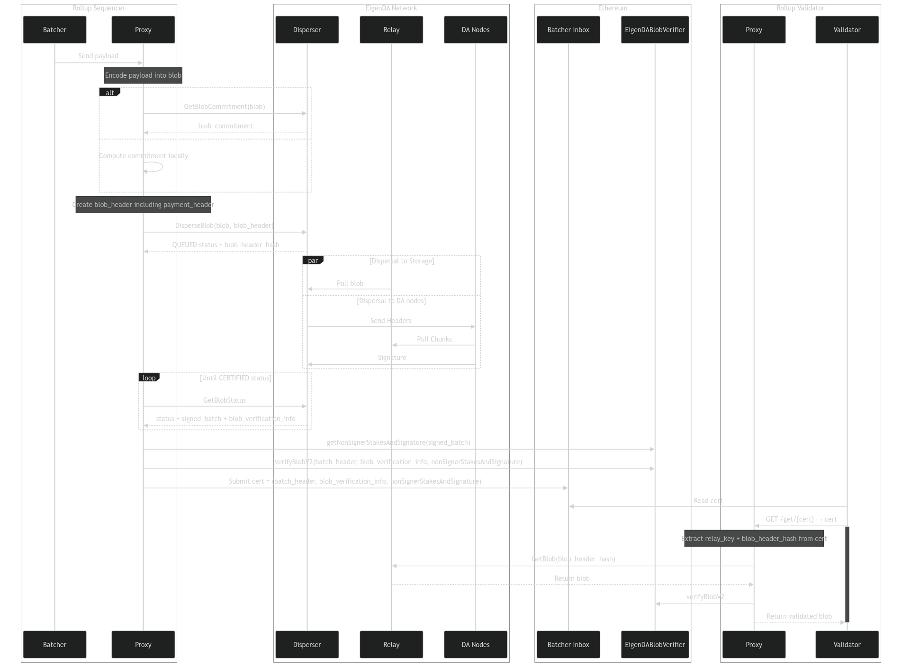
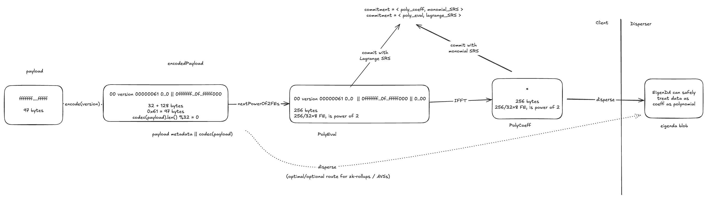

# EigenDA Proxy

A basic REST server for Rollups with the following endpoints:
- POST routes: used by sequencers to encode their payloads (batches of transactions or state transitions) into EigenDA blobs, submit them to the EigenDA disperser to make them available, and receive a DA certificate to be submitted to the rollup's batcher inbox.
- GET routes: used by validators to retrieve the blob from the EigenDA network given a DA Certificate, decode the blob back into the original payload, and return it to the validator, to be used in its derivation pipeline.

[](https://github.com/Layr-Labs/eigenda-proxy/actions/workflows/build.yml)
[](https://github.com/Layr-Labs/eigenda-proxy/actions/workflows/unit-tests.yml)
[](https://github.com/Layr-Labs/eigenda-proxy/actions/workflows/lint.yml)
[](https://github.com/Layr-Labs/eigenda-proxy/actions/workflows/holesky-test.yml)

[Integration Guide](https://docs.eigenda.xyz/integrations-guides/dispersal/clients/eigenda-proxy) | [EigenDA Repo](https://github.com/Layr-Labs/eigenda)

## Overview

This service wraps the [high-level EigenDA client](https://github.com/Layr-Labs/eigenda/blob/master/api/clients/eigenda_client.go), exposing endpoints for interacting with the EigenDA disperser in conformance to the [OP Alt-DA server spec](https://specs.optimism.io/experimental/alt-da.html), and adding disperser verification logic. This simplifies integrating EigenDA into various rollup frameworks by minimizing the footprint of changes needed within their respective services.

Features:

* Exposes an API for dispersing blobs to EigenDA and retrieving blobs from EigenDA via the EigenDA disperser
* Handles BN254 field element encoding/decoding
* Performs KZG verification during retrieval to ensure that data returned from the EigenDA disperser is correct.
* Performs KZG verification during dispersal to ensure that DA certificates returned from the EigenDA disperser have correct KZG commitments.
* Performs DA certificate verification during dispersal to ensure that DA certificates have been properly bridged to Ethereum by the disperser.
* Performs DA certificate verification during retrieval to ensure that data represented by bad DA certificates do not become part of the canonical chain.
* Compatibility with Optimism's alt-da commitment type with eigenda backend.
* Compatibility with Optimism's keccak-256 commitment type with S3 storage.

In order to disperse to the EigenDA network in production, or at high throughput on testnet, please register your authentication ethereum address through [this form](https://forms.gle/3QRNTYhSMacVFNcU8). Your EigenDA authentication keypair address should not be associated with any funds anywhere.

- [EigenDA Proxy](#eigenda-proxy)
  - [Overview](#overview)
  - [Deployment Guide](#deployment-guide)
    - [Hardware Requirements](#hardware-requirements)
    - [Ethereum Node Requirements](#ethereum-node-requirements)
    - [SRS Points Requirements](#srs-points-requirements)
    - [Deployment Steps](#deployment-steps)
    - [Env File](#env-file)
    - [Running via Docker](#running-via-docker)
  - [Features and Configuration Options](#features-and-configuration-options)
    - [Certificate verification](#certificate-verification)
      - [Soft Confirmations](#soft-confirmations)
    - [In-Memory Backend](#in-memory-backend)
    - [Asynchronous Secondary Insertions](#asynchronous-secondary-insertions)
    - [Storage Fallback](#storage-fallback)
    - [Storage Caching](#storage-caching)
    - [Failover Signals](#failover-signals)
  - [Blob Lifecycle](#blob-lifecycle)
    - [Posting Payloads](#posting-payloads)
    - [Retrieving Payloads](#retrieving-payloads)
    - [Rollup Commitment Schemas](#rollup-commitment-schemas)
      - [Optimism Commitment Mode](#optimism-commitment-mode)
      - [Standard Commitment Mode](#standard-commitment-mode)
  - [Testing](#testing)
    - [Unit](#unit)
    - [Integration](#integration)
    - [E2E Fuzz](#e2e-fuzz)
    - [Holesky](#holesky)
  - [Metrics](#metrics)
  - [Flags](#flags)
  - [Resources](#resources)


## Deployment Guide

### Hardware Requirements

The following specs are recommended for running on a single production server:

* 4 GB RAM
* 1-2 cores CPU

### Ethereum Node Requirements

A normal (non-archival) Ethereum node is sufficient for running the proxy with [cert verification](#certificate-verification) turned on. This is because all parameters that are read from the chain are either:
1. immutable (eg: [securityThresholds](https://github.com/Layr-Labs/eigenda/blob/a6dd724acdf732af483fd2d9a86325febe7ebdcd/contracts/src/core/EigenDAThresholdRegistryStorage.sol#L30)), or
2. are upgradeable but have all the historical versions available in contract storage (eg: [versioninedBlobParams](https://github.com/Layr-Labs/eigenda/blob/a6dd724acdf732af483fd2d9a86325febe7ebdcd/contracts/src/core/EigenDAThresholdRegistryStorage.sol#L27))

### SRS Points Requirements

In order to compute (and in our current implementation also verify) KZG commitments, G1 SRS points of size equivalent to the blob size are needed. The points must be loaded into the binary by using the [--eigenda.g1-path](https://github.com/Layr-Labs/eigenda-proxy/blob/147783535bedc117097ddc1c8c1eb7688de29eb6/verify/cli.go#L55) flag. A 32MiB G1 SRS file is available under [./resources/g1.point](./resources/g1.point). This file is also copied inside our distributed [docker images](https://github.com/Layr-Labs/eigenda-proxy/pkgs/container/eigenda-proxy), at [\<WORKDIR\>/resources/g1.point](https://github.com/Layr-Labs/eigenda-proxy/blob/147783535bedc117097ddc1c8c1eb7688de29eb6/Dockerfile#L30). The `--eigenda.g1-path` flag's default value is the relative path `resources/g1.point`, which will work when running the binary from the repo's root directory, as well as inside the container.

### Deployment Steps

```bash
## Build EigenDA Proxy
$ make
# env GO111MODULE=on GOOS= GOARCH= go build -v -ldflags "-X main.GitCommit=4b7b35bc3770ed5ca809b7ddb8a825c470a00fb4 -X main.GitDate=1719407123 -X main.Version=v0.0.0" -o ./bin/eigenda-proxy ./cmd/server
# github.com/Layr-Labs/eigenda-proxy/server
# github.com/Layr-Labs/eigenda-proxy/cmd/server

## Setup new keypair for EigenDA authentication
$ cast wallet new -j > keypair.json

## Extract keypair ETH address
$ jq -r '.[0].address' keypair.json
# 0x859F0F6D095E18B732FAdc8CD16Ae144F24e2F0D

## If running against mainnet, register the keypair ETH address and wait for approval: https://forms.gle/niMzQqj1JEzqHEny9

## Extract keypair private key and remove 0x prefix
PRIVATE_KEY=$(jq -r '.[0].private_key' keypair.json | tail -c +3)

## Run EigenDA Proxy
$ ./bin/eigenda-proxy \
    --addr 127.0.0.1 \
    --port 3100 \
    --eigenda.disperser-rpc disperser-holesky.eigenda.xyz:443 \
    --eigenda.signer-private-key-hex $PRIVATE_KEY \
    --eigenda.eth-rpc https://ethereum-holesky-rpc.publicnode.com \
    --eigenda.svc-manager-addr 0xD4A7E1Bd8015057293f0D0A557088c286942e84b
# 2024/06/26 09:41:04 maxprocs: Leaving GOMAXPROCS=10: CPU quota undefined
# INFO [06-26|09:41:04.881] Initializing EigenDA proxy server...     role=eigenda_proxy
# INFO [06-26|09:41:04.884]     Reading G1 points (2164832 bytes) takes 2.169417ms role=eigenda_proxy
# INFO [06-26|09:41:04.961]     Parsing takes 76.634042ms            role=eigenda_proxy
# numthread 10
# WARN [06-26|09:41:04.961] Verification disabled                    role=eigenda_proxy
# INFO [06-26|09:41:04.961] Using eigenda backend                    role=eigenda_proxy
# INFO [06-26|09:41:04.962] Starting DA server                       role=eigenda_proxy endpoint=127.0.0.1:5050
# INFO [06-26|09:41:04.973] Started DA Server                        role=eigenda_proxy
...
```

### Env File

We also provide network-specific example env configuration files in `.env.example.holesky` and `.env.example.mainnet` as a place to get started:

1. Copy example env file: `cp .env.example.holesky .env`
2. Update env file, setting `EIGENDA_PROXY_SIGNER_PRIVATE_KEY_HEX`. On mainnet you will also need to set `EIGENDA_PROXY_ETH_RPC`.
3. Pass into binary: `ENV_PATH=.env ./bin/eigenda-proxy --addr 127.0.0.1 --port 3100`

### Running via Docker

Container can be built via running `make docker-build`. We also build and publish containers on every release to [ghcr.io/layr-labs/eigenda-proxy](https://github.com/Layr-Labs/eigenda-proxy/pkgs/container/eigenda-proxy).


## Features and Configuration Options

Below is a list of different features offered by the eigenda-proxy, some of which are behind feature flags. For a full extensive list of available flags, see the [Flags](#flags) section.

### Certificate verification

In order for the EigenDA Proxy to avoid a trust assumption on the EigenDA disperser, the proxy offers a DA cert verification feature which ensures that:

1. The DA cert's batch hash can be computed locally and matches the one persisted on-chain in the `ServiceManager` contract
2. The DA cert's blob inclusion proof can be successfully verified against the blob-batch merkle root
3. The DA cert's quorum params are adequately defined and expressed when compared to their on-chain counterparts
4. The DA cert's quorum ids map to valid quorums

To target this feature, use the CLI flags `--eigenda-svc-manager-addr`, `--eigenda-eth-rpc`.


#### Soft Confirmations

An optional `--eigenda-eth-confirmation-depth` flag can be provided to specify a number of ETH block confirmations to wait before verifying the blob certificate. This allows for blobs to be accredited upon `confirmation` versus waiting (e.g, 25-30m) for `finalization`. The following integer expressions are supported:
`-1`: Wait for blob finalization
`0`: Verify the cert immediately upon blob confirmation and return the blob
`N where N>0`: Wait `N` blocks before verifying the cert and returning the blob

### In-Memory Backend

An ephemeral memory store backend can be used for faster feedback testing when testing rollup integrations. To target this feature, use the CLI flags `--memstore.enabled`, `--memstore.expiration`.

### Asynchronous Secondary Insertions
An optional `--routing.concurrent-write-routines` flag can be provided to enable asynchronous processing for secondary writes - allowing for more efficient dispersals in the presence of a hefty secondary routing layer. This flag specifies the number of write routines spun-up with supported thread counts in range `[1, 100)`.

### Storage Fallback
An optional storage fallback CLI flag `--routing.fallback-targets` can be leveraged to ensure resiliency when **reading**. When enabled, a blob is persisted to a fallback target after being successfully dispersed. Fallback targets use the keccak256 hash of the existing EigenDA commitment as their key, for succinctness. In the event that blobs cannot be read from EigenDA, they will then be retrieved in linear order from the provided fallback targets. 

### Storage Caching
An optional storage caching CLI flag `--routing.cache-targets` can be leveraged to ensure less redundancy and more optimal reading. When enabled, a blob is persisted to each cache target after being successfully dispersed using the keccak256 hash of the existing EigenDA commitment for the fallback target key. This ensure second order keys are succinct. Upon a blob retrieval request, the cached targets are first referenced to read the blob data before referring to EigenDA. 

### Failover Signals
In the event that the EigenDA disperser or network is down, the proxy will return a 503 (Service Unavailable) status code as a response to POST requests, which rollup batchers can use to failover and start submitting blobs to the L1 chain instead. For more info, see our failover designs for [op-stack](https://github.com/ethereum-optimism/specs/issues/434) and for [arbitrum](https://hackmd.io/@epociask/SJUyIZlZkx).

This behavior is turned on by default, but configurable via the `--eigenda.confirmation-timeout` flag (set to 15 mins by default currently). If a blob is not confirmed within this time, the proxy will return a 503 status code. This should be set long enough to accomodate for the disperser's batching interval (typically 10 minutes), signature gathering, and onchain submission.

## Blob Lifecycle

> Warning: the below diagrams describe EigenDA V2 interactions. EigenDA V1 is very similar, but has slight discrepancies.

The proxy fundamentally acts as a bridge between the rollup nodes and the EigenDA network. The following sequence diagram illustrates the lifecycle of a rollup payload (compressed batch of txs or state transitions), as it gets transformed to an EigenDA blob and dispersed to the network. The received EigenDA cert is then published to the rollup batcher-inbox, to be retrieved by rollup validators, and used to retrieve and validate the corresponding blob, which can then be decoded into the original payload and used by the rollup's stack.



### Posting Payloads



The rollup payload is submitted via a POST request to the proxy. Proxy encodes the payload into a blob and submits it to the EigenDA disperser. After the DACertificate is available via the GetBlobStatus endpoint, it is encoded using the requested [commitment schema](#commitment-schemas) and sent back to the rollup sequencer. The sequencer then submits the commitment to the rollup's batcher inbox.

### Retrieving Payloads

Validator nodes proceed with the exact reverse process as that used by the sequencer in the [posting blobs](#posting-blobs) section. The rollup validator submits a GET request to the proxy with the DACert in the body. The proxy validates the cert, fetches the corresponding blob from EigenDA, validates it, decodes it back into the rollup payload, and returns it the rollup node.

### Rollup Commitment Schemas

> Warning: the name `commitment` here refers to the piece of data sent to the rollup's batcher inbox (see op spec's [description](https://specs.optimism.io/experimental/alt-da.html#input-commitment-submission)), not to blobs' KZG commitment. The Rollup commitment consists of a few-byte header (described below) followed by a `DACertificate`, which contains all the information necessary to retrieve and validate an EigenDA blob. The `DACertificate` itself contains the KZG commitment to the blob.

Currently, there are two commitment modes supported with unique encoding schemas for each. The `version byte` is shared for all modes and denotes which version of the EigenDA `DACertificate` is being used/requested. The following versions are currently supported:
* `0x00`: EigenDA V1 certificate type (i.e, dispersal blob info struct with verification against service manager)
* `0x01`: EigenDA V2 certificate type

#### Optimism Commitment Mode
For `alt-da` Optimism rollups using EigenDA, the following [commitment schemas](https://specs.optimism.io/experimental/alt-da.html#example-commitments) are supported by our proxy:

| commitment_type (byte) | da_layer_byte | version_byte | payload           |
| ---------------------- | ------------- | ------------ | ----------------- |
| 0x00                   |               |              | keccak_commitment |
| 0x01                   | 0x00          | 0x00         | eigenda_cert_v1   |
| 0x01                   | 0x00          | 0x01         | eigenda_cert_v2   |

`keccak256` (commitment_type 0x00) uses an S3 storage backend with where a simple keccak commitment of the `blob` is used as the key. For `generic` commitments, we only support `da_layer_byte` 0x00 which represents EigenDA.

#### Standard Commitment Mode
For standard clients (i.e, `client/client.go`) communicating with proxy (e.g, arbitrum nitro), the following commitment schema is supported:

| version_byte | payload         |
| ------------ | --------------- |
| 0x00         | eigenda_cert_v1 |
| 0x01         | eigenda_cert_v2 |

`eigenda_cert_v0` is an RLP-encoded [EigenDA V1 certificate](https://github.com/Layr-Labs/eigenda/blob/eb422ff58ac6dcd4e7b30373033507414d33dba1/api/proto/disperser/disperser.proto#L168). `eigenda_cert_v1` works similarly.

## Testing

### Unit

Unit tests can be ran via invoking `make test`.

### Integration

End-to-end (E2E) tests can be ran via `make e2e-test`. These tests use the [op-e2e](https://github.com/ethereum-optimism/optimism/tree/develop/op-e2e) framework for asserting correct interaction behaviors with batch submission and state derivation.

These tests also assert E2E client <-> server interactions using simple/op clients.

### E2E Fuzz

This E2E test will fuzz the proxy client server integration and op client keccak256 with malformed inputs. This is never meant to be fuzzed with EigenDA. Run with `make e2e-fuzz-test`.

### Holesky

A holesky integration test can be ran using `make holesky-test` to assert proper dispersal/retrieval against a public network. Please **note** that EigenDA Holesky network which is subject to rate-limiting and slow confirmation times *(i.e, >10 minutes per blob confirmation)*. Please advise EigenDA's [inabox](https://github.com/Layr-Labs/eigenda/tree/master/inabox#readme) if you'd like to spin-up a local DA network for faster iteration testing.

## Metrics

To the see list of available metrics, run `./bin/eigenda-proxy doc metrics`

To quickly set up monitoring dashboard, add eigenda-proxy metrics endpoint to a reachable prometheus server config as a scrape target, add prometheus datasource to Grafana to, and import the existing [Grafana dashboard JSON file](./grafana_dashboard.json)

## Flags

> Note: this list is hand-crafted and is very likely to be out of date. 
> 
> To get a list of exact flags available with a given version, run `eigenda-proxy --help`

| Flag                                        | Default Value                   | Environment Variable                                     | Description                                                                                                                                                                                                   |
| ------------------------------------------- | ------------------------------- | -------------------------------------------------------- | ------------------------------------------------------------------------------------------------------------------------------------------------------------------------------------------------------------- |
| `--addr`                                    | `"127.0.0.1"`                   | `$EIGENDA_PROXY_ADDR`                                    | Server listening address                                                                                                                                                                                      |
| `--eigenda.cache-path`                      | `"resources/SRSTables/"`        | `$EIGENDA_PROXY_EIGENDA_TARGET_CACHE_PATH`               | Directory path to SRS tables for caching.                                                                                                                                                                     |
| `--eigenda.custom-quorum-ids`               |                                 | `$EIGENDA_PROXY_EIGENDA_CUSTOM_QUORUM_IDS`               | Custom quorum IDs for writing blobs. Should not include default quorums 0 or 1.                                                                                                                               |
| `--eigenda.disable-point-verification-mode` | `false`                         | `$EIGENDA_PROXY_EIGENDA_DISABLE_POINT_VERIFICATION_MODE` | Disable point verification mode. This mode performs IFFT on data before writing and FFT on data after reading. Disabling requires supplying the entire blob for verification against the KZG commitment.      |
| `--eigenda.disable-tls`                     | `false`                         | `$EIGENDA_PROXY_EIGENDA_GRPC_DISABLE_TLS`                | Disable TLS for gRPC communication with the EigenDA disperser. Default is false.                                                                                                                              |
| `--eigenda.cert-verification-disabled`      | `false`                         | `$EIGENDA_PROXY_EIGENDA_CERT_VERIFICATION_DISABLED`      | Whether to verify certificates received from EigenDA disperser.                                                                                                                                               |
| `--eigenda.disperser-rpc`                   |                                 | `$EIGENDA_PROXY_EIGENDA_DISPERSER_RPC`                   | RPC endpoint of the EigenDA disperser.                                                                                                                                                                        |
| `--eigenda.svc-manager-addr`                |                                 | `$EIGENDA_PROXY_EIGENDA_SERVICE_MANAGER_ADDR`            | The deployed EigenDA service manager address. The list can be found here: https://github.com/Layr-Labs/eigenlayer-middleware/?tab=readme-ov-file#current-mainnet-deployment                                   |
| `--eigenda.eth-confirmation-depth`          | `-1`                            | `$EIGENDA_PROXY_EIGENDA_ETH_CONFIRMATION_DEPTH`          | The number of Ethereum blocks of confirmation that the DA bridging transaction must have before it is assumed by the proxy to be final. If set negative the proxy will always wait for blob finalization.     |
| `--eigenda.eth-rpc`                         |                                 | `$EIGENDA_PROXY_EIGENDA_ETH_RPC`                         | JSON RPC node endpoint for the Ethereum network used for finalizing DA blobs. See available list here: https://docs.eigenlayer.xyz/eigenda/networks/                                                          |
| `--eigenda.g1-path`                         | `"resources/g1.point"`          | `$EIGENDA_PROXY_EIGENDA_TARGET_KZG_G1_PATH`              | Directory path to g1.point file.                                                                                                                                                                              |
| `--eigenda.g2-power-of-2-path`              | `"resources/g2.point.powerOf2"` | `$EIGENDA_PROXY_EIGENDA_TARGET_KZG_G2_POWER_OF_2_PATH`   | Directory path to g2.point.powerOf2 file.                                                                                                                                                                     |
| `--eigenda.max-blob-length`                 | `"16MiB"`                       | `$EIGENDA_PROXY_EIGENDA_MAX_BLOB_LENGTH`                 | Maximum blob length to be written or read from EigenDA. Determines the number of SRS points loaded into memory for KZG commitments. Example units: '30MiB', '4Kb', '30MB'. Maximum size slightly exceeds 1GB. |
| `--eigenda.put-blob-encoding-version`       | `0`                             | `$EIGENDA_PROXY_EIGENDA_PUT_BLOB_ENCODING_VERSION`       | Blob encoding version to use when writing blobs from the high-level interface.                                                                                                                                |
| `--eigenda.response-timeout`                | `60s`                           | `$EIGENDA_PROXY_EIGENDA_RESPONSE_TIMEOUT`                | Total time to wait for a response from the EigenDA disperser. Default is 60 seconds.                                                                                                                          |
| `--eigenda.signer-private-key-hex`          |                                 | `$EIGENDA_PROXY_EIGENDA_SIGNER_PRIVATE_KEY_HEX`          | Hex-encoded signer private key. This key should not be associated with an Ethereum address holding any funds.                                                                                                 |
| `--eigenda.status-query-retry-interval`     | `5s`                            | `$EIGENDA_PROXY_EIGENDA_STATUS_QUERY_INTERVAL`           | Interval between retries when awaiting network blob finalization. Default is 5 seconds.                                                                                                                       |
| `--eigenda.status-query-timeout`            | `30m0s`                         | `$EIGENDA_PROXY_EIGENDA_STATUS_QUERY_TIMEOUT`            | Duration to wait for a blob to finalize after being sent for dispersal. Default is 30 minutes.                                                                                                                |
| `--log.format`                              | `text`                          | `$EIGENDA_PROXY_LOG_FORMAT`                              | The format of the log file. Accepted options are 'json' and 'text' (default: "json")                                                                                                               |
| `--log.level`                               | `INFO`                          | `$EIGENDA_PROXY_LOG_LEVEL`                               | The lowest log level that will be output. The lowest log level that will be output. Accepted options are "debug", "info", "warn" "error"                                                                                                                                                                     |
| `log.path`                                  | `""`                              | `$EIGENDA_PROXY_LOG_PATH`                                | Path to file where logs will be written |
| `--memstore.enabled`                        | `false`                         | `$EIGENDA_PROXY_MEMSTORE_ENABLED`                        | Whether to use mem-store for DA logic.                                                                                                                                                                        |
| `--memstore.expiration`                     | `25m0s`                         | `$EIGENDA_PROXY_MEMSTORE_EXPIRATION`                     | Duration that a mem-store blob/commitment pair are allowed to live.                                                                                                                                           |
| `--memstore.put-latency`                    | `0`                             | `$EIGENDA_PROXY_MEMSTORE_PUT_LATENCY`                    | Artificial latency added for memstore backend to mimic EigenDA's dispersal latency.                                                                                                                           |
| `--memstore.get-latency`                    | `0`                             | `$EIGENDA_PROXY_MEMSTORE_GET_LATENCY`                    | Artificial latency added for memstore backend to mimic EigenDA's retrieval latency.                                                                                                                           |
| `--metrics.addr`                            | `"0.0.0.0"`                     | `$EIGENDA_PROXY_METRICS_ADDR`                            | Metrics listening address.                                                                                                                                                                                    |
| `--metrics.enabled`                         | `false`                         | `$EIGENDA_PROXY_METRICS_ENABLED`                         | Enable the metrics server.                                                                                                                                                                                    |
| `--metrics.port`                            | `7300`                          | `$EIGENDA_PROXY_METRICS_PORT`                            | Metrics listening port.                                                                                                                                                                                       |
| `--port`                                    | `3100`                          | `$EIGENDA_PROXY_PORT`                                    | Server listening port.                                                                                                                                                                                        |
| `--s3.credential-type`                      |                                 | `$EIGENDA_PROXY_S3_CREDENTIAL_TYPE`                      | Static, iam or public.                                                                                                                                                                                                |
| `--s3.access-key-id`                        |                                 | `$EIGENDA_PROXY_S3_ACCESS_KEY_ID`                        | Access key id for S3 storage.                                                                                                                                                                                 |
| `--s3.access-key-id`                        |                                 | `$EIGENDA_PROXY_S3_ACCESS_KEY_ID`                        | Access key id for S3 storage.                                                                                                                                                                                 |
| `--s3.access-key-secret`                    |                                 | `$EIGENDA_PROXY_S3_ACCESS_KEY_SECRET`                    | Access key secret for S3 storage.                                                                                                                                                                             |
| `--s3.bucket`                               |                                 | `$EIGENDA_PROXY_S3_BUCKET`                               | Bucket name for S3 storage.                                                                                                                                                                                   |
| `--s3.path`                                 |                                 | `$EIGENDA_PROXY_S3_PATH`                                 | Bucket path for S3 storage.                                                                                                                                                                                   |
| `--s3.endpoint`                             |                                 | `$EIGENDA_PROXY_S3_ENDPOINT`                             | Endpoint for S3 storage.                                                                                                                                                                                      |
| `--s3.enable-tls`                           |                                 | `$EIGENDA_PROXY_S3_ENABLE_TLS`                           | Enable TLS connection to S3 endpoint.                                                                                                                                                                         |
| `--storage.fallback-targets`                | `[]`                            | `$EIGENDA_PROXY_STORAGE_FALLBACK_TARGETS`                | Fall back backend targets. Supports S3.                                                                                                                                                                       | Backup storage locations to read from in the event of eigenda retrieval failure.                       |
| `--storage.cache-targets`                   | `[]`                            | `$EIGENDA_PROXY_STORAGE_CACHE_TARGETS`                   | Caching targets. Supports S3.                                                                                                                                                                                 | Caches data to backend targets after dispersing to DA, retrieved from before trying read from EigenDA. |
| `--storage.concurrent-write-threads`        | `0`                             | `$EIGENDA_PROXY_STORAGE_CONCURRENT_WRITE_THREADS`        | Number of threads spun-up for async secondary storage insertions. (<=0) denotes single threaded insertions where (>0) indicates decoupled writes.                                                             |
| `--s3.timeout`                              | `5s`                            | `$EIGENDA_PROXY_S3_TIMEOUT`                              | timeout for S3 storage operations (e.g. get, put)                                                                                                                                                             |
| `--redis.db`                                | `0`                             | `$EIGENDA_PROXY_REDIS_DB`                                | redis database to use after connecting to server                                                                                                                                                              |
| `--redis.endpoint`                          | `""`                            | `$EIGENDA_PROXY_REDIS_ENDPOINT`                          | redis endpoint url                                                                                                                                                                                            |
| `--redis.password`                          | `""`                            | `$EIGENDA_PROXY_REDIS_PASSWORD`                          | redis password                                                                                                                                                                                                |
| `--redis.eviction`                          | `24h0m0s`                       | `$EIGENDA_PROXY_REDIS_EVICTION`                          | entry eviction/expiration time                                                                                                                                                                                |
| `--help, -h`                                | `false`                         |                                                          | Show help.                                                                                                                                                                                                    |
| `--version, -v`                             | `false`                         |                                                          | Print the version.                                                                                                                                                                                            |

## Resources

* [OP stack](https://github.com/ethereum-optimism/optimism)
* [OP Alt-DA spec](https://specs.optimism.io/experimental/alt-da.html)
* [EigenDA repo](https://github.com/Layr-Labs/eigenda)
