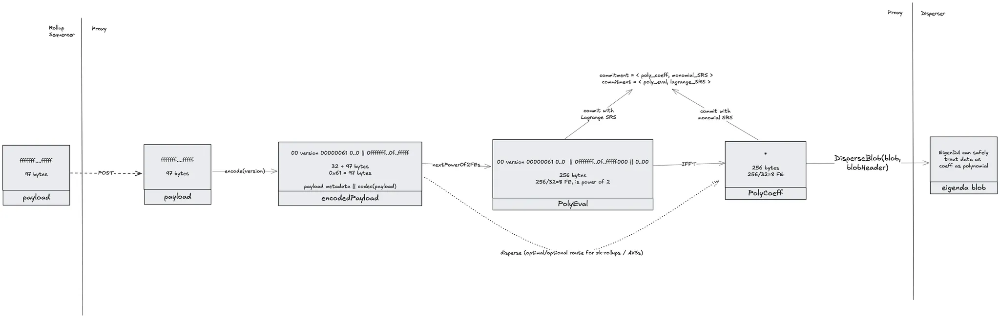

# EigenDA Proxy <!-- omit from toc -->

A basic REST proxy server to interact with the EigenDA network:
- POST routes: submit a payload (rollup txs, state-diffs, or anything really) that will be encoded 
  into an EigenDA blob and submitted to the EigenDA disperser to make available for 2 weeks. 
  A DA certificate of availability will be returned, which can be used to validate the 
  availability and query the payload back.
- GET routes: submit a DA Certificate to retrieve its respective blob from the EigenDA network, 
  which will be decoded, validated, and returned as a response.

[](https://github.com/Layr-Labs/eigenda/actions/workflows/test-proxy.yml)
[](https://github.com/Layr-Labs/eigenda/actions/workflows/docker-publish-release.yaml)


[V1 Integration Guide](https://docs.eigenda.xyz/integrations-guides/dispersal/clients/eigenda-proxy) | [V2 Integration Spec](https://layr-labs.github.io/eigenda/integration.html) | [Clients Godoc Examples](https://pkg.go.dev/github.com/Layr-Labs/eigenda-proxy/clients/standard_client) | [EigenDA Repo](https://github.com/Layr-Labs/eigenda)

## Overview

This service wraps the [high-level EigenDA client](https://github.com/Layr-Labs/eigenda/blob/master/api/clients/eigenda_client.go), exposing endpoints for interacting with the EigenDA disperser in conformance to the [OP Alt-DA server spec](https://specs.optimism.io/experimental/alt-da.html), and adding disperser verification logic. This simplifies integrating EigenDA into various rollup frameworks by minimizing the footprint of changes needed within their respective services.

Features:

* Exposes an API for dispersing blobs to EigenDA and retrieving blobs from EigenDA via the EigenDA disperser
* Handles BN254 field element encoding/decoding
* Performs KZG verification during retrieval to ensure that data returned from the EigenDA disperser is correct.
* Performs KZG verification during dispersal to ensure that DA certificates returned from the EigenDA disperser have correct KZG commitments.
* Performs DA certificate verification during dispersal to ensure that DA certificates have been properly bridged to Ethereum by the disperser.
* Performs DA certificate verification during retrieval to ensure that data represented by bad DA certificates do not become part of the canonical chain.
* Compatibility with Optimism's alt-da commitment type with eigenda backend.
* Compatibility with Optimism's keccak-256 commitment type with S3 storage.

- [Overview](#overview)
- [User Guide](#user-guide)
  - [Quick Start With Memstore Backend](#quick-start-with-memstore-backend)
  - [REST API Routes](#rest-api-routes)
    - [Standard Routes](#standard-routes)
    - [Optimism Routes](#optimism-routes)
    - [Admin Routes](#admin-routes)
  - [Migrating from EigenDA V1 to V2](#migrating-from-eigenda-v1-to-v2)
    - [On-the-Fly Migration](#on-the-fly-migration)
    - [Migration With Service Restart](#migration-with-service-restart)
  - [Deployment Against Real EigenDA Network](#deployment-against-real-eigenda-network)
  - [Features and Configuration Options (flags/env vars)](#features-and-configuration-options-flagsenv-vars)
  - [Requirements / Dependencies](#requirements--dependencies)
    - [Authn/Authz/Payments](#authnauthzpayments)
    - [Ethereum Node](#ethereum-node)
    - [SRS Points](#srs-points)
    - [Hardware Recommendation](#hardware-recommendation)
  - [Monitoring / Observability](#monitoring--observability)
- [Blob Lifecycle](#blob-lifecycle)
  - [Posting Payloads](#posting-payloads)
  - [Retrieving Payloads](#retrieving-payloads)
  - [Rollup Commitment Schemas](#rollup-commitment-schemas)
    - [Optimism Commitment Mode](#optimism-commitment-mode)
    - [Standard Commitment Mode](#standard-commitment-mode)
- [Contributor Guide](#contributor-guide)
  - [Testing](#testing)
    - [Unit](#unit)
    - [Integration / E2E](#integration--e2e)
    - [Fuzz](#fuzz)
- [Repo Structure and Releases](#repo-structure-and-releases)

## User Guide

### Quick Start With Memstore Backend

For testing purposes, proxy provides a fully in-memory backend that mocks a real backing EigenDA network. Here's how to start the proxy in this mode and interact with it:

```bash
# Start the proxy with memstore backend enabled
$ docker run --rm -p 3100:3100 ghcr.io/layr-labs/eigenda-proxy:latest --memstore.enabled --port 3100

# In another terminal... submit a payload save the returned cert in hex format
$ CERT_HEX=$(curl -X POST -d my-eigenda-payload "http://127.0.0.1:3100/put?commitment_mode=standard" | xxd -p | tr -d ' \n')

# Finally retrieve the payload using the cert
$ curl "http://127.0.0.1:3100/get/$CERT_HEX?commitment_mode=standard"
```

We build and publish containers on every release to [ghcr.io/layr-labs/eigenda-proxy](https://github.com/Layr-Labs/eigenda-proxy/pkgs/container/eigenda-proxy). You can also build from source by running `make`.

### REST API Routes

The source of truth for the routes is defined by our gorilla mux router in [./server/routing.go](./server/routing.go). We offer two sets of POST/GET routes.

#### Standard Routes

TODO

#### Optimism Routes

These routes are specific to optimism rollups and follow op's [altda-server spec](https://specs.optimism.io/experimental/alt-da.html#da-server). Do note that the op spec is wrong in that their altda client and server implementation actually return <commitment_bytes> on the POST routes, not <hex_encoded_commitment>. The below routes are correct.

```text
Request:
  POST /put/<hex_encoded_commitment>
  Content-Type: application/octet-stream
  Body: <preimage_bytes>

Response:
  200 OK
```
Where the <hex_encoded_commitment> for keccak commitments is the keccak256 hash of the preimage_bytes, prepended with `0x00`.


```text
Request:
  POST /put
  Content-Type: application/octet-stream
  Body: <preimage_bytes>

Response:
  200 OK
  Content-Type: application/octet-stream
  Body: <commitment_bytes>
```

Where the <commitment_bytes> is the serialized versioned DA certificate of the blob.


Both altda commitment forms above share the same GET route to retrieve the preimage_bytes.

```text
Request:
  GET /get/<hex_encoded_commitment>

Response:
  200 OK
  Content-Type: application/octet-stream
  Body: <preimage_bytes>
```

#### Admin Routes

The proxy provides administrative endpoints to control runtime behavior. By default, these endpoints are disabled 
and must be explicitly enabled through configuration.

> **SECURITY WARNING:** The admin endpoints should NEVER be publicly accessible. These endpoints 
> do not implement authentication or authorization controls and should only be exposed on internal networks.

To enable admin endpoints, include "admin" in the `--api-enabled` flag value or set the environment variable 
`EIGENDA_PROXY_API_ENABLED=admin` when starting the proxy server. For example:
  
```bash
# Enable admin API
./bin/eigenda-proxy --api-enabled admin

# Example of enabling multiple APIs (note: 'metrics' shown for illustration only and is not currently implemented)
./bin/eigenda-proxy --api-enabled admin,metrics
```

When enabled, the following admin endpoints are available:

```text
Request:
  GET /admin/eigenda-dispersal-backend

Response:
  200 OK
  Content-Type: application/json
  Body: {"eigenDADispersalBackend": string}
```

```text
Request:
  PUT /admin/eigenda-dispersal-backend
  Content-Type: application/json
  Body: {"eigenDADispersalBackend": string}

Response:
  200 OK
  Content-Type: application/json
  Body: {"eigenDADispersalBackend": string}
```

These endpoints allow operators to check and set which EigenDA backend version is used for blob dispersal. 
The GET endpoint retrieves the current state, while the PUT endpoint idempotently updates the state to the specified value. 
The `eigenDADispersalBackend` value represents the current backend being used after any changes have been applied.

Valid values for `eigenDADispersalBackend` are:
- `"v1"`: Use EigenDA V1 backend for dispersal
- `"v2"`: Use EigenDA V2 backend for dispersal

### Migrating from EigenDA V1 to V2

There are two approaches for migrating from EigenDA V1 to V2: on-the-fly migration using runtime configuration,
and migration with a service restart. Choose the approach that best fits your operational requirements.

#### On-the-Fly Migration

This approach allows you to switch from V1 to V2 while the proxy is running, without any service interruption:

1. **Configure Both V1 and V2 Backends**
   - Use a configuration file that includes settings for both V1 and V2 backends
      - See `.env.exampleV1AndV2.holesky` for an example configuration
   - Set `EIGENDA_PROXY_STORAGE_DISPERSAL_BACKEND=V1` in your configuration
      - This ensures that the proxy will continue dispersing to the V1 backend, until it's time to migrate
   - Set `EIGENDA_PROXY_API_ENABLED=admin` to expose the admin API
      - This allows runtime switching between V1 and V2 without service restart

2. **Runtime Migration**
   - When ready to migrate to V2, use the admin endpoint to switch dispersal targets:
   ```
   curl -X PUT http://localhost:3100/admin/eigenda-dispersal-backend \
     -H "Content-Type: application/json" \
     -d '{"eigenDADispersalBackend": "v2"}'
   ```

This migration path allows for a seamless transition from V1 to V2 without service downtime and provides the ability 
to roll back to V1 if needed.

#### Migration With Service Restart

If you prefer a more controlled migration with explicit service updates, follow this approach:

1. **Initial Configuration (V1 Only)**
   - Start proxy with a V1-only configuration
      - See `.env.exampleV1.holesky` for an example configuration

2. **Prepare V2 Configuration**
   - Prepare a configuration file that includes settings for both V1 and V2 backends
      - See `.env.exampleV1AndV2.holesky` for an example configuration
   - Set `EIGENDA_PROXY_STORAGE_DISPERSAL_BACKEND=V2`, so that the proxy started with this config will immediately
enable V2 dispersal

3. **Scheduled Migration**
   - During a planned migration window, stop the V1-only proxy service
   - Restart the proxy service, using the prepared V2 configuration

### Deployment Against Real EigenDA Network

We also provide network-specific example env configuration files in `.env.example.holesky` and `.env.example.mainnet` as a place to get started:

1. Copy example env file: `cp .env.example.holesky .env`
2. Update env file, setting `EIGENDA_PROXY_SIGNER_PRIVATE_KEY_HEX`. On mainnet you will also need to set `EIGENDA_PROXY_ETH_RPC`.
3. Pass into binary: `ENV_PATH=.env ./bin/eigenda-proxy --addr 127.0.0.1 --port 3100`

```bash
## Setup new keypair for EigenDA authentication
$ cast wallet new --json > keypair.json

## Extract keypair private key and remove 0x prefix
$ PRIVATE_KEY=$(jq -r '.[0].private_key' keypair.json | tail -c +3)

## If running V1 against testnet or mainnet, register the keypair ETH address and wait for approval: https://forms.gle/niMzQqj1JEzqHEny9

## Run EigenDA Proxy with EigenDA V1 backend
$ ./bin/eigenda-proxy \
    --port 3100 \
    --eigenda.disperser-rpc disperser-holesky.eigenda.xyz:443 \
    --eigenda.signer-private-key-hex $PRIVATE_KEY \
    --eigenda.eth-rpc https://ethereum-holesky-rpc.publicnode.com \
    --eigenda.svc-manager-addr 0xD4A7E1Bd8015057293f0D0A557088c286942e84b
```

### Features and Configuration Options (flags/env vars)

Below is a list of the main high-level features offered for configuring the eigenda-proxy. These features are controlled via flags and/or env vars. To view the extensive list of available flags/env-vars to configure a given version of eigenda-proxy, run `eigenda-proxy --help`.

#### Certificate verification <!-- omit from toc -->

In order for the EigenDA Proxy to avoid a trust assumption on the EigenDA disperser, the proxy offers a DA cert verification feature which ensures that:

1. The DA cert's batch hash can be computed locally and matches the one persisted on-chain in the `ServiceManager` contract
2. The DA cert's blob inclusion proof can be successfully verified against the blob-batch merkle root
3. The DA cert's quorum params are adequately defined and expressed when compared to their on-chain counterparts
4. The DA cert's quorum ids map to valid quorums

To target this feature, use the CLI flags `--eigenda-svc-manager-addr`, `--eigenda-eth-rpc`.


#### Soft Confirmations <!-- omit from toc -->

An optional `--eigenda.confirmation-depth` flag can be provided to specify a number of ETH block confirmations to wait for the confirmBatch to have landed onchain before returning the cert to the batcher after having dispersed a blob in the put route. The flag value can either be the string 'finalized' or a number:
`finalized`: Wait for the confirmBatch transaction to be finalized on-chain before returning the cert to the batcher
`0`: Verify the cert immediately upon blob confirmation and return the cert
`N where 0<N<64`: Wait `N` blocks before returning the cert to the batcher

The default value is 8. Using 0 is dangerous: see [troubleshooting the batch-hash-mismatch error](./docs/troubleshooting_v1.md#batch-hash-mismatch-error).

#### In-Memory Backend <!-- omit from toc -->

An ephemeral memory store backend can be used for faster feedback testing when testing rollup integrations. To target this feature, use the CLI flags `--memstore.enabled`, `--memstore.expiration`.

#### Asynchronous Secondary Insertions <!-- omit from toc -->
An optional `--storage.concurrent-write-routines` flag can be provided to enable asynchronous processing for secondary writes - allowing for more efficient dispersals in the presence of a hefty secondary routing layer. This flag specifies the number of write routines spun-up with supported thread counts in range `[1, 100)`.

#### Storage Caching <!-- omit from toc -->
An optional flag `--storage.cache-targets` can be enabled to persist successfully dispersed blobs to each cache target, with the keccak256 hash of the constructed cert used as the key.
Upon blob retrieval requests, the cached targets will each be tried before reading from EigenDA. `--storage.write-on-cache-miss` can also be set to true to write the blob after retrievals,
which can be used to populate caches during archival syncs, as one example.

#### Failover Signals <!-- omit from toc -->
In the event that the EigenDA disperser or network is down, the proxy will return a 503 (Service Unavailable) status code as a response to POST requests, which rollup batchers can use to failover and start submitting blobs to the L1 chain instead. For more info, see our failover designs for [op-stack](https://github.com/ethereum-optimism/specs/issues/434) and for [arbitrum](https://hackmd.io/@epociask/SJUyIZlZkx).

This behavior is turned on by default, but configurable via the `--eigenda.confirmation-timeout` flag (set to 15 mins by default currently). If a blob is not confirmed within this time, the proxy will return a 503 status code. This should be set long enough to accomodate for the disperser's batching interval (typically 10 minutes), signature gathering, and onchain submission.

### Requirements / Dependencies

#### Authn/Authz/Payments

In order to disperse to the EigenDA V1 network in production, or at high throughput on testnet, please register your authentication ethereum address through [this form](https://forms.gle/3QRNTYhSMacVFNcU8). Your EigenDA authentication keypair address should not be associated with any funds anywhere. For EigenDA V2, please see our [payments](https://docs.eigenda.xyz/releases/payments) doc.

> Note: Proxy only supports using a single authorization (v1) or payment (v2) key. For RaaS providers, we discourage sharing keys between rollups, and thus recommend running a single instance of the Proxy per Rollup.

#### Ethereum Node

A normal (non-archival) Ethereum node is sufficient for running the proxy with cert verification turned on. This is because all parameters that are read from the chain are either:
1. immutable (eg: [securityThresholds](https://github.com/Layr-Labs/eigenda/blob/a6dd724acdf732af483fd2d9a86325febe7ebdcd/contracts/src/core/EigenDAThresholdRegistryStorage.sol#L30)), or
2. are upgradeable but have all the historical versions available in contract storage (eg: [versioninedBlobParams](https://github.com/Layr-Labs/eigenda/blob/a6dd724acdf732af483fd2d9a86325febe7ebdcd/contracts/src/core/EigenDAThresholdRegistryStorage.sol#L27))

#### SRS Points

In order to compute (and in our current implementation also verify) KZG commitments, G1 SRS points of size equivalent to the blob size are needed. The points must be loaded into the binary by using the [--eigenda.g1-path](https://github.com/Layr-Labs/eigenda/blob/86e27fa0342f4638a356ba9738cf998374889ee3/api/proxy/store/generated_key/eigenda/verify/cli.go#L67) flag. A 32MiB G1 SRS file is available under [./resources/g1.point](./resources/g1.point). This file is also copied inside our distributed [docker images](https://github.com/Layr-Labs/eigenda-proxy/pkgs/container/eigenda-proxy), at [\<WORKDIR\>/resources/g1.point](https://github.com/Layr-Labs/eigenda/blob/86e27fa0342f4638a356ba9738cf998374889ee3/Dockerfile#L184). The `--eigenda.g1-path` flag's default value is the relative path `resources/g1.point`, which will work when running the binary from the repo's root directory, as well as inside the container.

#### Hardware Recommendation

The following specs are recommended for running on a single production server:

* 1-2 cores CPU
* 4 GB RAM

### Monitoring / Observability

To the see list of available metrics, run `./bin/eigenda-proxy doc metrics`

To quickly set up monitoring dashboard, add eigenda-proxy metrics endpoint to a reachable prometheus server config as a scrape target, add prometheus datasource to Grafana to, and import the existing [Grafana dashboard JSON file](./grafana_dashboard.json)

## Blob Lifecycle

> Warning: the below diagrams describe EigenDA V2 interactions. EigenDA V1 is very similar, but has slight discrepancies.

The proxy fundamentally acts as a bridge between the rollup nodes and the EigenDA network. The following sequence diagram illustrates the lifecycle of a rollup payload (compressed batch of txs or state transitions), as it gets transformed to an EigenDA blob and dispersed to the network. The received EigenDA cert is then published to the rollup batcher-inbox, to be retrieved by rollup validators, and used to retrieve and validate the corresponding blob, which can then be decoded into the original payload and used by the rollup's stack.


### Posting Payloads



The rollup payload is submitted via a POST request to the proxy. Proxy encodes the payload into a blob and submits it to the EigenDA disperser. After the DACertificate is available via the GetBlobStatus endpoint, it is encoded using the requested [commitment schema](#rollup-commitment-schemas) and sent back to the rollup sequencer. The sequencer then submits the commitment to the rollup's batcher inbox.

### Retrieving Payloads

Validator nodes proceed with the exact reverse process as that used by the sequencer in the [posting payloads](#posting-payloads) section. The rollup validator submits a GET request to the proxy with the DACert in the body. The proxy validates the cert, fetches the corresponding blob from EigenDA, validates it, decodes it back into the rollup payload, and returns it the rollup node.

### Rollup Commitment Schemas

> Warning: the name `commitment` here refers to the piece of data sent to the rollup's batcher inbox (see op spec's [description](https://specs.optimism.io/experimental/alt-da.html#input-commitment-submission)), not to blobs' KZG commitment. The Rollup commitment consists of a few-byte header (described below) followed by a `DACertificate`, which contains all the information necessary to retrieve and validate an EigenDA blob. The `DACertificate` itself contains the KZG commitment to the blob.

Currently, there are two commitment modes supported with unique encoding schemas for each. The `version byte` is shared for all modes and denotes which version of the EigenDA `DACertificate` is being used/requested. The following versions are currently supported:
* `0x00`: EigenDA V1 certificate type (i.e, dispersal blob info struct with verification against service manager)
* `0x01`: EigenDA V2 certificate type

#### Optimism Commitment Mode
For `alt-da` Optimism rollups using EigenDA, the following [commitment schemas](https://specs.optimism.io/experimental/alt-da.html#example-commitments) are supported by our proxy:

| commitment_type (byte) | da_layer_byte | version_byte | payload           |
| ---------------------- | ------------- | ------------ | ----------------- |
| 0x00                   |               |              | keccak_commitment |
| 0x01                   | 0x00          | 0x00         | eigenda_cert_v1   |
| 0x01                   | 0x00          | 0x01         | eigenda_cert_v2   |

`keccak256` (commitment_type 0x00) uses an S3 storage backend with where a simple keccak commitment of the `blob` is used as the key. For `generic` commitments, we only support `da_layer_byte` 0x00 which represents EigenDA.

#### Standard Commitment Mode
For standard clients (i.e, `clients/standard_client/client.go`) communicating with proxy (e.g, arbitrum nitro), the following commitment schema is supported:

| version_byte | payload         |
| ------------ | --------------- |
| 0x00         | eigenda_cert_v1 |
| 0x01         | eigenda_cert_v2 |

`eigenda_cert_v0` is an RLP-encoded [EigenDA V1 certificate](https://github.com/Layr-Labs/eigenda/blob/eb422ff58ac6dcd4e7b30373033507414d33dba1/api/proto/disperser/disperser.proto#L168). `eigenda_cert_v1` works similarly.

## Contributor Guide

Browse our [Makefile](./Makefile) for a list of available commands such as `make` for building the binary and `make docker-build` to build the docker image.

### Testing

#### Unit

Unit tests can be run with `make test-unit`.

#### Integration / E2E

Integration tests against op framework can be run with `make test-e2e`. These tests use the [op-e2e](https://github.com/ethereum-optimism/optimism/tree/develop/op-e2e) framework for asserting correct interaction behaviors with batch
submission and state derivation. Tests are run both in a local environment, and in a holesky testnet environment.

These tests also assert E2E client <-> server interactions using simple/op clients.

#### Fuzz

Fuzz tests exercise the proxy client server integration and op client keccak256 with malformed inputs. This is
never meant to be fuzzed with EigenDA. Run with `make test-fuzz`.

## Repo Structure and Releases

This repo is a fairly standard Go [workspace](https://go.dev/ref/mod#workspaces), which consists of 2 separate modules:
1. [eigenda-proxy](./go.mod) - the main module, which contains the proxy server and all the business logic
2. [clients](./clients/go.mod) - a module containing client implementations for interacting with the proxy server

Both modules follow their own independent [release](https://go.dev/doc/modules/release-workflow) cadence, with independent semantic versioning:
1. `eigenda-proxy` releases are made from `vX.Y.Z` tags, with release titles of the [same form](https://github.com/Layr-Labs/eigenda-proxy/releases/tag/v1.6.5).
2. `clients` releases are made from `clients/vX.Y.Z` tags, with release titles of the [same form](https://github.com/Layr-Labs/eigenda-proxy/releases/tag/clients%2Fv0.2.0)