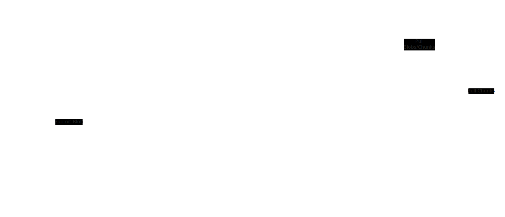

EigenDA V2 Architecture
=======================

The EigenDA team is currently working on a major overhaul of many of the core systems that make up EigenDA. These 
changes, collectively referred to as "EigenDA V2 Architecture", aim to overhaul several fundamental pillars of EigenDA
system to make it more efficient, secure, and scalable.

### Note: Design Stability

We've got a solid plan ahead of us, but one thing you learn early in software development is that 
"no plan survives first contact with the enemy". It's possible that some details presented in this document
may be altered by the time this project goes live. This document is meant to give a high-level overview of
we are planning, but it should be understood that some details may change along the way.

----

# V2 Architecture Overview

## Separation of Data and Control Planes

A core principle of the V2 Architecture is the separation of the data and control planes. Strategies well suited
for the transfer of large quantities of data are not always the same as those well suited for the flow of control
and metadata. By building separate systems for these two purposes, we can optimize each system to better suit its
needs.

## Relays

A relay is fundamentally a data transfer system. It acts as the primary point of contact between the disperser and
the outside world for the purpose of encoded chunks. It also provides access to unencoded blobs for the convenience
of clients.

The relay subsystem is designed from the ground up to be highly scalable. Relays can be sharded, permitting relays
to scale in capacity indefinitely to permit greater EigenDA network capacity. Relay shards can be replicated with
low overhead, providing high availability the capability to handle large volumes of traffic, and to scale resources
to meet shifting demand.

In the prior EigenDA architecture, the role of the relay was (is) handled by the disperser. The addition of relays
as a separate system allows us to optimize it for its role, as well as to scale it independently of the disperser.
Similar to the prior mentioned disperser, the security of the protocol does not rely on the honesty of the relays.
Although a dishonest or malfunctioning relay has the potential to cause liveness issues, once DA nodes issued
signatures on the availability of the data, the participation of the relay is not required for the data to be
retrieved.

## Encoders

The encoders are responsible for encoding data into chunks using reed-solomon erasure coding. Encoders can be
scaled horizontally to handle large volumes of data. This aspect of the system is designed is unchanged from the
prior (current) architecture.

## Blob Store

The role of the blob store is to store unencoded blobs of data and encoded chunks. It needs to be highly available
and scalable to meet the demands of the EigenDA network, and should utilize sufficient 
redundancy as to make data lost unlikely.

## Controller

The controller encapsulates and controls the core logic of EigenDA. When a new blob is submitted, the controller
decides if that blob will be accepted. It schedules blobs for encoding, and ensures that DA nodes become aware
of blob headers. When DA nodes eventually issue availability signatures, the controller is responsible for
collecting them.

Since much of the heavy lifting of the EigenDA system will be encapsulated elsewhere, the controller can become
much simpler and more easy to maintain than the equivalent system in the prior (or current) architecture.

## Metadata Store

The metadata store is responsible for storing metadata about blobs. Blob headers, blob certificates, and various
other pieces of data used for internal bookkeeping are stored here. The metadata store is designed to provide low
latency access to metadata, and to be highly available and scalable (for the type of data being stored).

## DA Nodes

DA nodes will continue to operate much as they do in the current EigenDA architecture. Each DA node will be responsible
for custodying a portion of each blob, and for issuing availability signatures when they have verified that they have
custody of the data.

----

# How will this effect EigenDA users?

Submitting and querying for blob confirmations will continue to work as it does in the current EigenDA architecture.
Queries for chunk data from DA nodes will also be unchanged. API for fetching the unencoded of an unencoded blob will
still be available, except that such requests will be served by the relay system rather than the disperser. We intend
on making this rollout as seamless as possible for users, and there will be a grace period where both the old and new
APIs will be available.

----

# How will this effect EigenDA node operators?

V2 Architecture will require DA nodes to fetch data from the relay system rather than the disperser. At a certain point
in time, DA nodes running software versions compatible with pre-V2 Architecture will no longer be able to fetch data
from the disperser.

----

# When is this code expected to go live?

We hope to have the V2 Architecture codebase in early 2025. This is a best estimate only, and the actual date 
of release may vary.

----

# Why such a boring name?

Naming things is hard, ok! I wanted to call it "EigenDA: The Reckoning" or "Project Kickass", 
but cooler heads prevailed. "V2 Architecture" it is. :)