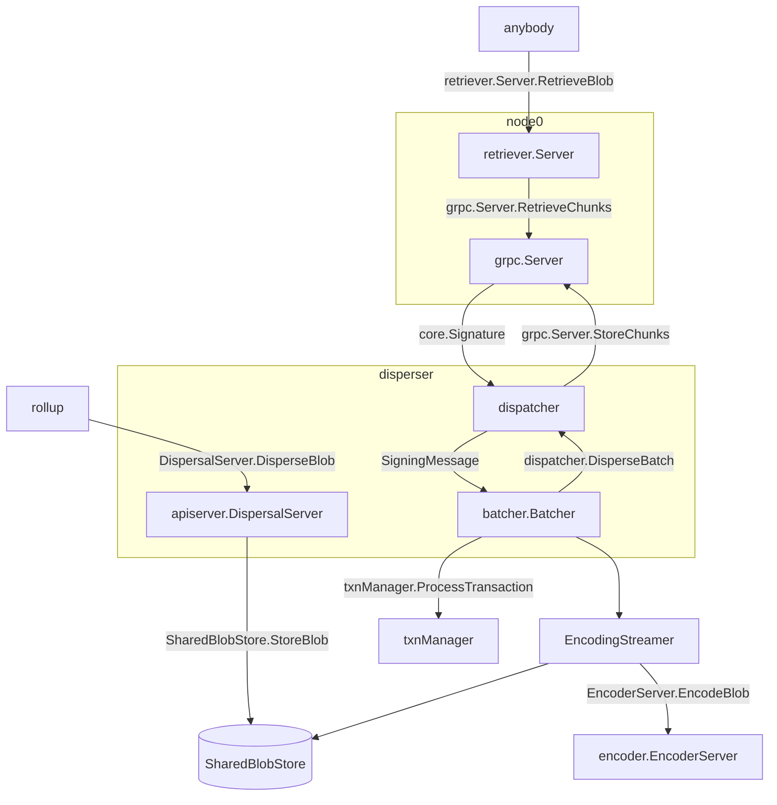
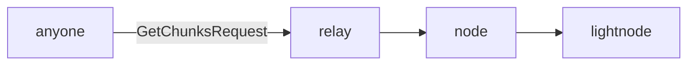

## v1

```mermaid
graph TB

rollup --DispersalServer.DisperseBlob--> apiserver.DispersalServer

retriever.Server --grpc.Server.RetrieveChunks--> grpc.Server

apiserver.DispersalServer 
apiserver.DispersalServer --SharedBlobStore.StoreBlob--> SharedBlobStore[(SharedBlobStore)]

EncodingStreamer --> SharedBlobStore
EncodingStreamer --EncoderServer.EncodeBlob--> encoder.EncoderServer

batcher.Batcher --dispatcher.DisperseBatch--> dispatcher --SigningMessage--> batcher.Batcher
batcher.Batcher --> EncodingStreamer
batcher.Batcher --txnManager.ProcessTransaction--> txnManager

dispatcher --grpc.Server.StoreChunks--> grpc.Server --core.Signature--> dispatcher

anybody --retriever.Server.RetrieveBlob--> retriever.Server

subgraph node0
    retriever.Server 
    grpc.Server
end

subgraph disperser
    batcher.Batcher
    apiserver.DispersalServer
    dispatcher
end
```

## v2 (2024-10-09)

```mermaid
graph LR

node --> lightnode
relay --> node
anyone --GetChunksRequest--> relay
```

