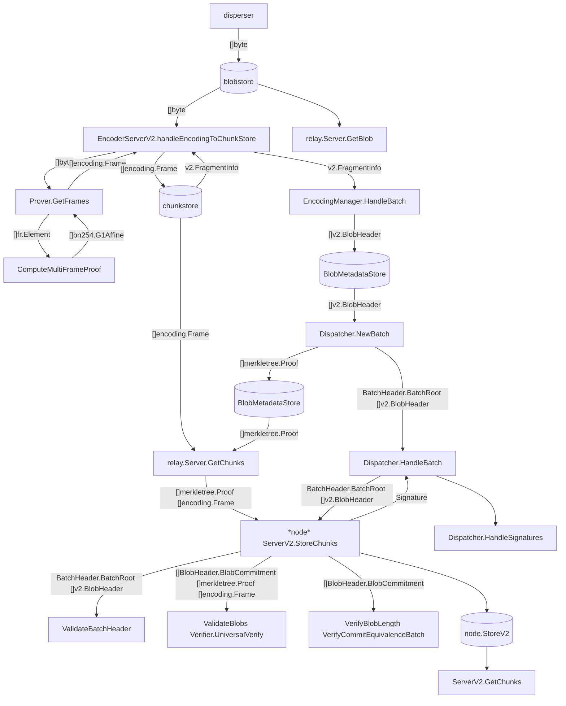

# Organization

The EigenDA repo is organized as a monorepo, with each project adhering to the "Ben Johnson" project structure style. Within the core project directories (e.g., `core`, `disperser`, `node`, `retriever`, `indexer`), the main interfaces and data types are defined at the root of the project, while implementations are organized by dependency. For instance, the folder `indexer/inmem` contains implementations of the interfaces in `indexer` which use in-memory storage, while `indexer/leveldb` may contain implementations of the same interfaces that use `leveldb`. Mocks of all interfaces in the `indexer` project go in `indexer/mock`.

The same pattern is used for intra-project and inter-project dependencies. For instance, the folder `indexer/indexer` contains implementations of the interfaces in `core` which depend on the `indexer` project.

In general, the `core` project contains implementation of all the important business logic responsible for the security guarantees of the EigenDA protocol, while the other projects add the networking layers needed to run the distributed system.


# Directory structure
<pre>
┌── <a href="../api">api</a> Protobuf definitions, contract bindings and client-side libraries for users to integrate with EigenDA
├── <a href="../common">common</a>: Common utility libraries
├── <a href="../contracts">contracts</a>
|   ├── <a href="../contracts/eignlayer-contracts">eigenlayer-contracts</a>: Contracts for the EigenLayer restaking platform
┌── <a href="../core">core</a>: Core logic of the EigenDA protocol
├── <a href="../disperser">disperser</a>: Disperser service including API server, encoder and batcher
├── <a href="../docs">docs</a>: Documentation and specification
├── <a href="../encoding">encoding</a>: Encoding libraries such as Reed-Solomon, KZG
├── <a href="../inabox">inabox</a>: Inabox test to run EigenDA system on a single machine
|── <a href="../indexer">indexer</a>: A simple indexer for efficiently tracking chain state and maintaining accumulators
├── <a href="../node">node</a>: DA node service
├── <a href="../operators">operators</a>: Operator network management such as Churner and Ejector
├── <a href="../retriever">retriever</a>: Retriever service
|── <a href="../subgraphs">subgraphs</a>: The subgraphs indexer for onchain information
├── <a href="../test">test</a>: Tools for running integration tests
├── <a href="../tools">tools</a>: General tools such as traffic generator
</pre>

# Data flow diagram

You can convert Mermaid source code into an image using the [VS Code extention](https://marketplace.visualstudio.com/items?itemName=bierner.markdown-mermaid).



# Data structures
```
encoding.Frame: 
    Proof: bn254.G1Affine
    Coeffs: fr.Element

v2.Batch:
    ReferenceBlockNumber: uint64
    []v2.BlobCertificate: v2.BlobHeader

v2.BlobHeader:
    BlobCommitment
        Commitment: []byte
        LengthCommitment: []byte
        LengthProof: []byte
        Length: uint32
```

# Finite field elements
```
fr.Element: [4]uint64
fp.Element: [4]uint64
bn254.G1Affine: [2]fp.Element
```