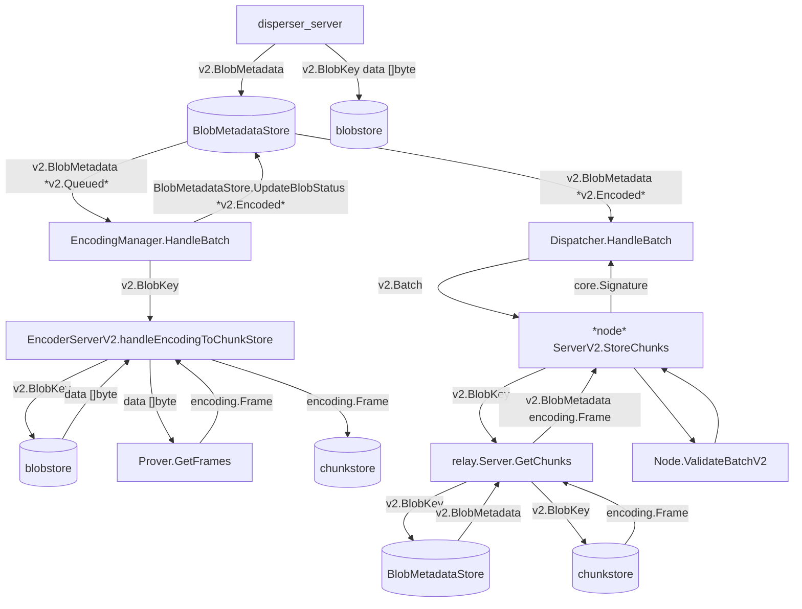

## Data Flow Diagram

```mermaid
flowchart TB

disperser_server -- v2.BlobMetadata --> metastore
disperser_server --v2.BlobKey data []byte --> disperser_blobstore

metastore -- v2.BlobMetadata *v2.Queued* --> encmgr
encmgr -- BlobMetadataStore.UpdateBlobStatus *v2.Encoded*  --> metastore

metastore -- v2.BlobMetadata *v2.Encoded* --> dispatcher

dispatcher -- v2.Batch --> node
node -- core.Signature --> dispatcher

encmgr -- v2.BlobKey --> encoder
%% encoder -- v2.FragmentInfo --> encmgr

encoder -- v2.BlobKey --> blobstore
blobstore -- data []byte --> encoder

%% TODO: Add details about prover
encoder -- data []byte --> prover
prover -- encoding.Frame --> encoder

encoder -- encoding.Frame --> chunkstore
%% chunkstore -- v2.FragmentInfo --> encoder

metastore[(BlobMetadataStore)]
blobstore[(blobstore)]
disperser_blobstore[(blobstore)]
chunkstore[(chunkstore)]

node[*node* ServerV2.StoreChunks]
dispatcher[Dispatcher.HandleBatch]
prover[Prover.GetFrames]
encoder[EncoderServerV2.handleEncodingToChunkStore]
encmgr[EncodingManager.HandleBatch]

node -- v2.BlobKey --> relay
relay -- v2.BlobMetadata encoding.Frame --> node

relay -- v2.BlobKey --> relay_metastore
relay_metastore -- v2.BlobMetadata --> relay

relay -- v2.BlobKey --> relay_chunkstore
relay_chunkstore -- encoding.Frame --> relay

%% TODO: Add details about validator
validate --> node
node --> validate

relay[relay.Server.GetChunks]
relay_metastore[(BlobMetadataStore)]
relay_chunkstore[(chunkstore)]

validate[Node.ValidateBatchV2]
node[*node* ServerV2.StoreChunks]
```