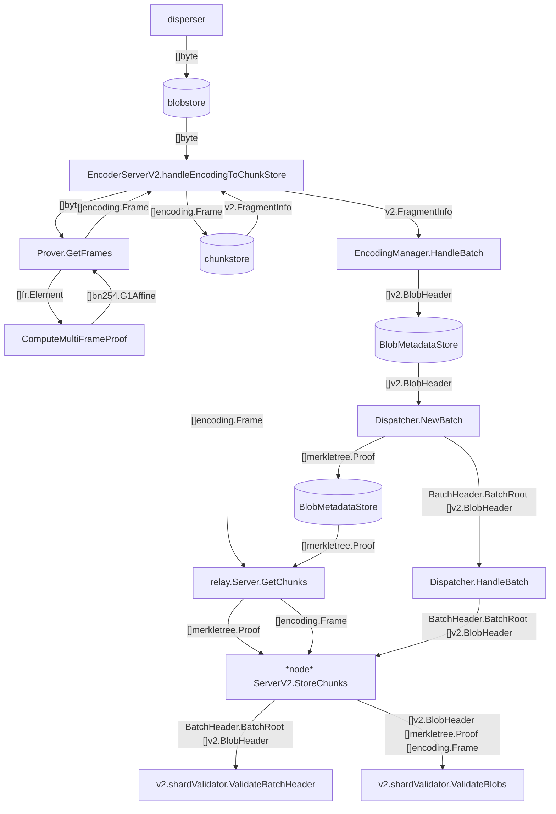

```mermaid
flowchart TB

disperser -- []byte --> blobstore

blobstore -- []byte --> encserver

encserver -- []byte --> prover
prover -- []encoding.Frame --> encserver

prover -- []fr.Element --> prover1
prover1 -- []bn254.G1Affine --> prover
%% prover1: polyFr ->(GetSlicesCoeff) coeffStore -> sumVec -> fft_inv -> fft -> proof
%% fft: fast compute polynomial value using Toeplitz Matrix

encserver -- []encoding.Frame --> chunkstore
chunkstore -- v2.FragmentInfo --> encserver
chunkstore -- []encoding.Frame --> relay

encserver -- v2.FragmentInfo --> encmgr
encmgr -- []v2.BlobHeader --> certstore
certstore -- []v2.BlobHeader --> newbatch

newbatch -- BatchHeader.BatchRoot []v2.BlobHeader --> dispatcher
newbatch -- []merkletree.Proof --> verifstore 
verifstore -- []merkletree.Proof --> relay

relay -- []merkletree.Proof --> node
relay -- []encoding.Frame --> node

dispatcher -- BatchHeader.BatchRoot []v2.BlobHeader --> node
%% node -- Signature --> dispatcher

%% check header.BatchRoot
node -- BatchHeader.BatchRoot []v2.BlobHeader --> validate1 

%% 
node -- []v2.BlobHeader []merkletree.Proof []encoding.Frame --> validate2

newbatch[Dispatcher.NewBatch]
dispatcher[Dispatcher.HandleBatch]
prover[Prover.GetFrames]
prover1[ComputeMultiFrameProof]
encmgr[EncodingManager.HandleBatch]
encserver[EncoderServerV2.handleEncodingToChunkStore]

relay[relay.Server.GetChunks]
node[*node* ServerV2.StoreChunks]
validate1[v2.shardValidator.ValidateBatchHeader]
validate2[v2.shardValidator.ValidateBlobs]

blobstore[(blobstore)]
chunkstore[(chunkstore)]
verifstore[(BlobMetadataStore)]
certstore[(BlobMetadataStore)]
```