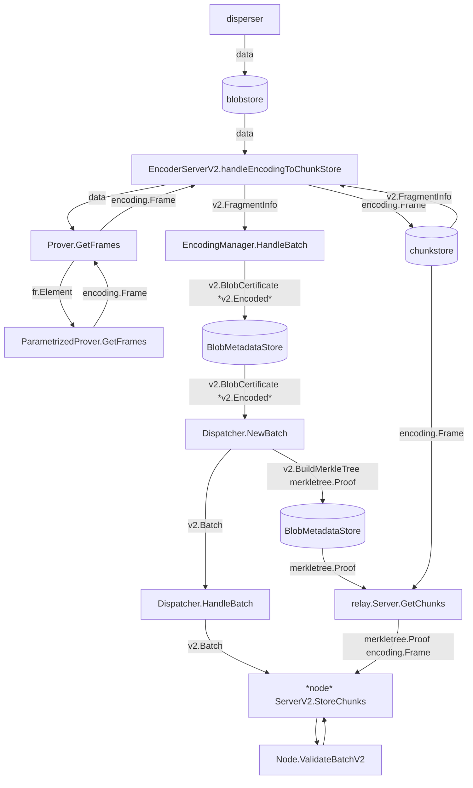

```mermaid
flowchart TB

disperser -- data --> blobstore

blobstore -- data --> encoder

encoder -- data --> prover
prover -- encoding.Frame --> encoder

prover -- fr.Element --> prover1
prover1 -- encoding.Frame --> prover

encoder -- encoding.Frame --> chunkstore
chunkstore -- v2.FragmentInfo --> encoder

encoder -- v2.FragmentInfo --> encmgr

encmgr -- v2.BlobCertificate *v2.Encoded* --> certstore

certstore -- v2.BlobCertificate *v2.Encoded* --> dispatcher

dispatcher -- v2.BuildMerkleTree merkletree.Proof --> verifstore 
dispatcher -- v2.Batch --> dispatcher1
dispatcher1 -- v2.Batch --> node

%% relay
verifstore -- merkletree.Proof --> relay
chunkstore -- encoding.Frame --> relay
relay -- merkletree.Proof encoding.Frame --> node

node --> validate
validate --> node

dispatcher[Dispatcher.NewBatch]
dispatcher1[Dispatcher.HandleBatch]
prover[Prover.GetFrames]
prover1[ParametrizedProver.GetFrames]
encmgr[EncodingManager.HandleBatch]
encoder[EncoderServerV2.handleEncodingToChunkStore]
relay[relay.Server.GetChunks]

node[*node* ServerV2.StoreChunks]
validate[Node.ValidateBatchV2]

blobstore[(blobstore)]
chunkstore[(chunkstore)]
verifstore[(BlobMetadataStore)]
certstore[(BlobMetadataStore)]
```