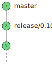
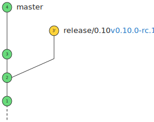
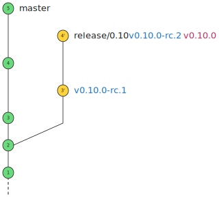
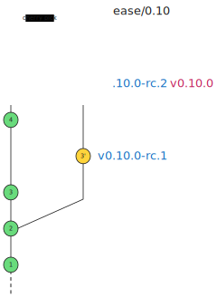
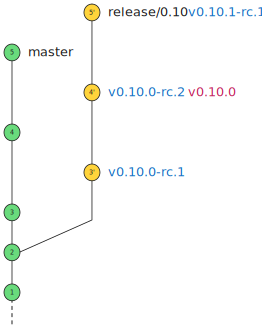
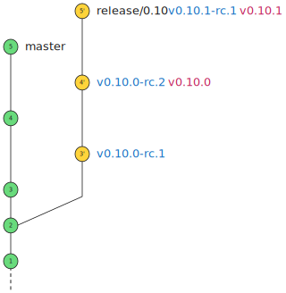

# Release Example

This file is a visual example of the release process outlined in [Release Process](release-process.md) document.

1. Initial state

    

2. Cut release branch `release/0.10`

    

3. Commit `feature 3` to `master`

    

4. Cherry pick `feature 3` to `release/0.10`

    

5. Create tag `v0.10.0-rc.1`

    

6. Commit `feature 4` to `master`

    

7. Cherry pick `feature 4` to `release/0.10`

    

8. Create tag `v0.10.0-rc.2`

    

9. Create production tag `v0.10.0`

    

10. Commit `feature 5` to `master`

    

11. Cherry pick `feature 5` to `release/0.10`

    

12. Create tag `v0.10.1-rc.1`. Since production tag `v0.10.0` has already been created, it is no longer permissible to create
any `v0.10.0-rc.X` tags

    

13. Create production tag `v0.10.1`

    
