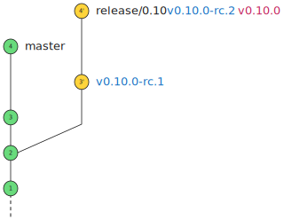

# Release Example

This file is a visual example of the release process outlined in [Release Process](release-process.md) document.

1. Initial state

    

2. Cut release branch `release/0.10`

    

3. Commit `bugfix 3` to `master`

    

4. Cherry pick `bugfix 3` to `release/0.10`

    

5. Create tag `v0.10.0-rc.1`

    

6. Commit `bugfix 4` to `master`

    

7. Cherry pick `bugfix 4` to `release/0.10`

    

8. Create tag `v0.10.0-rc.2`

    

9. Create production tag `v0.10.0`

    

10. Merge hotfix PR directly to `release/0.10`

    

11. Create tag `v0.10.1-rc.1`. Since production tag `v0.10.0` has already been created, it is no longer permissible to create
any `v0.10.0-rc.X` tags

    

12. Create production tag `v0.10.1`

    

(Note for document maintainers: the source diagrams can be found [here](https://link.excalidraw.com/l/1XPZRMVbRNH/32yMzzv0C50).
Please be sure to use consistent svg format by exporting from Excalidraw. Output svgs should be scaled down to 40% of the original
size, for the sake of consistency.)