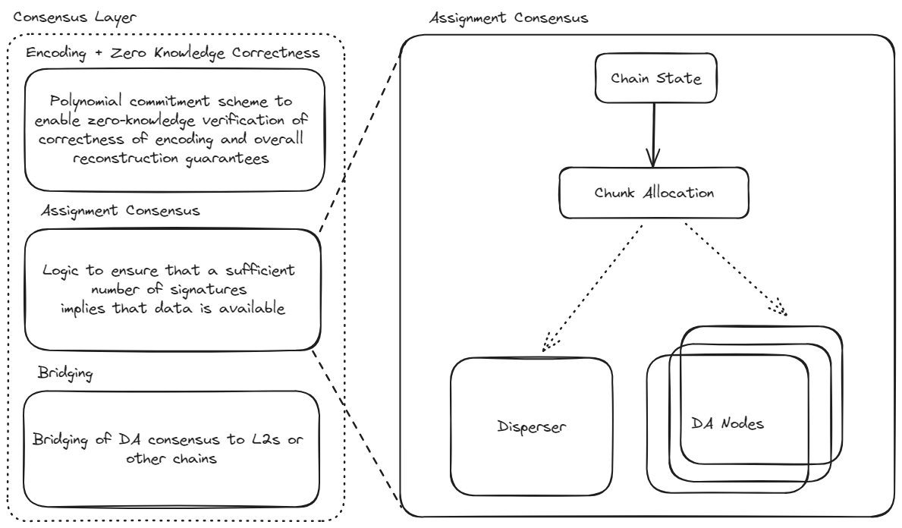

## Assignment Module

The assignment module is essentially a rule which takes in the Ethereum chain state and outputs an allocation of chunks to DA operators. This can be generalized to a function that outputs a set of valid allocations.

A chunk assignment has the following parameters: 
1) **Indices**: the chunk indices that will be assigned to each DA node. Some DA nodes receive more than one chunk.
2) **ChunkLength**: the length of each chunk (measured in number of symbols, as defined by the encoding module). We currently require all chunks to be of the same length, so this parameter is a scalar. 

The assignment module is implemented by the `AssignmentCoordinator` interface. 

### Assignment Logic

The standard assignment coordinator implements a very simple logic for determining the number of chunks per node and the chunk length, which we describe here.

**Chunk Length**

Chunk lengths must be sufficiently small that operators with a small proportion of stake will be able to receive a quantity of data commensurate with their stake share. For each operator $i$, let $S_i$ signify the amount of stake held by that operator. 

We require that the chunk size $C$ satisfy

$$
C \le \text{NextPowerOf2}\left(\frac{B}{\gamma}\max\left(\frac{\min_jS_j}{\sum_jS_j}, \frac{1}{M_\text{max}} \right) \right)
$$

where $\gamma = \beta-\alpha$, with $\alpha$ and $\beta$ the adversary and quorum thresholds as defined in the [Overview](../overview.md).

This means that as long as an operator has a stake share of at least $1/M_\text{max}$, then the encoded data that they will receive will be within a factor of 2 of their share of stake. Operators with less than $1/M_\text{max}$ of stake will receive no more than a $1/M_\text{max}$ of the encoded data. $M_\text{max}$ represents the maximum number of chunks that the disperser can be required to encode per blob. This limit is included because proving costs scale somewhat super-linearly with the number of chunks. 

In the future, additional constraints on chunk length may be added; for instance, the chunk length may be set in order to maintain a fixed number of chunks per blob across all system states. Currently, the protocol does not mandate a specific value for the chunk length, but will accept the range satisfying the above constraint. The `CalculateChunkLength` function is provided as a convenience function that can be used to find a chunk length satisfying the protocol requirements. 

**Index Assignment**

For each operator $i$, let $S_i$ signify the amount of stake held by that operator. We want for the number of chunks assigned to operator $i$ to satisfy

$$
\frac{\gamma m_i C}{B} \ge \frac{S_i}{\sum_j S_j}
$$

Let

$$
m_i = \text{ceil}\left(\frac{B S_i}{C\gamma \sum_j S_j}\right)\tag{1}
$$

**Correctness**
Let's show that any sets $U_q$ and $U_a$ satisfying the constraints in the [Consensus Layer Overview](../overview.md#consensus-layer), the data held by the operators $U_q \setminus U_a$ will constitute an entire blob. The amount of data held by these operators is given by

$$
\sum_{i \in U_q \setminus U_a} m_i C
$$

We have from (1) and from the definitions of $U_q$ and $U_a$ that

$$
\sum_{i \in U_q \setminus U_a} m_i C \ge  =\frac{B}{\gamma}\sum_{i \in U_q \setminus U_a}\frac{S_i}{\sum_j S_j} = \frac{B}{\gamma}\frac{\sum_{i \in U_q} S_i - \sum_{i \in U_a} S_i}{\sum_jS_j} \ge B \frac{\beta-\alpha}{\gamma} = B  \tag{2}
$$

Since the unique data held by these operators exceeds the size of a blob, the encoding module ensures that the original blob can be reconstructed from this data. 

## Validation Actions

Validation with respect to assignments is performed at different layers of the protocol:

### DA Nodes

When the DA node receives a `StoreChunks` request, it performs the following validation actions relative to each blob header:
- It uses the `ValidateChunkLength` to validate that the `ChunkLength` for the blob satisfies the above constraints. 
- It uses `GetOperatorAssignment` to calculate the chunk indices for which it is responsible, and verifies that each of the chunks that it has received lies on the polynomial at these indices (see [Encoding validation actions](./encoding.md#validation-actions))

This step ensures that each honest node has received the blobs for which it is accountable.

Since the DA nodes will allow a range of `ChunkLength` values, as long as they satisfy the constraints of the protocol, it is necessary for there to be consensus on the `ChunkLength` that is in use for a particular blob and quorum. For this reason, the `ChunkLength` is included in the `BlobQuorumParam` which is hashed to create the merkle root contained in the `BatchHeaderHash` signed by the DA nodes. 

### Rollup Smart Contract

When the rollup confirms its blob against the EigenDA batch, it checks that the `QuorumThreshold` for the blob is greater than the `AdversaryThreshold`. This means that if the `ChunkLength` determined by the disperser is invalid, the batch cannot be confirmed as a sufficient number of nodes will not sign.
