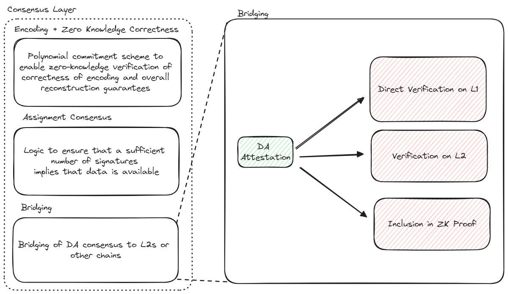

## Signature verification and bridging

### L1 Bridging

Bridging a DA attestion for a specific blob requires the following stages:
- *Bridging the batch attestation*. This involves checking the aggregate signature of the DA nodes for the batch, and tallying up the total amount of stake the signing nodes.
- *Verifying the blob inclusion*. Each batch contains a the root of a a Merkle tree whose leaves correspond to the blob headers contained in the batch. To verify blob inclusion, the associate Merkle proof must be supplied and evaluated. Furthermore, the specific quorum threshold requirement for the blob must be checked against the total amount of signing stake for the batch. 

For the first stage, EigenDA makes use of the EigenLayer's default utilities for managing operator state, verifying aggregate BLS signatures, and checking the total stake held by the signing operators.

For the second stage, the EigenDA provides a utility contract with a `verifyBlob` method which rollups would typically integrate into their fraud proof pathway in the following manner: 
1. The rollup sequencer posts all lookup data needed to verify a blob against a batch to the rollup inbox contract. 
2. To initiate a fraud proof, the challenger must call the `verifyBlob` method with the supplied lookup data. If the blob does not verify correctly, the blob is considered invalid. 

#### Reorg behavior (needs to be rewritten)

One aspect of the chain behavior of which the attestation protocol must be aware is that of chain reorganization. The following requirements relate to chain reorganizations:
1. Signed attestations should remain valid under reorgs so that a disperser never needs to resend the data and gather new signatures.
2. If an attestation is reorged out, a disperser should always be able to simply resubmit it after a specific waiting period.
3. Payloads constructed by a disperser and sent to DA nodes should never be rejected due to reorgs.

These requirements result in the following design choices:
- Chunk allotments should be based on registration state from a finalized block.
- If an attestation is reorged out and if the transaction containing the header of a batch is not present within `BLOCK_STALE_MEASURE` blocks since `referenceBlockNumber` and the block that is `BLOCK_STALE_MEASURE` blocks since `referenceBlockNumber`  is finalized, then the disperser should again start a new dispersal with that blob of data. Otherwise, the disperser must not re-submit another transaction containing the header of a batch associated with the same blob of data.
- Payment payloads sent to DA nodes should only take into account finalized attestations.

The first and second decisions satisfy requirements 1 and 2. The three decisions together satisfy requirement 3.

Whenever the `confirmBatch` method of the [ServiceMananger.sol](../contracts-service-manager.md) is called, the following checks are used to ensure that only finalized registration state is utilized:
- Stake staleness check. The `referenceBlockNumber` is verified to be within `BLOCK_STALE_MEASURE` blocks before the confirmation block.This is to make sure that batches using outdated stakes are not confirmed. It is assured that stakes from within `BLOCK_STALE_MEASURE` blocks before confirmation are valid by delaying removal of stakes by `BLOCK_STALE_MEASURE + MAX_DURATION_BLOCKS`.