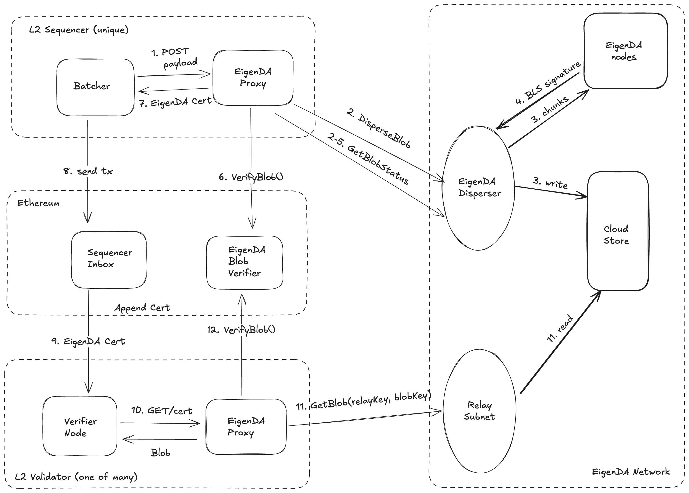
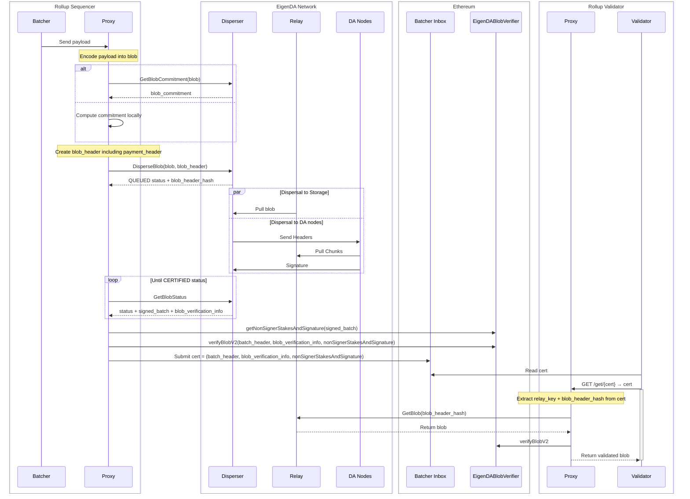
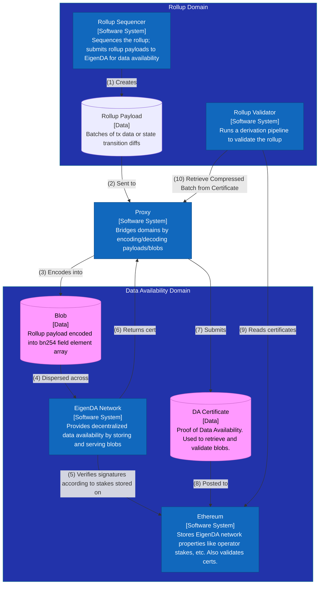

# EigenDA V2 Integration Spec

# Overview

The [EigenDA V2](https://docs.eigenda.xyz/releases/v2) documentation describes the architectural changes that allow for important network performance increases. From the point of view of rollup integrations, there are three important new features:

1. Blob batches are no longer bridged to Ethereum with dispersals now being confirmed once a batch has been `CERTIFIED`  (i.e, signed over by operator set). This operation takes 10-20 seconds - providing lower confirmation latency and higher throughput for the rollup. Verification of the blobs now needs to be done by the rollup stack.
2. Centralized (accounting done by disperser) payments model
3. A new relayer API from which to retrieve blobs (distinct from the disperser API which is now only used to disperse blobs)

# Diagrams

We will refer to the below diagrams throughout the text.

### High Level Diagram



### Sequence Diagram



### Ultra High Resolution Diagram


# APIs

Below we give a summary of the APIs relevant to understanding the [high-level diagram](https://www.notion.so/EigenDA-V2-Integration-Spec-12d13c11c3e0800e8968f31ef2c6a2b3?pvs=21) above.

### Proxy

See our gorilla/mux [routes](https://github.com/Layr-Labs/eigenda-proxy/blob/main/server/routing.go) for full detail, but the gist is that proxy presents a REST endpoint based off of the [op da-server spec](https://specs.optimism.io/experimental/alt-da.html#da-server) to rollup batchers:

```
# OP
POST /put body: <preimage_bytes> → <hex_encoded_commitment>
GET /get/{hex_encoded_commitment} → <preimage_bytes>
# NITRO
Same as OP but add a `?commitment_mode=standard` query param 
to both POST and GET methods.
```

### Disperser

The disperser presents a [grpc v2 service](https://github.com/Layr-Labs/eigenda/blob/ce89dab18d2f8f55004002e17dd3a18529277845/api/proto/disperser/v2/disperser_v2.proto#L10) endpoint

```bash
$ EIGENDA_DISPERSER_PREPROD=disperser-preprod-holesky.eigenda.xyz:443
$ grpcurl $EIGENDA_DISPERSER_PREPROD list disperser.v2.Disperser
disperser.v2.Disperser.DisperseBlob
disperser.v2.Disperser.GetBlobCommitment
disperser.v2.Disperser.GetBlobStatus
disperser.v2.Disperser.GetPaymentState
```

### Relay

Relays similarly present a [grpc service](https://github.com/Layr-Labs/eigenda/blob/ce89dab18d2f8f55004002e17dd3a18529277845/api/proto/relay/relay.proto#L10) endpoint

```bash
$ EIGENDA_RELAY_PREPROD=relay-1-preprod-holesky.eigenda.xyz:443
$ grpcurl $EIGENDA_RELAY_PREPROD list relay.Relay
relay.Relay.GetBlob
relay.Relay.GetChunks
```

### Contracts

The most important contract for rollups integrations is the EigenDACertVerifier, which presents a [function](https://github.com/Layr-Labs/eigenda/blob/98e21397e3471d170f3131549cdbc7113c0cdfaf/contracts/src/core/EigenDACertVerifier.sol#L86) to validate Certs:

```solidity
/**
 * @notice Verifies a blob cert for the specified quorums with the default security thresholds
 * @param batchHeader The batch header of the blob 
 * @param blobInclusionInfo The inclusion proof for the blob cert
 * @param nonSignerStakesAndSignature The nonSignerStakesAndSignature to verify the blob cert against
 */
function verifyDACertV2(
    BatchHeaderV2 calldata batchHeader,
    BlobInclusionInfo calldata blobInclusionInfo,
    NonSignerStakesAndSignature calldata nonSignerStakesAndSignature
) external view
```

# Rollup Payload Lifecycle

How is a rollup’s payload (compressed batches of transactions or state transition diffs) encoded and made available on the EigenDA network?



At a high-level, a rollup sequencer needs to make it’s `payload` available for download from validators of its network. The EigenDA network makes use of cryptographic concepts such as KZG commitments as fundamental building blocks. Because of this, it can only work with `eigenda blobs` (herreafter referred to simply as `blobs`; see technical definition below) of data. The [EigenDA proxy](https://github.com/Layr-Labs/eigenda-proxy) is used to bridge the rollup domain (which deals with payloads) and the EigenDA domain (which deals with blobs).

As an example, an op-stack Ethereum rollup’s `payload` is a compressed batch of txs (called a [frame](https://specs.optimism.io/protocol/derivation.html#frame-format)). This frame gets sent to Ethereum to be made available either as a simple tx, or as a [`4844 blob`](https://eips.ethereum.org/EIPS/eip-4844#type-aliases) (using a [blob tx](https://eips.ethereum.org/EIPS/eip-4844#blob-transaction)). Using EigenDA instead of Ethereum for data availability works similarly: the payloads are encoded into an `eigenda blob`  and dispersed to the EigenDA network via an EigenDA disperser. The disperser eventually returns a `certificate` containing signatures of EigenDA operators certifying the availability of the data, which is then posted to Ethereum as the `input` field of a normal tx. Note that due to the rollup settling on Ethereum, Ethereum DA is needed, but only to make the `cert` available, which is much smaller than the `blob` containing the `payload` which is made available on EigenDA instead.

**Data structs**:

- `Payload`: piece of data that an EigenDA client (rollup, avs, etc.) wants to make available. This is typically compressed batches of transactions or state transition diffs.
- `EncodedPayload`: payload encoded into a list of bn254 field elements (each 32 bytes), typically with a prefixed field element containing the payload length in bytes, such that the payload can decoded.
- `PayloadPolynomial` : encodedPayload padded with 0s to the next power of 2 (if needed) and interpreted either as evaluations (`PolyCoeff`) or coefficients (`PolyEval`) of a polynomial. Because the EigenDA network interprets blobs as coefficients, a `PolyEval` will need to be IFFT’d into a `PolyCoeff` before being dispersed.
- `(EigenDA) Blob`: array of bn254 field elements of length a power of two. Interpreted by the network as coefficients of a polynomial. Equivalent to `PolyCoeff`.
- `Blob Header`: contains the information necessary to uniquely identify a BlobDispersal request.
- `Blob Certificate`: Signed BlobHeader along with relayKeys, which uniquely identify a relay service for DA Nodes to retrieve chunks from and clients to retrieve full blobs from.
- `Batch`: Batch of blobs whose blob certs are grouped into a merkle tree and dispersed together for better network efficiency.
- `DA Certificate` (or `DACert`): contains the information necessary to retrieve and verify a blob from the EigenDA network, along with a proof of availability.
- `AltDACommitment`: RLP serialized `DACert` prepended with rollup-specific header bytes. This commitment is what gets sent to the rollup’s batcher inbox.

**Contracts**

- `EigenDACertVerifier`: contains one main important function verifyCertV2 which is used to verify `certs`.
- `EigenDAThresholdRegistry`: contains signature related thresholds and blob→chunks encoding related parameters.
- `EigenDARelayRegistry`: contains EigenDA network registered Relays’ Ethereum address and DNS hostname or IP address.
- `EigenDADisperserRegistry` : contains EigenDA network registered Dispersers’ Ethereum address.

**Lifecycle phases**:

- Sequencer:
    - `Encoding`: Payload → Blob
    - `BlobHeader Construction`: Blob → BlobHeader
    - `Dispersal`: (Blob, BlobHeader) → Certificate
        - Certificate+Blob `Validation`
        - Unhappy path: `Failover` to EthDA
    - `Posting`: Certificate → Ethereum tx
- Validator (exact reverse of sequencer):
    - `Reading`: Ethereum tx → Certificate
    - `Retrieval`: Certificate → Blob
        - Certificate+Blob `Validation`
    - `Decoding`: Blob → Payload

## Data Structs

The below diagram represents the transformation from a rollup `payload` to the different structs that are allowed to be dispersed


### Payload

A client `payload` is whatever piece of data the EigenDA client wants to make available. For optimistic rollups this would be compressed batches of txs (frames). For (most) zk-rollups this would be compressed state transitions. For AVSs it could be Proofs, or Pictures, or whatever.

A `payload` must fit inside an EigenDA blob to be dispersed. See the allowed blob sizes in the [Blob](https://www.notion.so/EigenDA-V2-Integration-Spec-12d13c11c3e0800e8968f31ef2c6a2b3?pvs=21) section.

### EncodedPayload

An `encodedPayload` is the bn254 encoding of the `payload`. This is an intermediary processing step, but useful to give a name to it. The encoding must respect the same constraints as those on the blob:

> Every 32 bytes of data is interpreted as an integer in big endian format. Each such integer must stay in the valid range to be interpreted as a field element on the bn254 curve. The valid range is 0 <= x < 21888242871839275222246405745257275088548364400416034343698204186575808495617.
> 

The eigenda codebase currently only supports [encoding version 0x0](https://github.com/Layr-Labs/eigenda/blob/f591a1fe44bced0f17edef9df43aaf13929e8508/api/clients/codecs/blob_codec.go#L12), which encodes as follows:

```solidity
[0x00, version_byte, big-endian uint32 len(payload), 0x00, 0x00,...] +
    [0x00, payload[0:31], 0x00, payload[32:63],..., 
        0x00, payload[n:len(payload)], 0x00, ..., 0x00]
```

where the last chunk is padded with 0s to be a multiple of 32.

So for eg, the payload `hello` would be encoded as

```solidity
[0x00, 0x00, 0x00, 0x00, 0x00, 0x05, 0x00, 0x00,...] +
    [0x00, 'h', 'e', 'l', 'l', 'o', 0x00 * 26]
```

### PayloadPolynomial

EigenDA uses [KZG commitments](https://dankradfeist.de/ethereum/2020/06/16/kate-polynomial-commitments.html), which represent a commitment to a function. Abstractly speaking, we thus need to represent the encodedPayload as a polynomial. We have two choices: either treat the data as the coefficients of a polynomial, or as evaluations of a polynomial. In order to convert between these two representations, we make use of [FFTs](https://vitalik.eth.limo/general/2019/05/12/fft.html) which require the data to be a power of 2. Thus, `PolyEval` and `PolyCoeff` are defined as being an `encodedPayload` padded with 0s to the next power of 2 (if needed) and interpreted as desired.

Once an interpretation of the data has been chosen, one can convert between them as follows:

```solidity
PolyCoeff --FFT--> PolyEval
PolyCoef <--IFFT-- PolyEval
```

EigenDA works differently from Ethereum  network interprets blobs as coefficients, only `PolyCoeff`s can be submitted as a `blob` to the Disperser. A `PolyEval` will thus need to be IFFT’d into a `PolyCoeff` before being dispersed. One benefit of interpreting the data as being evaluations is that it one can use point opening proofs to reveal a single field element (32 byte chunk) of data at a time. This is useful for interactive fraud proofs (e.g. see how [optimism fraud proves 4844 blobs](https://specs.optimism.io/fault-proof/index.html#type-5-global-eip-4844-point-evaluation-key)), but less so for validity proofs that zk rollups use.

### Blob

A `blob` is a bn254 field elements array that has a power of 2. It is interpreted by the EigenDA network as containing the coefficients of a polynomial (unlike Ethereum which [treats blobs as being evaluations of a polynomial](https://github.com/ethereum/consensus-specs/blob/dev/specs/deneb/polynomial-commitments.md#cryptographic-types)).

An `encodedPayload` can thus be transformed into a `blob` by being padded with 0s to a power of 2, with size at most 16MiB. There is no minimum size, but any blob smaller than 128KiB will be charged for 128KiB.

### BlobHeader And BlobCertificate

The `blobHeader` is submitted alongside the `blob` as part of the DisperseBlob request, and the hash of its rlp serialization (`blobKey`aka `blobHeaderHash`) is a unique identifier for a blob dispersal. This unique identifier is used to retrieve the blob.


We refer to the eigenda [core spec](https://www.notion.so/EigenDA-V2-Release-17013c11c3e080edb756e353456ab77a?pvs=21) for full details of this struct. The `version` is modified

### DACertificate

A `certicate` (or short `cert`) contains all the information needed to retrieve a blob from the EigenDA network, as well as validate it.


A `cert` contains the three data structs needed to call [verifyDACertV2](https://github.com/Layr-Labs/eigenda/blob/98e21397e3471d170f3131549cdbc7113c0cdfaf/contracts/src/core/EigenDACertVerifier.sol#L86) on the EigenDACertVerifier.sol contract. Please refer to the eigenda core spec for more details, but in short, the `BlobCertificate` is included as a leaf inside the merkle tree identified by the `batch_root` in the `BatchHeader`. The `BlobInclusionInfo` contains the information needed to prove this merkle tree inclusion. The `NonSignerStakesAndSignature` contains the aggregated BLS signature `sigma` of the EigenDA validators. `sigma` is a signature over the `BatchHeader`.


### AltDACommitment

In order to be understood by each rollup stack’s derivation pipeline, the cert must be prepended with header bytes, to turn it into an [`altda-commitment`](https://github.com/Layr-Labs/eigenda-proxy?tab=readme-ov-file#commitment-schemas) respective to each stack:

- [op](https://specs.optimism.io/experimental/alt-da.html#input-commitment-submission) preprends 3 bytes: `version_byte`, `commitment_type`, `da_layer_byte`
- nitro prepends 1 byte: `version_byte`

## Smart Contracts

The smart contracts can be found [here](https://github.com/Layr-Labs/eigenda/tree/master/contracts/src/core).


### EigenDACertVerifier

Contains a single function verifyDACertV2 which is used to verify `certs` . This function’s logic is described in the [Cert Validation](https://www.notion.so/EigenDA-V2-Integration-Spec-12d13c11c3e0800e8968f31ef2c6a2b3?pvs=21) section.

### EigenDAThreshold Registry

The [EigenDAThresholdRegistry](https://github.com/Layr-Labs/eigenda/blob/c4567f90e835678fae4749f184857dea10ff330c/contracts/src/core/EigenDAThresholdRegistryStorage.sol#L22) contains two sets of fundamental parameters:

```solidity
/// @notice mapping of blob version id to the params of the blob version
mapping(uint16 => VersionedBlobParams) public versionedBlobParams;
struct VersionedBlobParams {
    uint32 maxNumOperators;
    uint32 numChunks;
    uint8 codingRate;
}

/// @notice Immutable security thresholds for quorums
SecurityThresholds public defaultSecurityThresholdsV2;
struct SecurityThresholds {
    uint8 confirmationThreshold;
    uint8 adversaryThreshold;
}
```

The securityThresholds are currently immutable. These are the same as the [previously called](https://github.com/Layr-Labs/eigenda/blob/master/docs/spec/overview.md#security-model) liveness and safety thresholds:

- Confirmation Threshold (fka liveness threshold): minimum percentage of stake which an attacker must control in order to mount a liveness attack on the system.
- Adversary Threshold (fka safety threshold): total percentage of stake which an attacker must control in order to mount a first-order safety attack on the system.

Their values are

```solidity
defaultSecurityThresholdsV2 = {
    confirmationThreshold = ??,
    adversaryThreshold = ??,
}
```

A new BlobParam version is very infrequently introduced by the EigenDA Foundation Governance, and rollups can choose which version they wish to use when dispersing a blob. Currently there is only version 0 defined, with parameters:

```solidity
versionedBlobParams[0] = {
    maxNumOperators = ??,
    numChunks = 8192,
    codingRate = ??,
}
```

The five parameters are intricately related by this formula which is also verified onchain by the [verifyBlobSecurityParams](https://github.com/Layr-Labs/eigenda/blob/77d4442aa1b37bdc275173a6b27d917cc161474c/contracts/src/libraries/EigenDABlobVerificationUtils.sol#L386) function: 

$$
numChunks \cdot (1 - \frac{100}{\gamma * codingRate}) \geq maxNumOperators
$$

where $\gamma = confirmationThreshold - adversaryThreshold$

### EigenDARelayRegistry

Contains EigenDA network registered Relays’ Ethereum address and DNS hostname or IP address. `BlobCertificate`s contain `relayKey`(s), which can be transformed into that relay’s URL by calling [relayKeyToUrl](https://github.com/Layr-Labs/eigenda/blob/77d4442aa1b37bdc275173a6b27d917cc161474c/contracts/src/core/EigenDARelayRegistry.sol#L35).

### EigenDADisperserRegistry

Contains EigenDA network registered Dispersers’ Ethereum address. The EigenDA Network currently only supports a single Disperser, hosted by EigenLabs. The Disperser’s URL is currently static and unchanging, and can be found on our docs site in the [Networks](https://docs.eigenda.xyz/networks/mainnet) section.

## Phases

### Encoding

This phase is done inside the eigenda-proxy, because the proxy acts as the “bridge” between the Rollup Domain and Data Availability Domain (see [diagram](https://www.notion.so/EigenDA-V2-Integration-Spec-12d13c11c3e0800e8968f31ef2c6a2b3?pvs=21) above).

A `payload` contains an arbitrary byte array. The DisperseBlob endpoint accepts `encodedPayload`s, which are bn254 

### BlobHeader Construction

The BlobHeader contains 4 main sections that we need to construct.

**Version**

The blobHeader version refers to one of the versionedBlobParams struct defined in the [EigenDAThresholdRegistry](https://www.notion.so/EigenDA-V2-Integration-Spec-12d13c11c3e0800e8968f31ef2c6a2b3?pvs=21) contract.

**QuorumNumbers**

QuorumNumbers represents a list a quorums that are required to sign over and make the blob available. The quorums 0 represents the ETH quorum, and quorum 1 represents the EIGEN quorum, and both of these are required. Custom quorums can also be added to this list.

**BlobCommitment**

The BlobCommitment is the unique identifier for an EigenDA Blob. It can either be computed locally from the blob, or one can ask the disperser to generate it via the `GetBlobCommitment` endpoint.

```protobuf
message BlobCommitment {
  // A G1 commitment to the blob data.
  bytes commitment = 1;
  // A G2 commitment to the blob data.
  bytes length_commitment = 2;
    // Used with length_commitment to assert the correctness of the `length` field below.
  bytes length_proof = 3;
  // Length in bn254 field elements (32 bytes) of the blob. Must be a power of 2.
  uint32 length = 4;
}
```

Unlike Ethereum blobs which are all 128KiB, EigenDA blobs can be any power of 2 length between 32KiB and 16MiB (currently), and so the `commitment` alone is not sufficient to prevent certain attacks:

- Why is a commitment to the length of the blob necessary?
    
    There are different variants of the attack. The basic invariant the system needs to satisfy is that with the chunks from sufficient set of validators, you can get back the full blob. So the total size of the chunks held by these validators needs to exceed the blob size. If I don't know the blob size (or at least an upper bound), there's no way for the system to validate this invariant.
    Here’s a simple example. Assume a network of 8 DA nodes, and coding ratio 1/2. For a `blob` containing 128 field elements (FEs), each node gets 128*2/8=32 FEs, meaning that any 4 nodes can join forces and reconstruct the data. Now assume a world without length proof; a malicious disperser receives the same blob, uses the same commitment, but claims that the blob only had length 4 FEs. He sends each node 4*2/8=1 FE. The chunks submitted to the nodes match the commitment, so the nodes accept and sign over the blob’s batch. But now there are only 8 FEs in the system, which is not enough to reconstruct the original blob (need at least 128 for that).
    

> Note that the length here is the length of the blob (power of 2), which is different from the payload_length encoded as part of the `PayloadHeader` in the `blob` itself (see the [encoding section](https://www.notion.so/EigenDA-V2-Integration-Spec-12d13c11c3e0800e8968f31ef2c6a2b3?pvs=21)).
> 

**PaymentHeader**

The paymentHeader specifies how the blob dispersal to the network will be paid for. There are 2 main modes of payment, the permissionless pay-per-blob model and the permissioned reserved-bandwidth approach. See the [Payments Spec](https://www.notion.so/Payments-Release-17013c11c3e080759af3e5aae560aa05?pvs=21) for full details, we will only describe how to set these 4 fields here.

```protobuf
message PaymentHeader {
  // The account ID of the disperser client. This should be a hex-encoded string of the ECSDA public key
  // corresponding to the key used by the client to sign the BlobHeader.
  string account_id = 1;
  uint32 reservation_period = 2;
  bytes cumulative_payment = 3;
    // The salt is used to ensure that the payment header is intentionally unique.
  uint32 salt = 4;
}
```

Users who want to pay-per-blob need to set the cumulative_payment. Users who have already paid for reserved-bandwidth can set the reservation_period.

An rpc call to the Disperser’s `GetPaymentState` method can be made to query the current state of an `account_id`. A client can query for this information on startup, cache it and then update it manually when making pay-per-blob payments, by keeping track of its current `cumulative_payment` to set it correctly for subsequent dispersals.

The `salt` is needed for reserved bandwidth users: given that the `blob_header_hash` uniquely identifies a dispersal, if a dispersal ever fails (see next section), then to redisperse the same blob, a new unique `blob_header` must be created. If the `reservation_period` is still the same (currently set to 300 second intervals), then the salt must be increased (or randomly changed) to allow resubmitting the same `blob`.

### Blob Dispersal

The `DisperseBlob` method takes a `blob` and `blob_header` as input. Dispersal entails taking a blob, reed-solomon encoding it into chunks, dispersing those to the EigenDA nodes, retrieving their signatures, creating a `cert` from them, and returning that cert to the client. The disperser batches blob for a few seconds before dispersing them to nodes, so an entire dispersal process can take north of 10 seconds. For this reason, the API has been designed asynchronously with 2 relevant methods:

```protobuf
// Async call which queues up the blob for processing and immediately returns.
rpc DisperseBlob(DisperseBlobRequest) returns (DisperseBlobReply) {}
// Polled for the blob status updates, until a terminal status is received
rpc GetBlobStatus(BlobStatusRequest) returns (BlobStatusReply) {}

message DisperseBlobRequest {
  bytes blob = 1;
  common.v2.BlobHeader blob_header = 2;
  bytes signature = 3;
}
message BlobStatusReply {
  BlobStatus status = 1;
  SignedBatch signed_batch = 2;
  BlobVerificationInfo blob_verification_info = 3;
}

// Intermediate states: QUEUED, ENCODED
// Terminal states: CERTIFIED, UNKNOWN, FAILED, INSUFFICIENT_SIGNATURES
enum BlobStatus {
  UNKNOWN = 0; // functionally equivalent to FAILED but for unknown unknown bugs
  QUEUED = 1; // Initial state after a DisperseBlob call returns
  ENCODED = 2; // Reed-Solomon encoded into chunks ready to be dispersed to DA Nodes
  CERTIFIED = 3; // blob has been dispersed and attested by NA nodes
  FAILED = 4; // permanent failure (for reasons other than insufficient signatures)
  INSUFFICIENT_SIGNATURES = 5;
}
```

After a successful DisperseBlob rpc call, `BlobStatus.QUEUED` is returned. To retrieve a `cert`, the `GetBlobStatus` rpc shall be polled until a terminal status is reached. If `BlobStatus.CERTIFIED` is received, the `signed_batch` and `blob_verification_info` fields of the `BlobStatusReply` will be returned and can be used to create the `cert` . Any other terminal status indicates failure, and a new blob dispersal will need to be made.

**Failover to EthDA**

The proxy can be configured to retry any failed terminal status n times, after which it returns to the rollup a `503` HTTP status code which rollup batchers can use to failover to EthDA. See [here](https://github.com/ethereum-optimism/specs/issues/434) for more info.

### BlobStatusReply → Cert

This is not necessarily part of the spec but is currently needed given that the disperser doesn’t actually return a cert, so we need a bit of data processing to transform its returned value into a Cert. The transformation is visualized in the [Ultra High Res Diagram](https://www.notion.so/EigenDA-V2-Integration-Spec-12d13c11c3e0800e8968f31ef2c6a2b3?pvs=21). The main difference is just calling the [`getNonSignerStakesAndSignature`](https://github.com/Layr-Labs/eigenda/blob/d9cf91e22b6812f85151f4d83aecc96bae967316/contracts/src/core/EigenDABlobVerifier.sol#L222) helper function within the new `EigenDACertVerifier` contract to create the `NonSignerStakesAndSignature` struct. The following pseudocode below exemplifies this necessary preprocessing step:

```python

class CertV2:
    batch_header: any  # You can specify proper types here
    blob_verification_proof: any
    nonsigner_stake_sigs: any

def get_cert_v2(blob_header_hash, blob_verifier_binding) -> CertV2:
    """
    V2 cert construction pseudocode
    @param blob_header_hash: key used for referencing blob status from disperser
    @param blob_verifier_binding: ABI contract binding used for generating nonsigner metadata
    @return v2_cert: EigenDA V2 certificate used by rollup 
    """
  # Call the disperser for the info needed to construct the cert
    blob_status_reply = disperser_client.get_blob_status(blob_header_hash)
    
    # Validate the blob_header received, since it uniquely identifies
    # an EigenDA dispersal.
    blob_header_hash_from_reply = blob_status_reply
                                                                .blob_verification_info
                                                                .blob_certificate
                                                                .blob_header
                                                                .Hash()
    if blob_header_hash != blob_header_hash_from_reply {
        throw/raise/panic
    }

    # Extract first 2 cert fields from blob status reply
    batch_header = blob_status_reply.signed_batch.batch_header
    blob_verification_proof = blob_status_reply.blob_verification_info
    
    # Construct NonSignerStakesAndSignature
    nonsigner_stake_sigs = blob_verifier_binding.[getNonSignerStakesAndSignature](https://www.notion.so/EigenDA-Proxy-V2-Changes-14813c11c3e080ce9f40fdc39c2062d0?pvs=21)(
                                                     blob_status_reply.signed_batch)
                                                 
  return Cert(batch_header, blob_verification_proof, nonsigner_stake_sigs)
```

### Posting to Ethereum

The proxy converts the `cert` to an [`altda-commitment`](https://www.notion.so/EigenDA-V2-Integration-Spec-12d13c11c3e0800e8968f31ef2c6a2b3?pvs=21) ready to be submitted to the batcher’s inbox without any further modifications by the rollup stack.

### Retrieval

There are two main blob retrieval paths:

1. decentralized trustless retrieval: retrieve chunks from Validators are recreate the `blob` from them.
2. centralized trustful retrieval: the same [Relay API](https://docs.eigenda.xyz/releases/v2#relay-interfaces) that Validators use to download chunks, can also be used to retrieve full blobs.

EigenDA V2 has a new [Relay API](https://docs.eigenda.xyz/releases/v2#relay-interfaces) for retrieving blobs from the disperser. The `GetBlob` method takes a `blob_key` as input, which is a synonym for `blob_header_hash`. Note that `BlobCertificate` (different from `Cert`!) contains an array of `relay_keys`, which are the relays that can serve that specific blob. A relay’s URL can be retrieved from the [relayKeyToUrl](https://github.com/Layr-Labs/eigenda/blob/9a4bdc099b98f6e5116b11778f0cf1466f13779c/contracts/src/core/EigenDARelayRegistry.sol#L35) function on the EigenDARelayRegistry.sol contract.

### Decoding

Decoding performs the exact reverse operations that [Encoding](https://www.notion.so/EigenDA-V2-Integration-Spec-12d13c11c3e0800e8968f31ef2c6a2b3?pvs=21) did.

## Cert+Blob+Timing Validation

Blob and Cert verification is done for both the write (sequencer) and read (validator) paths. Given this duplication in the lifecycle, and given its importance, it deserves its own section.

The validation process is:

1. Validate the Cert (against state on ethereum)
2. Validate the Blob (against the Cert)

### Cert Validation

Cert validation is done inside the EigenDACertVerifier contract, which EigenDA deploys as-is, but is also available for rollups to modify and deploy on their own. Specifically, the [verifyDACertV2](https://github.com/Layr-Labs/eigenda/blob/98e21397e3471d170f3131549cdbc7113c0cdfaf/contracts/src/core/EigenDACertVerifier.sol#L86) is the entry point for validation. This could either be called during a normal eth transaction (either for pessimistic “bridging” like EigenDA V1 used to do, or when uploading a Blob Field Element to a one-step-proof’s [preimage contract](https://specs.optimism.io/fault-proof/index.html#pre-image-oracle)), or be zk proven using a library like [Steel](https://github.com/risc0/risc0-ethereum/blob/main/crates/steel/docs/what-is-steel.md).

The [cert verification](https://github.com/Layr-Labs/eigenda/blob/master/contracts/src/libraries/EigenDABlobVerificationUtils.sol#L162) logic consists of:

1. [merkleInclusion](https://github.com/Layr-Labs/eigenda/blob/c3d1ff2a9a1ec39fc78c4936eabbc2443df38571/contracts/src/libraries/EigenDABlobVerificationUtils.sol#L173): 
2. verify `sigma` (operators’ bls signature) over `batchRoot` using the `NonSignerStakesAndSignature` struct
3. verify relay keys
4. verify blob security params (blob_params + security thresholds)
5. verify each quorum part of the blob_header has met its threshold

### Blob Validation

There are different required validation steps, depending on whether the client is retrieving or dispersing a blob.

Retrieval (whether data is coming from relays, or directly from DA nodes):

1. Verify that received blob length is ≤ the `length` in the cert’s `BlobCommitment`
2. Verify that the blob length claimed in the `BlobCommitment` is greater than `0`
3. Verify that the blob length claimed in the `BlobCommitment` is a power of two
4. Verify that the payload length claimed in the encoded payload header is ≤ the maximum permissible payload length, as calculated from the `length` in the `BlobCommitment`
    1. The maximum permissible payload length is computed by looking at the claimed blob length, and determining how many bytes would remain if you were to remove the encoding which is performed when converting a `payload` into an `encodedPayload`. This presents an upper bound for payload length: e.g. “If the `payload` were any bigger than `X`, then the process of converting it to an `encodedPayload` would have yielded a `blob` of larger size than claimed”
5. If the bytes received for the blob are longer than necessary to convey the payload, as determined by the claimed payload length, then verify that all extra bytes are `0x0`.
    1. Due to how padding of a blob works, it’s possible that there may be trailing `0x0` bytes, but there shouldn’t be any trailing bytes that aren’t equal to `0x0`.
6. Verify the KZG commitment. This can either be done:
    1. directly: recomputing the commitment using SRS points and checking that the two commitments match (this is the current implemented way)
    2. indirectly: verifying a point opening using Fiat-Shamir (see this [issue](https://github.com/Layr-Labs/eigenda/issues/1037))

Dispersal:

1. If the `BlobCertificate` was generated using the disperser’s `GetBlobCommitment` RPC endpoint, verify its contents:
    1. verify KZG commitment
    2. verify that `length` matches the expected value, based on the blob that was actually sent
    3. verify the `lengthProof` using the `length` and `lengthCommitment`
2. After dispersal, verify that the `BlobKey` actually dispersed by the disperser matches the locally computed `BlobKey`

Note: The verification steps in point 1. for dispersal are not currently implemented. This route only makes sense for clients that want to avoid having large amounts of SRS data, but KZG commitment verification via Fiat-Shamir is required to do the verification without this data. Until the alternate verification method is implemented, usage of `GetBlobCommitment` places a correctness trust assumption on the disperser generating the commitment.

### Timing Verification

Certs need to be included in the rollup’s batcher-inbox in a timely matter, otherwise a malicious batcher could wait until the blobs have expired on EigenDA before posting the cert to the rollup.


### Rollup Stack Secure Integrations

|  | Nitro V1 | OP V1 (insecure) | Nitro V2 | OP V2 |
| --- | --- | --- | --- | --- |
| Cert Verification | SequencerInbox | x | one-step proof | one-step proof: done in preimage oracle contract when uploading a blob field element |
| Blob Verification | one-step proof | x | one-step proof | one-step proof |
| Timing Verification | SequencerInbox | x | SequencerInbox | one-step proof (?) |

See our rollup stack specific specs for more detail:

- [OP Integration Spec](https://www.notion.so/OP-Integration-Spec-14313c11c3e08086adb0c4405a2627ec?pvs=21)

## V1 → V2 Migration

TODO