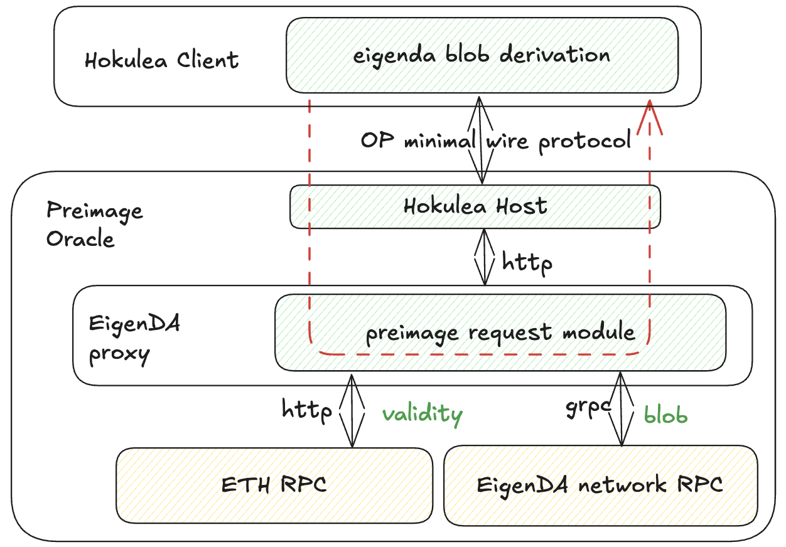

### Hokulea

Hokulea provides a Rust implementation of EigenDA blob derivation for the OP stack. The Hokulea client (and its associated crates) implements the EigenDA blob derivation logic described in the [EigenDA blob derivation section](#eigenda-blob-derivation). The client is designed to be imported as a library into the OP consensus Rust implementation [Kona](https://github.com/op-rs/kona).

Since the OP rollup inbox is not a smart contract, the secure integration requires EigenDA blob derivation to take place entirely offchain (see the design rationale in [secure integration](../spec/6-secure-integration.md#secure-integration-framework)). Depending on the choice of VM and game type, Hokulea can support optimistic fault proofs, ZK fault proofs, and validity ZK proofs.

#### Preimage Oracle Architecture

The major difference between implementations lies in how the preimage oracle is abstracted and implemented. In Hokulea, the interface is abstracted as a key-value map to make the preimage oracle verifiable on L1 Ethereum.

The Hokulea preimage host for the key-value oracle interface is built on top of the EigenDA proxy (see diagram above). The proxy handles all the heavy lifting to retrieve the actual preimage data, while the Hokulea host serves as a thin layer that translates HTTP status codes into preimage data or errors.

#### Communication Between Hokulea Host and EigenDA Proxy

The proxy uses an HTTP interface to serve as a base layer for abstraction. The proxy exposes the following JSON status codes in addition to HTTP status codes to convey information about the preimage:

| Message             | HTTP Status Code | JSON Status Code | Indication           |
| ------------------- | ---------------- | ---------------- | -------------------- |
| **Decoded blob (rollup payload)** | 200 | N/A | Successful request |
| **Certificate validity** | 418 | 1 | Certificate is invalid |
| **Certificate recency** | 418 | 2 | Certificate is too old |
| **Encoded payload** | 418 | 3 | Blob decoding error |

#### Encoded Payload vs. Decoded Blob

For developers familiar with the EigenDA proxy: on a default GET http query, the proxy returns the decoded blob (the rollup payload) as a byte string in an HTTP 200 response. However, to enable the proxy as part of the preimage oracle for other Hokulea, the preimage data must be a valid blob polynomial where every 32 bytes is a valid field element on BN254 (the [encoded payload](../spec/3-data-structs.md)).

The proxy must be able to return the encoded payload independently.

To eliminate redundant work that the upper layer (Hokulea host) would otherwise need to perform (the FFT step), the proxy needs to convert the EigenDA blob into encoded payload.