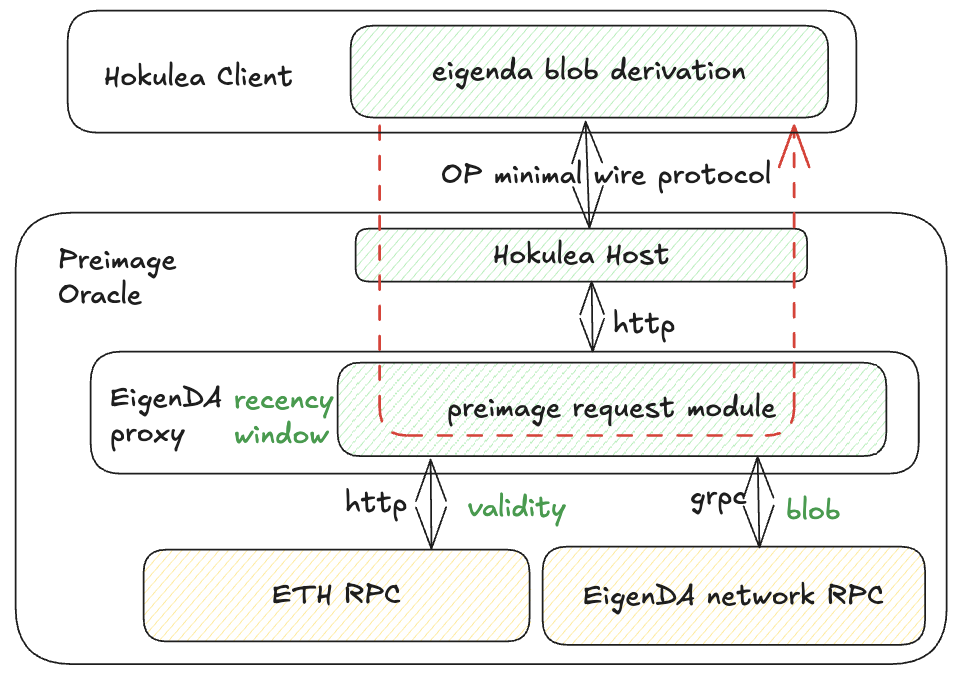

### Hokulea

Hokulae contains another implementation of EigenDA blob derivation for OP stack in Rust. The hokulea client (and crates it uses) implements the eigenda blob derivation logic described in the [eigenda blob derivation section](#eigenda-blob-derivation). The client is intended to be imported as a library into OP consensus rust implementation [Kona](https://github.com/op-rs/kona).
Because OP rollup inbox is not a smart contract, the secure integration requires the EigenDA blob derivatin to take place offchain entirely (see design choice of [secure integration](../spec/6-secure-integration.md#secure-integration-framework)).
And depending on the choice of VM and game type, Hokulea can support both optimistic and ZK fault proof, as well as validity ZK proofs.

The major difference between the two implementations comes to how the preimage oracle is abstracted and implemented.
For Hokulea, the interface is abstracted as key-value map to make preimage oracle verifiable on L1 Ethereum.
In Hokulea, the preimage host for the key-value oracle interface is built on top of the Eigenda proxy. See diagram above. All the heavy lifting parts to get
the actual preimage data is done by the proxy, and the Hokulea host is a thin layer to translate http status codes into preimage data or error.

### Communication betweeen Hokulea host and EigenDA proxy

Proxy Uses HTTP interface, And to allow proxy to be used as a base layer for abstraction. The proxy exposes the following JSON status code In addition to http
status code to convey Information about the preimage.

| Message             | HTTP Status Code                | JSON Status Code                |     Indication      |
| ------------------- | ------------------------------- | ------------------------------- | ------------------- |
| **decoded blob (i.e rollup payload)**    | 200                             | NA                              |  successful request |
| **cert validity**   | 418                             | 1                               |  cert is invalid    |
| **cert recency**    | 418                             | 2                               |  cert is too old    |
| **encoded payload(subject to change)**    | 418                             | 3                               |  blob decoding error|

For careful readers and developer familiar with EigenDA proxy, proxy by default returns the decoded blob, i.e. the rollup payload, as a byte string in a HTTP 200
reponse message. However, to enable proxy as a part of the preimage oracle against other implementation of EigenDA derivation pipeline (like Hokulea), the preimage data must be a valid blob polynomial, whose every 32 Bytes must be valid field element on BN254 (i.e [encoded payload](../spec/3-data-structs.md)).

Proxy must be able to return the encoded payload alone, though the specific implementation has not been decided yet.
As described in [data-struct page](../spec/3-data-structs.md). During the creation of a DA cert a rollup payload, the data is first transformed into the encoded paylod
then undergo IFFT transform into the right polynomial format before sending to EigenDA that created a DA cert.

Normally the DecodeBlob functional interface on the GET path of the proxy does the FFT transformation on the received EigenDA blob to convert into the encoded
payload which is the original polynomial format.
To remove redundant work which the upper layer (Hokulea host) has to do (i.e. the FFT step), the proxy when used as a component for providing preimage, it returns
the encoded payload as opposed to the raw eigenda blob, which has the IFFT transformation, which is needed for optimistic challenge for opening points onchain.