# EigenDA V2 Integration Spec

# Overview

The [EigenDA V2](https://docs.eigenda.xyz/releases/v2) release documentation describes the architectural changes that allow for important network performance increases. From the point of view of rollup integrations, there are three important new features:

1. Blob batches are no longer bridged to Ethereum with dispersals now being confirmed once a batch has been `CERTIFIED`  (i.e, signed over by operator set). This operation takes 10-20 seconds - providing lower confirmation latency and higher throughput for the rollup. Verification of the blobs now needs to be done by the rollup stack.
2. Centralized (accounting done by disperser) payments model
3. A new relayer API from which to retrieve blobs (distinct from the disperser API which is now only used to disperse blobs)

# Diagrams

We will refer to the below diagrams throughout the spec.

### High Level Diagram

### Sequence Diagram

```mermaid
sequenceDiagram
  box Rollup Sequencer
  participant B as Batcher
  participant SP as Proxy
  end
  box EigenDA Network
  participant D as Disperser
  participant R as Relay
  participant DA as DA Nodes
  end
  box Ethereum
  participant BI as Batcher Inbox
  participant BV as EigenDABlobVerifier
  end
  box Rollup Validator
  participant VP as Proxy
  participant V as Validator
  end

  %% Blob Creation and Dispersal Flow
  B->>SP: Send payload
  Note over SP: Encode payload into blob
  alt
          SP->>D: GetBlobCommitment(blob)
          D-->>SP: blob_commitment
    else
            SP->>SP: Compute commitment locally
    end
  Note over SP: Create blob_header including payment_header
  SP->>D: DisperseBlob(blob, blob_header)
  D-->>SP: QUEUED status + blob_header_hash
  
  %% Parallel dispersal to Relay and DA nodes
  par Dispersal to Storage
      R->>D: Pull blob
  and Dispersal to DA nodes
      D->>DA: Send Headers
      DA->>R: Pull Chunks
      DA->>D: Signature
  end

  loop Until CERTIFIED status
          SP->>D: GetBlobStatus
          D-->>SP: status + signed_batch + blob_verification_info
  end
  SP->>BV: getNonSignerStakesAndSignature(signed_batch)
  SP->>BV: verifyBlobV2(batch_header, blob_verification_info, nonSignerStakesAndSignature)
  SP->>BI: Submit cert = (batch_header, blob_verification_info, nonSignerStakesAndSignature)

  %% Validation Flow
  V->>BI: Read cert
  V->>VP: GET /get/{cert} → cert
  activate V
  Note over VP: Extract relay_key + blob_header_hash from cert
  VP->>R: GetBlob(blob_header_hash)
  R-->>VP: Return blob
  VP->>BV: verifyBlobV2
  VP-->>V: Return validated blob
  deactivate V
```

### Ultra High Resolution Diagram

