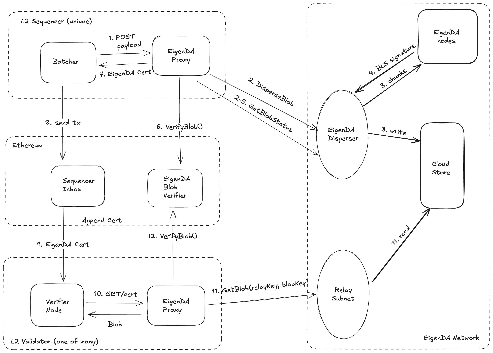

# APIs

Below we give a summary of the APIs relevant to understanding the EigenDA high-level diagram



### Proxy

See our gorilla/mux [routes](https://github.com/Layr-Labs/eigenda-proxy/blob/main/server/routing.go) for full detail, but the gist is that proxy presents a REST endpoint based off of the [op da-server spec](https://specs.optimism.io/experimental/alt-da.html#da-server) to rollup batchers:

```
# OP
POST /put body: <preimage_bytes> → <hex_encoded_commitment>
GET /get/{hex_encoded_commitment} → <preimage_bytes>
# NITRO
Same as OP but add a `?commitment_mode=standard` query param 
to both POST and GET methods.
```

### Disperser

The disperser presents a [grpc v2 service](https://github.com/Layr-Labs/eigenda/blob/ce89dab18d2f8f55004002e17dd3a18529277845/api/proto/disperser/v2/disperser_v2.proto#L10) endpoint

```bash
$ EIGENDA_DISPERSER_PREPROD=disperser-preprod-holesky.eigenda.xyz:443
$ grpcurl $EIGENDA_DISPERSER_PREPROD list disperser.v2.Disperser
disperser.v2.Disperser.DisperseBlob
disperser.v2.Disperser.GetBlobCommitment
disperser.v2.Disperser.GetBlobStatus
disperser.v2.Disperser.GetPaymentState
```

### Relay

Relays similarly present a [grpc service](https://github.com/Layr-Labs/eigenda/blob/ce89dab18d2f8f55004002e17dd3a18529277845/api/proto/relay/relay.proto#L10) endpoint

```bash
$ EIGENDA_RELAY_PREPROD=relay-1-preprod-holesky.eigenda.xyz:443
$ grpcurl $EIGENDA_RELAY_PREPROD list relay.Relay
relay.Relay.GetBlob
relay.Relay.GetChunks
```

### Contracts

#### Immutable Cert Verifier
The most important contract for rollups integrations is the `EigenDACertVerifier`, which presents a [function](https://github.com/Layr-Labs/eigenda/blob/3e670ff3dbd3a0a3f63b51e40544f528ac923b78/contracts/src/periphery/cert/EigenDACertVerifier.sol#L46-L56) to validate DACerts:

```solidity
    /// @notice Check a DA cert's validity
    /// @param abiEncodedCert The ABI encoded certificate. Any cert verifier should decode this ABI encoding based on the certificate version.
    /// @return status An enum value. Success is always mapped to 1, and other values are errors specific to each CertVerifier.
    function checkDACert(bytes calldata abiEncodedCert) external view returns (uint8 status);

    /// @notice Returns the EigenDA certificate version. Used off-chain to identify how to encode a certificate for this CertVerifier.
    /// @return The EigenDA certificate version.
    function certVersion() external view returns (uint8);
```

#### Upgradable Router
`EigenDACertVerifierRouter` acts as an intermediary contract that maintains an internal mapping of `activation_block_number -> EigenDACertVerifier`. This contract can be used to enable seamless upgrades for new `EigenDACertVerifier` and provides a way for a rollup to introduce custom quorums and thresholds.
```solidity
    /// @notice Returns the address for the active cert verifier at a given reference block number.
    ///         The reference block number must not be in the future.
    function getCertVerifierAt(uint32 referenceBlockNumber) external view returns (address);

    /// @notice Check a DA cert's validity
    /// @param abiEncodedCert The ABI encoded certificate. Any cert verifier should decode this ABI encoding based on the certificate version.
    /// @return status An enum value. Success is always mapped to 1, and other values are errors specific to each CertVerifier.
    function checkDACert(bytes calldata abiEncodedCert) external view returns (uint8 status);

```