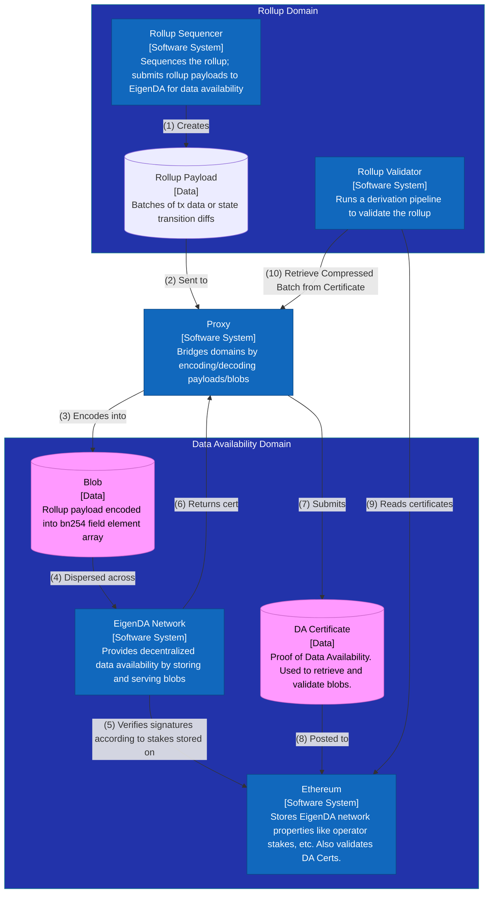

# Rollup Payload Lifecycle

How is a rollup’s payload (compressed batches of transactions or state transition diffs) encoded and made available on the EigenDA network?

At a high-level, a rollup sequencer needs to make its `payload` available for download from validators of its network. The EigenDA network makes use of cryptographic concepts such as KZG commitments as fundamental building blocks. Because of this, it can only work with `eigenda blobs` (hereafter referred to simply as `blobs`; see technical definition below) of data. The [EigenDA proxy](https://github.com/Layr-Labs/eigenda-proxy) is used to bridge the rollup domain (which deals with payloads) and the EigenDA domain (which deals with blobs).

As an example, an op-stack Ethereum rollup’s `payload` is a compressed batch of txs (called a [frame](https://specs.optimism.io/protocol/derivation.html#frame-format)). This frame gets sent to Ethereum to be made available either as a simple tx, or as a [`4844 blob`](https://eips.ethereum.org/EIPS/eip-4844#type-aliases) (using a [blob tx](https://eips.ethereum.org/EIPS/eip-4844#blob-transaction)). Using EigenDA instead of Ethereum for data availability works similarly: the payloads are encoded into an `eigenda blob`  and dispersed to the EigenDA network via an EigenDA disperser. The disperser eventually returns a `DACert` containing signatures of EigenDA operators certifying the availability of the data, which is then posted to Ethereum as the `input` field of a normal tx. Note that due to the rollup settling on Ethereum, Ethereum DA is needed, but only to make the `DACert` available, which is much smaller than the `blob` itself.

[**Data structs**](./3-datastructs.md)

- `Payload`: piece of data that an EigenDA client (rollup, avs, etc.) wants to make available. This is typically compressed batches of transactions or state transition diffs.
- `EncodedPayload`: payload encoded into a list of bn254 field elements (each 32 bytes), typically with a prefixed field element containing the payload length in bytes, such that the payload can be decoded.
- `PayloadPolynomial` : encodedPayload padded with 0s to the next power of 2 (if needed) and interpreted either as evaluations (`PolyCoeff`) or coefficients (`PolyEval`) of a polynomial. Because the EigenDA network interprets blobs as coefficients, a `PolyEval` will need to be IFFT’d into a `PolyCoeff` before being dispersed.
- `(EigenDA) Blob`: array of bn254 field elements of length a power of two. Interpreted by the network as coefficients of a polynomial. Equivalent to `PolyCoeff`.
- `Blob Header`: contains the information necessary to uniquely identify a BlobDispersal request.
- `Blob Certificate`: Signed BlobHeader along with relayKeys, which uniquely identify a relay service for DA Nodes to retrieve chunks from and clients to retrieve full blobs from.
- `Batch`: Batch of blobs whose blob certs are aggregated into a merkle tree and dispersed together for better network efficiency.
- `DA Certificate` (or `DACert`): contains the information necessary to retrieve and verify a blob from the EigenDA network, along with a proof of availability.
- `AltDACommitment`: RLP serialized `DACert` prepended with rollup-specific header bytes. This commitment is what gets sent to the rollup’s batcher inbox.

[**Contracts**](./4-contracts.md)

- `EigenDACertVerifier`: contains one main important function checkDACert which is used to verify `DACert`s.
- `EigenDACertVerifierRouter`: contains router mapping of activation block number to `EigenDACertVerifier` and allows for securely and deterministically upgrading CertVerification constants (security thresholds and custom quorums) over time.
- `EigenDAThresholdRegistry`: contains signature related thresholds and blob→chunks encoding related parameters.
- `EigenDARelayRegistry`: contains an Ethereum address and DNS hostname (or IP address) for each registered Relay.
- `DisperserRegistry` : contains an Ethereum address network for each registered Disperser.

[**Lifecycle phases**](./5-lifecycle-phases.md)

- Sequencer:
    - `Encoding`: Payload → Blob
    - `BlobHeader Construction`: Blob → BlobHeader
    - `Dispersal`: (Blob, BlobHeader) → Certificate
        - Certificate+Blob `Validation`
        - Unhappy path: `Failover` to EthDA
    - `Posting`: Certificate → Ethereum tx
- Validator (exact reverse of sequencer):
    - `Reading`: Ethereum tx → Certificate
    - `Retrieval`: Certificate → Blob
        - Certificate+Blob `Validation`
    - `Decoding`: Blob → Payload
