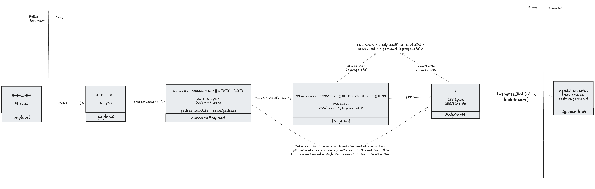
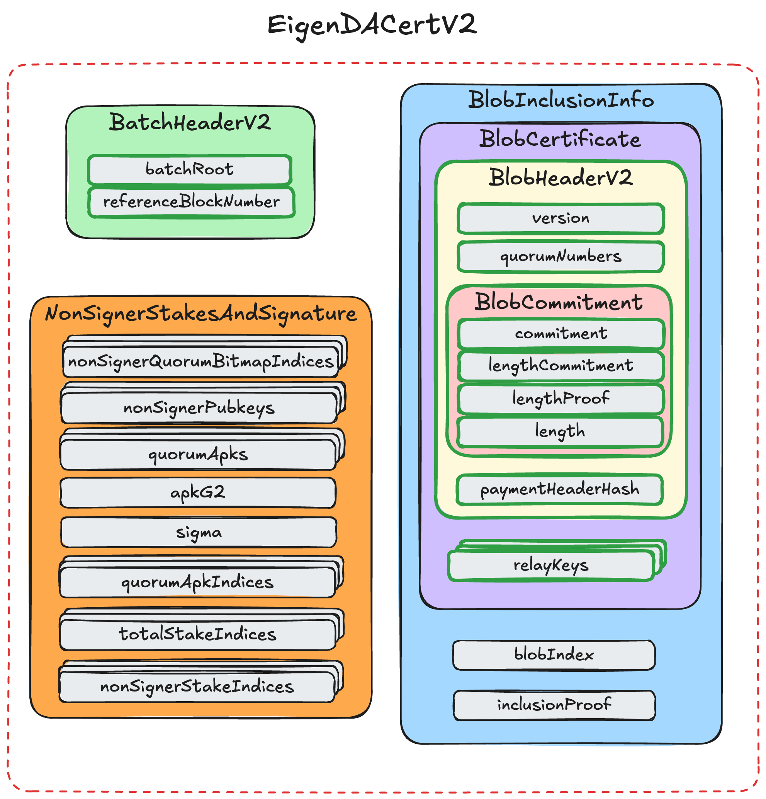
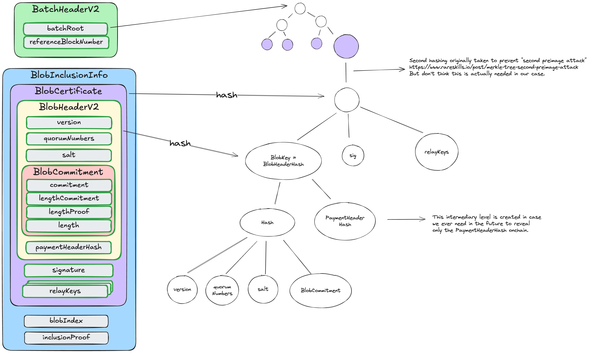

## Data Structs

The diagram below represents the transformation from a rollup `payload` to the different structs that are allowed to be dispersed.



### Payload

A client `payload` is whatever piece of data the EigenDA client wants to make available. For optimistic rollups this would be compressed batches of txs (frames). For (most) zk-rollups this would be compressed state transitions. For AVSs it could be Proofs, or Pictures, or any arbitrary data.

A `payload` must fit inside an EigenDA blob to be dispersed. See the allowed blob sizes in the [Blob](#blob) section.

### EncodedPayload

An `encodedPayload` is the bn254 encoding of the `payload`, prefixed with an encoded payload header. It is an intermediary processing artifact, named here for clarity. The encoding obeys the same constraints as EigenDA blobs:

> Every 32 bytes of data is interpreted as an integer in big endian format. Each such integer must stay in the valid range to be interpreted as a field element on the bn254 curve. The valid range is 0 <= x < 21888242871839275222246405745257275088548364400416034343698204186575808495617.

#### Encoded Payload Header

The header carries metadata needed to decode back to the original payload. Because it is included in the encoded payload, it too must be representable as valid field elements. The header currently takes 32 bytes: the first byte is 0x00 (to ensure it forms a valid field element), followed by an encoding version_byte and 4 bytes representing the size of the original payload. The golang payload clients provided in the eigenda repo currently only support [encoding version 0x0](https://github.com/Layr-Labs/eigenda/blob/f591a1fe44bced0f17edef9df43aaf13929e8508/api/clients/codecs/blob_codec.go#L12). The remaining bytes of the encoded payload header are zero-filled.

#### Encoding Payload Version 0x0

Version 0x0 specifies the following transformation from the original payload to a sequence of field element:
- For every 31 bytes of the payload, insert a zero byte to produce a 32-byte value that is a valid field element.
- Zero-pad the final chunk so the payload length is a multiple of 32 bytes, and ensure the encoded payload comprises a power-of-two number of 32-byte field elements (32, 64, 128, 256, …) to match EigenDA blob sizing.

```solidity
[0x00, version_byte, big-endian uint32 len(payload), 0x00, 0x00,...] +
    [0x00, payload[0:31], 0x00, payload[32:63],..., 
        0x00, payload[n:len(payload)], 0x00, ..., 0x00]
```

For example, the payload `hello` would be encoded as

```solidity
[0x00, 0x00, 0x00, 0x00, 0x00, 0x05, 0x00, 0x00,...] +
    [0x00, 'h', 'e', 'l', 'l', 'o', 0x00 * 26]
```

### PayloadPolynomial

EigenDA uses [KZG commitments](https://dankradfeist.de/ethereum/2020/06/16/kate-polynomial-commitments.html), which represent a commitment to a function. Abstractly speaking, we thus need to represent the encodedPayload as a polynomial. We have two choices: either treat the data as the coefficients of a polynomial, or as evaluations of a polynomial. In order to convert between these two representations, we make use of [FFTs](https://vitalik.eth.limo/general/2019/05/12/fft.html) which require the data to be a power of 2. Thus, `PolyEval` and `PolyCoeff` are defined as being an `encodedPayload` and interpreted as desired.

Once an interpretation of the data has been chosen, one can convert between them as follows:

```solidity
PolyCoeff --FFT--> PolyEval
PolyCoeff <--IFFT-- PolyEval
```

Whereas Ethereum treats 4844 blobs as evaluations of a polynomial, EigenDA instead interprets EigenDA blobs as coefficients of a polynomial. Thus, only `PolyCoeff`s can be submitted as a `blob` to the Disperser. Each rollup integration must thus decide whether to interpret their `encodedPayload`s as `PolyCoeff`, which can directly be dispersed, or as `PolyEval`, which will require IFFT’ing into a `PolyCoeff` before being dispersed. 

Typically, optimistic rollups will interpret the data as being evaluations. This allows creating point opening proofs to reveal a single field element (32 byte chunk) at a time, which is needed for interactive fraud proofs (e.g. see how [optimism fraud proves 4844 blobs](https://specs.optimism.io/fault-proof/index.html#type-5-global-eip-4844-point-evaluation-key)). ZK rollups, on the flip side, don't require point opening proofs and thus can safely save on the extra IFFT compute costs and instead interpret their data as coefficients directly.

### Blob

A `blob` is a bn254 field elements array that has a power of 2. It is interpreted by the EigenDA network as containing the coefficients of a polynomial (unlike Ethereum which [treats blobs as being evaluations of a polynomial](https://github.com/ethereum/consensus-specs/blob/dev/specs/deneb/polynomial-commitments.md#cryptographic-types)).

An `encodedPayload` can thus be transformed into a `blob` directly or optionally by taking IFFT on itself, with size currently limited to 16MiB. There is no minimum size, but any blob smaller than 128KiB will be charged for 128KiB.

### BlobHeader

The `blobHeader` is submitted alongside the `blob` as part of the `DisperseBlob` request, and the hash of its ABI encoding (`blobKey`, also known as `blobHeaderHash`) serves as a unique identifier for a blob dispersal. This identifier is used to retrieve the blob.

The `BlobHeader` contains four main sections that must be constructed. It is passed into the `DisperseBlobRequest` and is signed over for payment authorization.

Refer to the eigenda [protobufs](https://github.com/Layr-Labs/eigenda/blob/master/api/proto/disperser/v2/disperser_v2.proto) for full details of this struct.

#### Version
The `blobHeader` version refers to one of the `versionedBlobParams` structs defined in the [`EigenDAThresholdRegistry`](./4-contracts.md#eigendathreshold-registry) contract.

#### QuorumNumbers

`QuorumNumbers` represents a list of quorums required to sign and make the blob available. Quorum 0 represents the ETH quorum, quorum 1 represents the EIGEN quorum — both are always required. Custom quorums can also be added to this list.

#### BlobCommitment

The `BlobCommitment` is a binding commitment to an EigenDA Blob. Due to the length field, a `BlobCommitment` uniquely represents a single `Blob`. The length field is added to the kzgCommitment to respect the binding property. It is used by the disperser to prove to EigenDA validators that the chunks they received belong to the original blob (or its Reed-Solomon extension). This commitment can either be computed locally by the *EigenDA Client* from the blob or generated by the disperser via the `GetBlobCommitment` [endpoint](./../../protobufs/generated/disperser_v2.md#disperserv2disperser_v2proto###disperser).


```protobuf
message BlobCommitment {
  // A G1 commitment to the blob data.
  bytes commitment = 1;
  // A G2 commitment to the blob data.
  bytes length_commitment = 2;
    // Used with length_commitment to assert the correctness of the `length` field below.
  bytes length_proof = 3;
  // Length in bn254 field elements (32 bytes) of the blob. Must be a power of 2.
  uint32 length = 4;
}
```

Unlike Ethereum blobs which are all 128KiB, EigenDA blobs can be any power of 2 length between 32KiB and 16MiB (currently), and so the `commitment` alone is not sufficient to prevent certain attacks:

- Why is a commitment to the length of the blob necessary?
    
    There are different variants of the attack. The basic invariant the system needs to satisfy is that with the chunks from sufficient set of validators, you can get back the full blob. So the total size of the chunks held by these validators needs to exceed the blob size. If I don't know the blob size (or at least an upper bound), there's no way for the system to validate this invariant.
    Here’s a simple example. Assume a network of 8 DA nodes, and coding ratio 1/2. For a `blob` containing 128 field elements (FEs), each node gets 128*2/8=32 FEs, meaning that any 4 nodes can join forces and reconstruct the data. Now assume a world without length proof; a malicious disperser receives the same blob, uses the same commitment, but claims that the blob only had length 4 FEs. He sends each node 4*2/8=1 FE. The chunks submitted to the nodes match the commitment, so the nodes accept and sign over the blob’s batch. But now there are only 8 FEs in the system, which is not enough to reconstruct the original blob (need at least 128 for that).
    

> Note that the length here is the length of the blob (power of 2), which is different from the payload_length encoded as part of the `PayloadHeader` in the `blob` itself (see the [encoding section](#encoding)).
> 

**PaymentHeader**

The paymentHeader specifies how the blob dispersal to the network will be paid for. There are 2 modes of payment, the permissionless pay-per-blob model and the permissioned reserved-bandwidth approach. See the [Payments](https://docs.eigenda.xyz/core-concepts/payments#high-level-design) release doc for full details; we will only describe how to set these 3 fields here.

```protobuf
message PaymentHeader {
  // The account ID of the disperser client. This should be a hex-encoded string of the ECDSA public key
  // corresponding to the key used by the client to sign the BlobHeader.
  string account_id = 1;
  // UNIX timestamp in nanoseconds at the time of the dispersal request.
  // Used to determine the reservation period, for the reserved-bandwidth payment model.
  int64 timestamp = 2;
  // Total amount of tokens paid by the requesting account, including the current request.
  // Used for the pay-per-blob payment model.
  bytes cumulative_payment = 3;
}
```

Users who want to pay-per-blob need to set the cumulative_payment. `timestamp` is used by users who have paid for reserved-bandwidth. If both are set, reserved-bandwidth will be used first, and cumulative_payment only used if the entire bandwidth for the current reservation period has been used up.

**NOTE:** There will be a lot of subtleties added to this logic with the new separate-payment-per-quorum model that is actively being worked on.

An RPC call to the Disperser’s `GetPaymentState` method can be made to query the current state of an `account_id`. A client can query for this information on startup, cache it, and then update it manually when making dispersals. In this way, it can keep track of its reserved bandwidth usage and current cumulative_payment and set them correctly for subsequent dispersals.

### EigenDA Certificate (`DACert`)

An `EigenDA Certificate` (or short `DACert`) contains all the information needed to retrieve a blob from the EigenDA network, as well as validate it.



A `DACert` contains the four data structs needed to call [checkDACert](https://github.com/Layr-Labs/eigenda/blob/3e670ff3dbd3a0a3f63b51e40544f528ac923b78/contracts/src/periphery/cert/EigenDACertVerifier.sol#L46-L56) on the EigenDACertVerifier.sol contract. Please refer to the eigenda core spec for more details, but in short, the `BlobCertificate` is included as a leaf inside the merkle tree identified by the `batch_root` in the `BatchHeader`. The `BlobInclusionInfo` contains the information needed to prove this merkle tree inclusion. The `NonSignerStakesAndSignature` contains the aggregated BLS signature `sigma` of the EigenDA validators. `sigma` is a signature over the `BatchHeader`. The `signedQuorumNumbers` contains the quorum IDs that DA nodes signed over for the blob.



### AltDACommitment

In order to be understood by each rollup stack’s derivation pipeline, the encoded `DACert` must be prepended with header bytes, to turn it into an [`altda-commitment`](https://github.com/Layr-Labs/eigenda/tree/master/api/proxy?tab=readme-ov-file#rollup-commitment-schemas) respective to each stack:

- [op](https://specs.optimism.io/experimental/alt-da.html#input-commitment-submission) prepends 3 bytes: `version_byte`, `commitment_type`, `da_layer_byte`
- nitro prepends 1 byte: `version_byte`

**NOTE**
In the future we plan to support a custom encoding byte which allows a user to specify different encoding formats for the `DACert` (e.g, RLP, ABI).