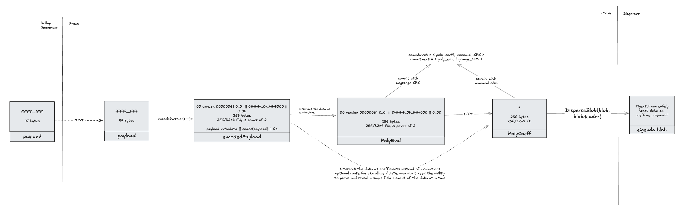
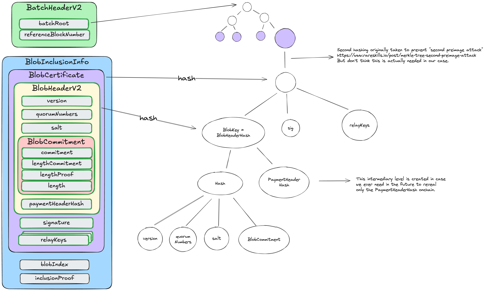

## Data Structs

The diagram below represents the transformation from a rollup `payload` to the different structs that are allowed to be dispersed



### Payload

A client `payload` is whatever piece of data the EigenDA client wants to make available. For optimistic rollups this would be compressed batches of txs (frames). For (most) zk-rollups this would be compressed state transitions. For AVSs it could be Proofs, or Pictures, or any arbitrary data.

A `payload` must fit inside an EigenDA blob to be dispersed. See the allowed blob sizes in the [Blob](#blob) section.

### EncodedPayload

An `encodedPayload` is the bn254 encoding of the `payload`. This is an intermediary processing step, but useful to give a name to it. The encoding must respect the same constraints as those on the blob:

> Every 32 bytes of data is interpreted as an integer in big endian format. Each such integer must stay in the valid range to be interpreted as a field element on the bn254 curve. The valid range is 0 <= x < 21888242871839275222246405745257275088548364400416034343698204186575808495617.
> 

The golang payload clients provided in the eigenda repo currently only support [encoding version 0x0](https://github.com/Layr-Labs/eigenda/blob/f591a1fe44bced0f17edef9df43aaf13929e8508/api/clients/codecs/blob_codec.go#L12), which encodes as follows:

```solidity
[0x00, version_byte, big-endian uint32 len(payload), 0x00, 0x00,...] +
    [0x00, payload[0:31], 0x00, payload[32:63],..., 
        0x00, payload[n:len(payload)], 0x00, ..., 0x00]
```

where the last chunk is padded with 0s such that the total length is a multiple of 32 bytes.

For example, the payload `hello` would be encoded as

```solidity
[0x00, 0x00, 0x00, 0x00, 0x00, 0x05, 0x00, 0x00,...] +
    [0x00, 'h', 'e', 'l', 'l', 'o', 0x00 * 26]
```

### PayloadPolynomial

EigenDA uses [KZG commitments](https://dankradfeist.de/ethereum/2020/06/16/kate-polynomial-commitments.html), which represent a commitment to a function. Abstractly speaking, we thus need to represent the encodedPayload as a polynomial. We have two choices: either treat the data as the coefficients of a polynomial, or as evaluations of a polynomial. In order to convert between these two representations, we make use of [FFTs](https://vitalik.eth.limo/general/2019/05/12/fft.html) which require the data to be a power of 2. Thus, `PolyEval` and `PolyCoeff` are defined as being an `encodedPayload` padded with 0s to the next power of 2 (if needed) and interpreted as desired.

Once an interpretation of the data has been chosen, one can convert between them as follows:

```solidity
PolyCoeff --FFT--> PolyEval
PolyCoeff <--IFFT-- PolyEval
```

Whereas Ethereum treats 4844 blobs as evaluations of a polynomial, EigenDA instead interprets EigenDA blobs as coefficients of a polynomial. Thus, only `PolyCoeff`s can be submitted as a `blob` to the Disperser. Each rollup integration must thus decide whether to interpret their `encodedPayload`s as `PolyCoeff`, which can directly be dispersed, or as `PolyEval`, which will require IFFT’ing into a `PolyCoeff` before being dispersed. 

Typically, optimistic rollups will interpret the data as being evaluations. This allows creating point opening proofs to reveal a single field element (32 byte chunk) at a time, which is needed for interactive fraud proofs (e.g. see how [optimism fraud proves 4844 blobs](https://specs.optimism.io/fault-proof/index.html#type-5-global-eip-4844-point-evaluation-key)). ZK rollups, on the flip side, don't require point opening proofs and thus can safely save on the extra IFFT compute costs and instead interpret their data as coefficients directly.

### Blob

A `blob` is a bn254 field elements array that has a power of 2. It is interpreted by the EigenDA network as containing the coefficients of a polynomial (unlike Ethereum which [treats blobs as being evaluations of a polynomial](https://github.com/ethereum/consensus-specs/blob/dev/specs/deneb/polynomial-commitments.md#cryptographic-types)).

An `encodedPayload` can thus be transformed into a `blob` by being padded with 0s to a power of 2, with size currently limited to 16MiB. There is no minimum size, but any blob smaller than 128KiB will be charged for 128KiB.

### BlobHeader And BlobCertificate

The `blobHeader` is submitted alongside the `blob` as part of the DisperseBlob request, and the hash of its rlp serialization (`blobKey` aka `blobHeaderHash`) is a unique identifier for a blob dispersal. This unique identifier is used to retrieve the blob.


Refer to the eigenda [protobufs](../../protobufs/generated/disperser_v2.md) documentation for full details of this struct.

### DACertificate

A `DA Certicate` (or short `DACert`) contains all the information needed to retrieve a blob from the EigenDA network, as well as validate it.


A `DACert` contains the three data structs needed to call [verifyDACertV2](https://github.com/Layr-Labs/eigenda/blob/98e21397e3471d170f3131549cdbc7113c0cdfaf/contracts/src/core/EigenDACertVerifier.sol#L86) on the EigenDACertVerifier.sol contract. Please refer to the eigenda core spec for more details, but in short, the `BlobCertificate` is included as a leaf inside the merkle tree identified by the `batch_root` in the `BatchHeader`. The `BlobInclusionInfo` contains the information needed to prove this merkle tree inclusion. The `NonSignerStakesAndSignature` contains the aggregated BLS signature `sigma` of the EigenDA validators. `sigma` is a signature over the `BatchHeader`.



### AltDACommitment

In order to be understood by each rollup stack’s derivation pipeline, the cert must be prepended with header bytes, to turn it into an [`altda-commitment`](https://github.com/Layr-Labs/eigenda-proxy?tab=readme-ov-file#commitment-schemas) respective to each stack:

- [op](https://specs.optimism.io/experimental/alt-da.html#input-commitment-submission) prepends 3 bytes: `version_byte`, `commitment_type`, `da_layer_byte`
- nitro prepends 1 byte: `version_byte`
