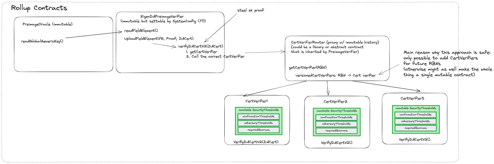

## Rollup Managed Contracts

This page describes contracts that are managed by rollups, but are needed to secure the EigenDA integration. For EigenDA-managed core contracts, see the [core contracts](../../protocol/contracts.md) page.



### EigenDACertVerifier

This contract's main use case is exposing a function checkDACert which is used to verify `DACerts`. This function’s logic is described in the [Cert Validation](./6-secure-integration.md#cert-validation) section. 

The contract also exposes a `certVersion` method which is called by the payload disperser client to know which cert version to build in order to be verifiable by that contract.

### EigenDACertVerifierRouter

This contract primarily facilitates secure upgrades of EigenDACertVerifier contracts while enabling custom quorum and threshold configurations in a format that maintains cross-version compatibility. This is done through maintaining a stateful mapping:
```solidity
    /// @notice A mapping from an activation block number (ABN) to a cert verifier address.
    mapping(uint32 => address) public certVerifiers;

    /// @notice The list of Activation Block Numbers (ABNs) for the cert verifiers.
    /// @dev The list is guaranteed to be in ascending order
    ///      and corresponds to the keys of the certVerifiers mapping.
    uint32[] public certVerifierABNs;
```

where each key refers to an `activation_block_number` (ABN). When calling `checkDACert`, the reference block number is decoded from the `DACert` bytes and is used to find the unique CertVerifier active at that RBN (a reverse linear search over the `certVerifierABNs` is performed). Once found, `EigenDACertVerifier` at the particular ABN is used for calling `checkDACert` to verify the DA Cert.

The `EigenDACertVerifierRouter` enables the use of a certificate’s Reference Block Number (RBN) as a commitment to the specific `EigenDACertVerifier` that should be used for verification. This mechanism ensures backward compatibility with older DA Certs, allowing an optimistic rollup to continue verifying historical data availability proofs accurately across verifier upgrades.
