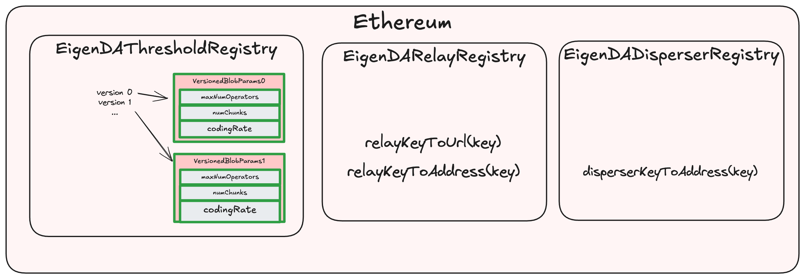

## EigenDA Managed Contracts

> Warning: This page is a work in progress as we have not completely finalized the design. The details might change but the information contained here should be enough to understand the different concerns and main ideas.

The smart contracts can be found [here](https://github.com/Layr-Labs/eigenda/tree/master/contracts/src/core).



### EigenDAThreshold Registry

The [EigenDAThresholdRegistry](https://github.com/Layr-Labs/eigenda/blob/c4567f90e835678fae4749f184857dea10ff330c/contracts/src/core/EigenDAThresholdRegistryStorage.sol#L22) contains two sets of fundamental parameters:

```solidity

/// @notice mapping of blob version id to the params of the blob version
mapping(uint16 => VersionedBlobParams) public versionedBlobParams;
struct VersionedBlobParams {
    uint32 maxNumOperators;
    uint32 numChunks;
    uint8 codingRate;
}

/// @notice Immutable security thresholds for quorums
SecurityThresholds public defaultSecurityThresholdsV2;
struct SecurityThresholds {
    uint8 confirmationThreshold;
    uint8 adversaryThreshold;
}
```

The securityThresholds are currently immutable. Confirmation and adversary thresholds are sometimes also [referred to](https://docs.eigenda.xyz/overview#optimal-da-sharding) as liveness and safety thresholds:

- **Confirmation Threshold (aka liveness threshold)**: minimum percentage of stake which an attacker must control in order to mount a liveness attack on the system.
- **Adversary Threshold (aka safety threshold)**: total percentage of stake which an attacker must control in order to mount a first-order safety attack on the system.

Their default values are currently set as:

```solidity
defaultSecurityThresholdsV2 = {
    confirmationThreshold = 55,
    adversaryThreshold = 33,
}
```

A new BlobParam version is very infrequently introduced by the EigenDA Foundation Governance, and rollups can choose which version they wish to use when dispersing a blob. Currently there is only version `0` defined, with parameters:

```solidity
versionedBlobParams[0] = {
    maxNumOperators =  3537,
    numChunks = 8192,
    codingRate = 8,
}
```

The five parameters are intricately related by this formula which is also verified onchain by the [verifyBlobSecurityParams](https://github.com/Layr-Labs/eigenda/blob/77d4442aa1b37bdc275173a6b27d917cc161474c/contracts/src/libraries/EigenDABlobVerificationUtils.sol#L386) function: 

$$
numChunks \cdot (1 - \frac{100}{\gamma * codingRate}) \geq maxNumOperators
$$

where $\gamma = confirmationThreshold - adversaryThreshold$

### EigenDARelayRegistry

Contains EigenDA network registered Relays’ Ethereum address and DNS hostname or IP address. `BlobCertificates` contain `relayKeys`, which can be transformed into that relay’s URL by calling [relayKeyToUrl](https://github.com/Layr-Labs/eigenda/blob/77d4442aa1b37bdc275173a6b27d917cc161474c/contracts/src/core/EigenDARelayRegistry.sol#L35).

### EigenDADisperserRegistry

Contains EigenDA network registered Dispersers’ Ethereum address. The EigenDA Network currently only supports a single Disperser, hosted by EigenLabs. The Disperser’s URL is currently static and unchanging, and can be found on our docs site in the [Networks](https://docs.eigenda.xyz/networks/mainnet) section.

## Rollup Managed Contracts


### EigenDACertVerifier

This contract's main use case is exposing a function checkDACert which is used to verify `DACerts`. This function’s logic is described in the [Cert Validation](./6-secure-integration.md#cert-validation) section. 

The contract also exposes a `certVersion` method which is called by the payload disperser client to understand which certificate version is needed for backend encoding. 

### EigenDACertVerifierRouter

This contract's main use case is allowing for secure upgrades of EigenDACertVerifier contracts in a cross version compatible format. This is done through maintaining a stateful mapping:
```solidity
    /// @notice A mapping from an activation block number (ABN) to a cert verifier address.
    mapping(uint32 => address) public certVerifiers;

    /// @notice The list of Activation Block Numbers (ABNs) for the cert verifiers.
    /// @dev The list is guaranteed to be in ascending order
    ///      and corresponds to the keys of the certVerifiers mapping.
    uint32[] public certVerifierABNs;
```

where each key refers to an `activation_block_number` (ABN). When calling `checkDACert`, the reference block number is decoded from the `DACert` bytes and is used to find the closest sibling ABN via a reverse linear search over the `certVerifierABNs`. Once found, `EigenDACertVerifier` at the particular ABN is used for calling `checkDACert` to verify the DA Cert.

The `EigenDACertVerifierRouter` enables the use of a certificate’s Reference Block Number (RBN) as a commitment to the specific `EigenDACertVerifier` that should be used for verification. This mechanism ensures backward compatibility with older DA Certs, allowing an optimistic rollup to continue verifying historical data availability proofs accurately across verifier upgrades.
