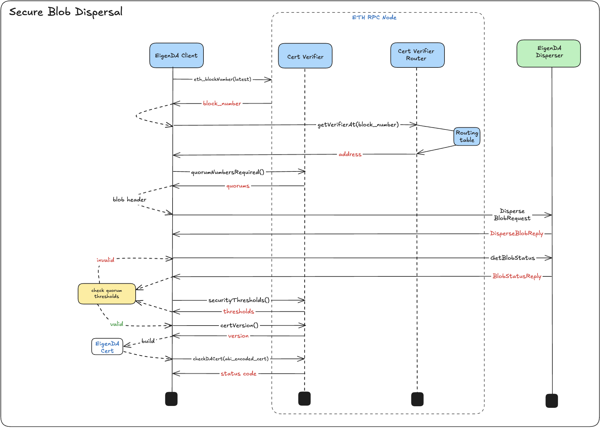

# Lifecycle Phases

Secure interaction between a rollup and EigenDA is composed of three distinct system flows:

1. [**Dispersal**](#secure-dispersal): Submitting raw batch data to the DA network  
2. [**Retrieval**](#secure-retrieval): Fetching batch data from the DA network  
3. **Verification**: Ensuring the integrity and quorum-based certification of retrieved data. Where and how verification is performed is often contingent on how an integration is implemented; e.g:
- *Pessimistic Verification* where a `DACert` is checked as pre-inclusion check for a sequencer inbox
- *Optimistic Verification* where a `DACert` is only verified in the worst-case challenge

EigenDA *Proxy* is used as the main entrypoint for secure dispersal and retrieval.

## Glossary
- *Rollup Batcher*: Sequencer rollup node component responsible for constructing and submitting user transaction batches
- *Rollup Nodes*: Refers to any rollup node (e,g, validator, verifier) which syncs current chain state through an onchain sequencer inbox
- *Proxy*: Side car server as a part of rollup and used for secure and trustless communication with EigenDA 


## Secure Dispersal

### Diagram



### System Flow
1. *Proxy* takes a raw [payload](./3-data-structs.md#payload) bytes on `/put` endpoint and [converts](#payload-to-blob-encoding) it into a [blob](./3-data-structs.md#blob).

1. Using `latest_block_number` (lbn) number fetched from ETH RPC node, *Proxy* calls the router to get the `EigenDACertVerifier` [contract](./4-contracts.md#eigendacertverifier) address *most likely* (if using [`EigenDACertVerifierRouter`](./4-contracts.md#eigendacertverifierrouter)) to be committed to by the `reference_block_number` (rbn) returned by the EigenDA disperser.

2. Using the `verifier`, *Proxy* fetches the `required_quorums` an embeds them into the [`BlobHeader`](./3-data-structs.md#blobheader) as part of the disperser request.

3. The *Proxy* submits the payload blob request to the EigenDA disperser and polls for a [`BlobStatusReply`](../../protobufs/generated/disperser_v2.md#blobstatusreply) (BSR). 

4. While querying the disperser, *Proxy* periodically checks against the confirmation threshold as it’s updated in real-time by the disperser using the rbn returned in the `BlobStatusReply` for fetching thresholds. ([ref](#blob-dispersal-with-eigenda-disperser))

5. Once confirmation thresholds are fulfilled, *Proxy* calls the `verifier`'s `certVersion()` method to get the `cert_version` and casts the `DACert` into a structured ABI binding type using the `cert_version` to dictate which certificate representation to use. ([ref](#blobstatusreply-→-cert))

7. *Proxy* then passes ABI encoded cert bytes via a call to the `verifier`'s `checkDACert` function which performs onchain cert verification [logic](./6-secure-integration.md#2-cert-validation) and returns a uint `verification_status_code`

8. Using the `verification_status_code`, *Proxy* determines whether to return the certificate (`CertV2Lib.StatusCode.SUCCESS`) to the *Rollup Batcher* or retry a subsequent dispersal attempt

9. If valid, *Proxy* converts the `DACert` into an [`altda-commitment`](./3-data-structs.md#altdacommitment), which is ready for direct submission to the batcher’s inbox without requiring any further processing or transformation by the rollup stack.


### Payload to Blob Encoding

This phase occurs inside the eigenda-proxy, because the proxy acts as the “bridge” between the Rollup Domain and Data Availability Domain (see [lifecycle](./2-rollup-payload-lifecycle.md) diagram).

A `payload` consists of an arbitrary byte array. The DisperseBlob endpoint accepts an `encodedPayload`, which needs to be a bn254 field element array.


### Disperser polling

The [`DisperseBlob`](../../protobufs/generated/eigenda-protos.md#disperser) method takes a `blob` and `blob_header` as input. Under the hood, the disperser performs the following steps:

1. **Batching**: The blob is aggregated into a Merkle tree along with other blobs.
2. **Reed-Solomon Encoding**: The blob is erasure-coded into chunks for fault tolerance.
3. **Dispersal to Validators**: The chunks are distributed to EigenDA validator nodes based on the required quorum settings.
4. **Signature Collection**: The disperser collects BLS signatures from participating validators.
5. **Status Reporting**: A `BlobStatusReply` is returned to the client to reflect progress or terminal status.

The disperser batches blobs for a few seconds before dispersing them to nodes, so an entire dispersal process can exceed 10 seconds. For this reason, the API has been designed asynchronously with 2 relevant methods.

```protobuf
// Async call which queues up the blob for processing and immediately returns.
rpc DisperseBlob(DisperseBlobRequest) returns (DisperseBlobReply) {}
// Polled for the blob status updates, until a terminal status is received
rpc GetBlobStatus(BlobStatusRequest) returns (BlobStatusReply) {}


// Intermediate states: QUEUED, ENCODED, GATHERING_SIGNATURES
// Terminal states: UNKNOWN, COMPLETE, FAILED
enum BlobStatus {
  UNKNOWN = 0; // functionally equivalent to FAILED but for unknown unknown bugs
  QUEUED = 1; // Initial state after a DisperseBlob call returns
  ENCODED = 2; // Reed-Solomon encoded into chunks ready to be dispersed to DA Nodes
  GATHERING_SIGNATURES = 3; // blob chunks are actively being transmitted to validators
  COMPLETE = 4; // blob has been dispersed and attested by DA nodes
  FAILED = 5;
}
```

After a successful *DisperseBlob* RPC call, the disperser returns `BlobStatus.QUEUED`. To retrieve a valid `BlobStatusResponse`, the *GetBlobStatus* RPC should be polled until a terminal status is reached.

If `BlobStatus.GATHERING_SIGNATURES` is returned, the `signed_batch` and `blob_verification_info` fields will be present in the `BlobStatusReply`. These can be used to construct a `DACert`, which may be verified immediately against the configured threshold parameters stored in the `EigenDACertVerifier` contract. If the verification passes, the certificate can be accepted early. If verification fails, polling should continue.

Once `BlobStatus.COMPLETE` is returned, it indicates that the disperser has stopped collecting additional signatures, typically due to reaching a timeout or encountering an issue. While the `signed_batch` and `blob_verification_info` fields will be populated and can be used to construct a `DACert`, the `DACert` could still be invalid if an insufficient amount of signatures were collected in-regards to the threshold parameters.

Any other terminal status indicates failure, and a new blob dispersal will need to be made.

#### Failover to Native Rollup DA

*Proxy* can be configured to retry `UNKNOWN`, `FAILED`, & `COMPLETE` dispersal `n` times, after which it returns to the rollup a `503` HTTP status code which rollup batchers can use to failover to EthDA or native rollup DA offerings (e.g, arbitrum anytrust). See [here](https://github.com/ethereum-optimism/specs/issues/434) for more info on the OP implementation and [here](https://hackmd.io/@epociask/SJUyIZlZkx) for Arbitrum. 

### BlobStatusReply → Cert

> **Implementation Note**: While not mandated by the EigenDA spec, clients must currently reconstruct the `DACert` from fields in the `BlobStatusReply`, as the disperser does not return a cert directly. The transformation is visualized in the [Ultra High Res Diagram](../spec.md#ultra-high-resolution-diagram). 

In the updated implementation, a `CertBuilder` constructs the DA Cert through direct communication with the [`OperatorStateRetriever`](./4-contracts.md#eigenda-managed-contracts) contract, which provides the necessary information about operator stake states. This approach ensures accurate on-chain data for certificate verification. The following pseudocode demonstrates this process:

```python
class DACert:
    batch_header: any
    blob_verification_proof: any
    nonsigner_stake_sigs: any
    cert_version: uint8
    signedQuorumNumbers: bytes

def get_da_cert(blob_header_hash, operator_state_retriever, cert_version_uint8) -> DACert:
    """
    DA Cert construction pseudocode with OperatorStateRetriever
    @param blob_header_hash: key used for referencing blob status from disperser
    @param operator_state_retriever: ABI contract binding for retrieving operator state data
    @param cert_version_uint8: uint8 version of the certificate format to use
    @return DACert: EigenDA certificate used by rollup 
    """
    # Call the disperser for the info needed to construct the cert
    blob_status_reply = disperser_client.get_blob_status(blob_header_hash)
    
    # Validate the blob_header received, since it uniquely identifies
    # an EigenDA dispersal.
    blob_header_hash_from_reply = blob_status_reply.blob_verification_info.blob_certificate.blob_header.Hash()
    if blob_header_hash \!= blob_header_hash_from_reply:
        throw/raise/panic
    
    # Extract first 2 cert fields from blob status reply
    batch_header = blob_status_reply.signed_batch.batch_header
    blob_verification_proof = blob_status_reply.blob_verification_info
    
    # Get the reference block number from the batch header
    reference_block_number = batch_header.reference_block_number
    
    # Get quorum IDs from the blob header
    quorum_numbers = blob_verification_info.blob_certificate.blob_header.quorum_numbers
    
    # Retrieve operator state data directly from the OperatorStateRetriever contract
    operator_states = operator_state_retriever.getOperatorState(
        reference_block_number,
        quorum_numbers,
        blob_status_reply.signed_batch.signatures
    )
    
    # Construct NonSignerStakesAndSignature using the operator state data
    nonsigner_stake_sigs = construct_nonsigner_stakes_and_signature(
        operator_states,
        blob_status_reply.signed_batch.signatures
    )

    signed_quorum_numbers = blob_status_reply.signed_batch.quorum_numbers
    
    return DACert(batch_header, blob_verification_proof, nonsigner_stake_sigs, cert_version_uint8, signed_quorum_numbers)
```


## Secure Retrieval

### System Diagram


### System Flow

1. A *Rollup Node* queries *Proxy’s* `/get` endpoint to fetch batch contents associated with an encoded DA commitment.

2. *Proxy* decodes the `cert_version` for the DA commitment and uses an internal mapping of `cert_version` ⇒ `cert_abi_struct` to deserialize into the structured binding cert type.

3. *Proxy* submits ABI encoded cert bytes to `EigenDACertVerifier` read call via the `checkDAcert` method, which returns a `verification_status_code`.

4. *Proxy* interprets the `verification_status_code` to understand how to acknowledge the certificate's validity. If the verification fails, *Proxy* returns an HTTP **418 I'm a teapot** status code, indicating to a secure rollup that it should disregard the certificate and treat it as an empty batch in its derivation pipeline.

5. Assuming a valid certificate, *Proxy* attempts to query EigenDA [retrieval paths](#retrieval-paths) for the underlying blob contents.

6. Once fetched, *Proxy* verifies the blob's KZG commitments to ensure tamper resistance (i.e., confirming that what's returned from EigenDA matches what was committed to during dispersal).

7. *Proxy* [decodes](#decoding) the underlying blob into a `payload` type, which is returned to the *Rollup Node*.

### Retrieval Paths
There are two main blob retrieval paths:

1. **decentralized retrieval:** retrieve erasure coded chunks from Validators and recreate the `blob` from them.
2. **centralized retrieval:** the same [Relay API](https://docs.eigenda.xyz/releases/v2#relay-interfaces) that Validators use to download chunks, can also be used to retrieve full blobs.

EigenDA V2 has a new [Relay API](https://docs.eigenda.xyz/releases/v2#relay-interfaces) for retrieving blobs from the disperser. The `GetBlob` method takes a `blob_key` as input, which is a synonym for `blob_header_hash`. Note that `BlobCertificate` (different from `DACert`!) contains an array of `relay_keys`, which are the relays that can serve that specific blob. A relay’s URL can be retrieved from the [relayKeyToUrl](https://github.com/Layr-Labs/eigenda/blob/9a4bdc099b98f6e5116b11778f0cf1466f13779c/contracts/src/core/EigenDARelayRegistry.sol#L35) function on the EigenDARelayRegistry.sol contract.

### Decoding

Decoding performs the exact reverse operations that [Encoding](#encoding) did.