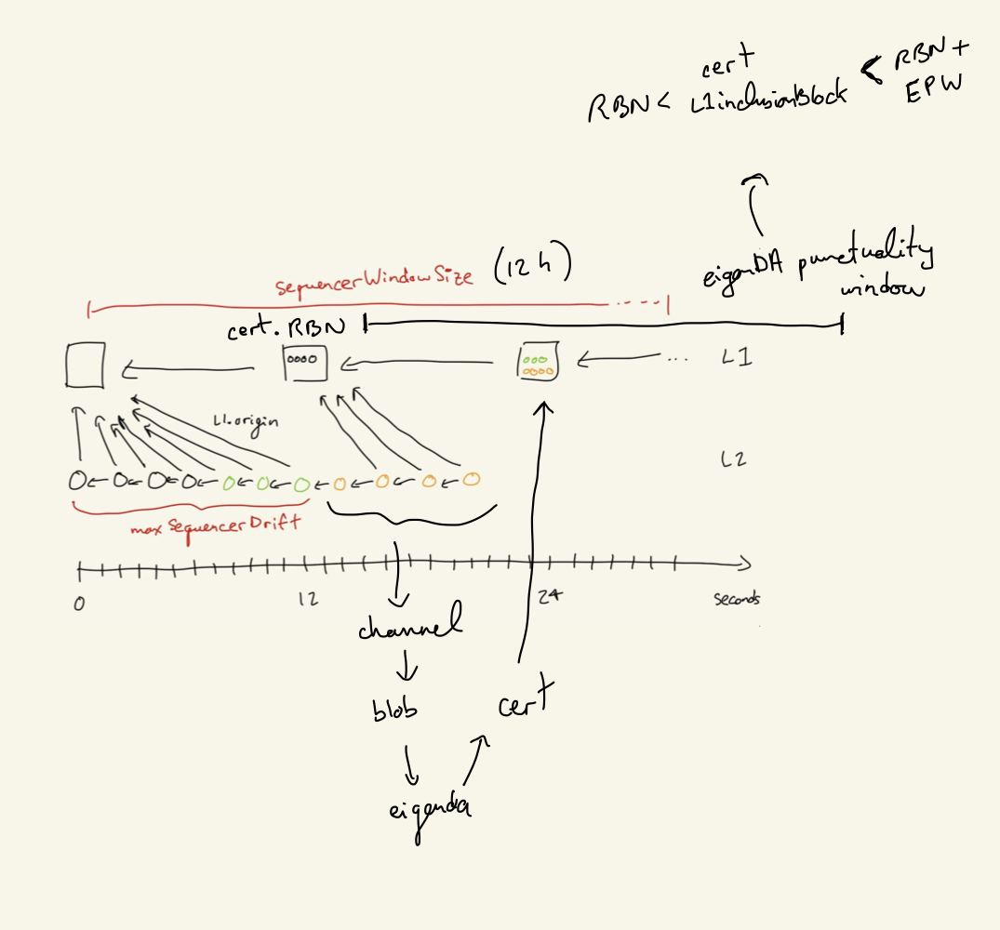

# Secure Integration

This page is meant to be read by eigenda and rollup developers who are writing a secure integration. To understand what a secure integration is at a high level, visit our [secure integration overview](https://docs.eigenda.xyz/integrations-guides/rollup-guides/integrations-overview) docs instead.

## Cert+Blob+Timing Validation

Blob and Cert verification is done for both the write (sequencer) and read (validator) paths. Given this duplication in the lifecycle, and given its importance, it deserves its own section.

The validation process is:

1. Validate the Cert (against state on ethereum)
2. Validate the Blob (against the Cert)

### Cert Validation

Cert validation is done inside the EigenDACertVerifier contract, which EigenDA deploys as-is, but is also available for rollups to modify and deploy on their own. Specifically, the [verifyDACertV2](https://github.com/Layr-Labs/eigenda/blob/98e21397e3471d170f3131549cdbc7113c0cdfaf/contracts/src/core/EigenDACertVerifier.sol#L86) is the entry point for validation. This could either be called during a normal eth transaction (either for pessimistic “bridging” like EigenDA V1 used to do, or when uploading a Blob Field Element to a one-step-proof’s [preimage contract](https://specs.optimism.io/fault-proof/index.html#pre-image-oracle)), or be zk proven using a library like [Steel](https://github.com/risc0/risc0-ethereum/blob/main/crates/steel/docs/what-is-steel.md).

The [cert verification](https://github.com/Layr-Labs/eigenda/blob/master/contracts/src/libraries/EigenDABlobVerificationUtils.sol#L162) logic consists of:

1. [merkleInclusion](https://github.com/Layr-Labs/eigenda/blob/c3d1ff2a9a1ec39fc78c4936eabbc2443df38571/contracts/src/libraries/EigenDABlobVerificationUtils.sol#L173): 
2. verify `sigma` (operators’ bls signature) over `batchRoot` using the `NonSignerStakesAndSignature` struct
3. verify relay keys
4. verify blob security params (blob_params + security thresholds)
5. verify each quorum part of the blob_header has met its threshold

### Blob Validation

There are different required validation steps, depending on whether the client is retrieving or dispersing a blob.

Retrieval (whether data is coming from relays, or directly from DA nodes):

1. Verify that received blob length is ≤ the `length` in the cert’s `BlobCommitment`
2. Verify that the blob length claimed in the `BlobCommitment` is greater than `0`
3. Verify that the blob length claimed in the `BlobCommitment` is a power of two
4. Verify that the payload length claimed in the encoded payload header is ≤ the maximum permissible payload length, as calculated from the `length` in the `BlobCommitment`
    1. The maximum permissible payload length is computed by looking at the claimed blob length, and determining how many bytes would remain if you were to remove the encoding which is performed when converting a `payload` into an `encodedPayload`. This presents an upper bound for payload length: e.g. “If the `payload` were any bigger than `X`, then the process of converting it to an `encodedPayload` would have yielded a `blob` of larger size than claimed”
5. If the bytes received for the blob are longer than necessary to convey the payload, as determined by the claimed payload length, then verify that all extra bytes are `0x0`.
    1. Due to how padding of a blob works, it’s possible that there may be trailing `0x0` bytes, but there shouldn’t be any trailing bytes that aren’t equal to `0x0`.
6. Verify the KZG commitment. This can either be done:
    1. directly: recomputing the commitment using SRS points and checking that the two commitments match (this is the current implemented way)
    2. indirectly: verifying a point opening using Fiat-Shamir (see this [issue](https://github.com/Layr-Labs/eigenda/issues/1037))

Dispersal:

1. If the `BlobCertificate` was generated using the disperser’s `GetBlobCommitment` RPC endpoint, verify its contents:
    1. verify KZG commitment
    2. verify that `length` matches the expected value, based on the blob that was actually sent
    3. verify the `lengthProof` using the `length` and `lengthCommitment`
2. After dispersal, verify that the `BlobKey` actually dispersed by the disperser matches the locally computed `BlobKey`

Note: The verification steps in point 1. for dispersal are not currently implemented. This route only makes sense for clients that want to avoid having large amounts of SRS data, but KZG commitment verification via Fiat-Shamir is required to do the verification without this data. Until the alternate verification method is implemented, usage of `GetBlobCommitment` places a correctness trust assumption on the disperser generating the commitment.

### Timing Verification

Certs need to be included in the rollup’s batcher-inbox in a timely matter, otherwise a malicious batcher could wait until the blobs have expired on EigenDA before posting the cert to the rollup.

### Rollup Stack Secure Integrations

|                     | Nitro V1       | OP V1 (insecure) | Nitro V2       | OP V2                                                                                |
| ------------------- | -------------- | ---------------- | -------------- | ------------------------------------------------------------------------------------ |
| Cert Verification   | SequencerInbox | x                | one-step proof | one-step proof: done in preimage oracle contract when uploading a blob field element |
| Blob Verification   | one-step proof | x                | one-step proof | one-step proof                                                                       |
| Timing Verification | SequencerInbox | x                | SequencerInbox | one-step proof (?)                                                                   |