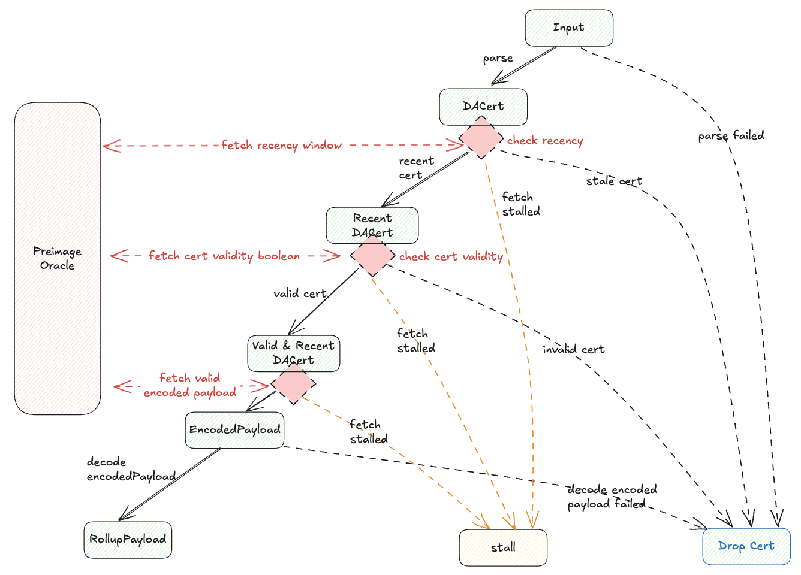
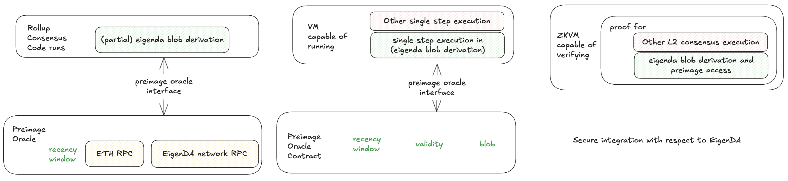

# Secure Integration

> **Audience:** This page is for EigenDA and rollup developers implementing secure integrations. For a high-level overview, see our [secure integration overview](https://docs.eigenda.xyz/integrations-guides/rollup-guides/integrations-overview).

## Overview

A secure integration must handle malicious data posted on Ethereum L1, unlike trusted integrations. Potential threats include:

- **Malicious batcher:** Posts invalid or malformed DA certificates (DA Cert)
- **Malicious proposer:** Publishes incorrect L2 state roots 

## EigenDA Blob Derivation

This section describes the canonical procedure for deriving a rollup payload from a DA Certificate. This derivation is integral to rollup consensus and must be integrated in both rollup nodes and the proof system in secure integrations.

### Current Implementations

- **EigenDA Proxy**
- **OP EigenDA Secure Integration** ([Hokulea](https://github.com/Layr-Labs/hokulea/tree/master))

### Derivation Process

The diagram below shows the step-by-step transformation from input to final rollup payload:

**Key Components:**
- **Input:** Serialized DA Cert (as calldata) + block number of DA Cert inclusion
- **Blob Derivation:** Routes DA cert through validation to one of several terminal states
- **Preimage Oracle:** Interface for fetching additional data during derivation
  - Implementation varies by requirement (e.g., key-value mapping for optimistic fault proofs)
- **Host:** Entity that provides preimage oracle responses

> A encoded payload is an intermdeidate artifact between the rollup payload and the EigenDA blob. See its [definition](./3-data-structs.md/#encodedpayload).




### Terminal States

All inputs to the EigenDA derivation pipeline end in exactly one of these states:

| State | Description |
|-------|-------------|
| **Dropped** | Input rejected and ignored by rollup execution |
| **Stalled** | Required preimage data unavailable at the moment, and it should be retried |
| **Rollup Payload** | ✅ Success - desired payload bytes produced |

### Failure Cases

When validation fails, the DA Cert is discarded and nothing is forwarded downstream:

#### Parse Failed
- Batcher submitted improperly-serialized or unrecognized DA Cert

#### Recency Check Failed
- DA Cert reached rollup inbox after reference block number + recency window 
- Host provides false recency window size that leads to failure

#### Cert Validity Check Failed
- Certificate doesn't satisfy [quorum-attestation constraint](../spec/6-secure-integration.md#2-cert-validation)
- Host provides false validity information via preimage oracle

#### Decode Blob Failed
- EigenDA blob cannot be decoded back to rollup payload per [spec](../spec/3-data-structs.md#data-structs)
- Causes:
  - Host or Batcher intentionally corrupts encoding

**Success:** If no failures occur, the pipeline outputs the expected payload.

## Secure Integration Framework

Rollup consensus must cover all aspects of EigenDA blob derivation. Designers have two degrees of freedom:

1. **Derivation Split:** Choose which parts are executed on-chain (pessimistically via native execution) vs secured off-chain (via proving system)
2. **Proving VM Choice:** Select the on-chain proving virtual machine

Each integration can be tailored to fit specific rollup protocol constraints.

### Splitting EigenDA Blob Derivation

Rollups can split the derivation pipeline between on-chain execution and off-chain verification which is secured by some proof system. This degree
of freedom allows for variants of integrations that tailored to individual stacks. For examples,
- **Arbitrum with EigenDA V1:** All components through cert validity checked in rollup inbox
- **OP Optimstic Fault Proof Integration:** Entire EigenDA blob derivation executes off-chain, and they are secured by the OP [FPVM](https://specs.optimism.io/fault-proof/index.html#fault-proof-vm) proof system. 

### Securely integrating with any VM

In order to secure parts from the EigenDA blob derivation taking place off-chain:

1. **Integration Required:** Blob derivation must be imported into L2 consensus as a library
2. **Compilation:** The library compiles to instructions replayable by on-chain VM
3. **Security:** Off-chain derivation secured by proof system
4. **Complete Coverage:** The combined on-chain (pessimistic native execution) and off-chain logics covers entire derivation

**Preimage Oracle Requirement:** Both on-chain and off-chain implementations needed. 



### Secure integration with ZKVM

The ZKVM integration must also satisfy the requirements described above. Using a ZKVM can also eliminate the need for pessimistic on‑chain execution,
but more importantly it allows the system to either act as a ZK rollup or as a standard optimistic rollup that relies on a challenge mechanism.
- ZK rollup integration: Every time the L2 state is updated to L1, a ZK proof must accompany it, covering all state changes since the previous valid update.
- Optimistic ZK fault‑proof integration: Functionally identical to the standard Optimistic Fault‑Proof integration, except the proof system runs on the ZKVM.

## EigenDA Blob Derivation in EigenDA Proxy

We have dedicated pages for [secure integrations](../rollup-stacks/), but let's review the **EigenDA Proxy** GET path implementation, which has been used in rollup consensus nodes since EigenDA integration began. Proxy also implements WRITE path, solely used by rollup batcher for rollup liveness.

### Proxy Architecture for Blob Derivation

The proxy combines:
- **Blob derivation logic**
- **Retrieval clients** for preimage data
  - **Cert validity:** ETH RPC
  - **EigenDA blob:** gRPC connection to EigenDA network
  - **Recency window:** Input parameter at binary startup 


## Derivation validation In Depth

### 1. RBN Recency Validation

This check enforces timing guarantees: once a cert lands in the batcher inbox, optimistic and zk rollup validators must have enough time to download the EigenDA blob.


We use fault proofs to motivate the need for a recency check. A similar reason exists for zk rollup, where the validator of zk rollup must be able to download the eigenDA blob after the rollup prover posts the L2 state update on L1. 


From the timeline above, EigenDA’s availability window must overlap the ~7-day challenge period so any honest party can detect faults and fetch the required data. Rollup derivation pipelines should reject certificates whose DA window began too far in the past. While a DA cert doesn’t record its signing or availability time, it does include cert.RBN, which is the L1 Reference Block Number chosen by the disperser to anchor the operator set and stakes. Because RBN is fixed before validators sign, it provides a proxy to bound how old the cert can be at inclusion, enabling a simple recency check.
```
certL1InclusionBlock - cert.RBN <= RecencyWindowSize
```
If the inequality fails, discard the cert. This also hardens security by preventing a disperser from choosing a very old RBN with materially different stakes (e.g., after withdrawals).

> To give a concrete example with a rollup stack, optimism has a [sequencerWindow](https://docs.optimism.io/stack/rollup/derivation-pipeline#sequencer-window) which forces batches to land onchain in a timely fashion (12h). This filtering however, happens in the [BatchQueue](https://specs.optimism.io/protocol/derivation.html#batch-queue) stage of the derivation pipeline (DP). But because EigenDA blob derivation needs to take place right after [L1Retrieval](https://specs.optimism.io/protocol/derivation.html#l1-retrieval) and before [BatchQueue], we cannot use the OP's existing mechanism in [BatchQueue] with [sequencerWindow] to discard old DA certificate. To prevent this, we need the recencyWindow filtering to happen during the L1Retrieval stage of the DP.
>
> Despite its semantics being slightly different, sequencerWindow and recencyWindow are related concepts, and in order to not force another config change on op altda forks, we suggest using the same value as the `SequencerWindowSize` for the `RecencyWindowSize`, namely 12h.

For the ~7-day challenge window overlaps EigenDA availability, we assume there is at least one honest challenger runs an L2 consensus node and downloads the EigenDA blob soon after the batch is posted on L1. Define L2StatePostingPeriod as the interval between (a) L1 inclusion of the certificate in the batcher inbox and (b) L1 inclusion of the corresponding L2 state update. As long as L2StatePostingPeriod + RecencyWindowSize < ~7 days, the honest challenger can deter any invalid-proposal attack.


In the diagram, the top row shows L1 blocks every 12 s; the smaller squares are L2 blocks every 2 s. Yellow labels mark key artifacts across the batching pipeline: batches → channel → EigenDA blob. Dispersal completes between t=12 s and t=24 s. The resulting certificate has RBN equal to the L1 block at t=0 (two L1 blocks earlier). The cert is then submitted to L1 at t=24 s. Green annotations show the generalized L2→L1 submission, with batches posted to the adjacent L1 block.

### 2. Cert Validation

Cert validation is done inside the EigenDACertVerifier contract, which EigenDA deploys as-is, but is also available for rollups to modify and deploy on their own. Specifically, [checkDACert](https://github.com/Layr-Labs/eigenda/blob/2414ed6f11bd28bc631eab4da3d6b576645801b0/contracts/src/periphery/cert/EigenDACertVerifier.sol#L46-L56) is the entry point for validation. This could either be called during a normal eth transaction (either for pessimistic “bridging” like EigenDA V1 used to do, or when uploading a Blob Field Element to a one-step-proof’s [preimage contract](https://specs.optimism.io/fault-proof/index.html#pre-image-oracle)), or be zk proven using a library like [Steel](https://docs.beboundless.xyz/developers/steel/what-is-steel) and [Sp1CC](https://succinctlabs.github.io/sp1-contract-call/).

The `checkDACert` function accepts an ABI-encoded `[]byte` certificate input. This design allows the underlying DACert structure to evolve across versions, enabling seamless upgrades without requiring changes to the `EigenDACertVerifierRouter` interface.

The [cert verification](https://github.com/Layr-Labs/eigenda/blob/3e670ff3dbd3a0a3f63b51e40544f528ac923b78/contracts/src/periphery/cert/libraries/EigenDACertVerificationLib.sol#L92-L152) logic consists of:

1. verify blob batch [merkleInclusion](https://github.com/Layr-Labs/eigenda/blob/3e670ff3dbd3a0a3f63b51e40544f528ac923b78/contracts/src/periphery/cert/libraries/EigenDACertVerificationLib.sol#L154-L179) proof
2. [verify](https://github.com/Layr-Labs/eigenda/blob/3e670ff3dbd3a0a3f63b51e40544f528ac923b78/contracts/src/periphery/cert/libraries/EigenDACertVerificationLib.sol#L203-L240) `sigma` (operators’ bls signature) over `batchRoot` using the `NonSignerStakesAndSignature` struct
3. [verify](https://github.com/Layr-Labs/eigenda/blob/3e670ff3dbd3a0a3f63b51e40544f528ac923b78/contracts/src/periphery/cert/legacy/v2/EigenDACertVerificationV2Lib.sol#L198-L218) blob security params (blob_params + security thresholds)
4. [verify](https://github.com/Layr-Labs/eigenda/blob/3e670ff3dbd3a0a3f63b51e40544f528ac923b78/contracts/src/periphery/cert/legacy/v2/EigenDACertVerificationV2Lib.sol#L259-L279) each quorum part of the blob_header has met its threshold

More information about upgrading the cert verification can be found in the [section](#upgradable-quorums-and-thresholds-for-optimistic-verification).

### 3. Downloading and Decoding an Encoded Payload

#### Downloading an Encoded Payload

The preimage oracle served [encoded payload](./3-data-structs.md/#encodedpayload). When the EigenDA blob derivation queries the preimage oracle for the encoded payload corresponding to a DA cert, the preimage oracle (i.e. the preimage request module of the EigenDA proxy) downloads the EigenDA blob from relay or directly from EigenDA operators, or any data sources including pre-populated local storage or s3 that stores the EigenDA blob.
The preimage oracle performs checks on the blob against the KZG commitment from the DA cert. 
If verification fails, it discards the blob and retries with other sources until a valid one is found. Once verified, it returns the encoded payload to the derivation step.

> A rollup may apply an FFT on the blob to obtain its encoded payload, or use the blob directly as the encoded payload, depending on whether an inverse FFT was taken on the encoded payload during the dispersal path.
> Taking IFFT on the dispersal path lets the rollup open points on bytes using parts of the payload. Both Arbitrum Nitro and OP (optimistic or ZK) apply IFFT. The encoded payload always live in the same domain (i.e. without any data transformation) as the payload. It is formed by adding the encoded payload header and interleaving 0s to make every 32bytes a valid field element, the padding 0s at the end to a power of two number of field elements (each 32 bytes).

#### Decoding an Encoded Payload

After verification, EigenDA blob derivation decodes the [encoded payload](./3-data-structs.md/#encodedpayload) to the original rollup payload. If any check fails, discard the blob returned from the preimage oracle. The procedure:

- checkLenInvariant
  - Encoded payload size ≥ size of encoded payload header.
  - Encoded payload contains a power-of-two number of 32-byte field elements (valid sizes: 32, 64, 128, 256, …). See client [implementation](https://github.com/Layr-Labs/eigenda/blob/57ed95ce77a57c53341cad10233ca2f29b29c0f5/api/clients/v2/coretypes/encoded_payload.go#L152).
- decodeHeader: (first 32-byte field element)
  - Encoded payload size ≥ size of encoded payload header.
  - First byte is 0x00 so the first 32 bytes form a valid field element.
  - Encoding version is known (currently 0x00).
  - Returns the claimed original rollup payload size.
- decodePayload
  - Remove internal padding (drop the first byte of each 32-byte word).
  - Decoded size must be ≥ the claimed length.

> The EigenDA protocol enforces blob length > 0 (see [implementation](https://github.com/Layr-Labs/eigenda/blob/57ed95ce77a57c53341cad10233ca2f29b29c0f5/node/grpc/server_v2.go#L127)).

Proxy behavior. The EigenDA proxy can return either the encoded payload or the decoded rollup payload based on GET parameters:
  - With `?return_encoded_payload=true` or `?return_encoded_payload=1`, it only checks the blob against the kzg commitment and returns the encoded payload, it is useful when integrating with proof systems to control the data transformation.
  - Without parameters, it decodes and returns the rollup payload; on any decoding error, it returns HTTP 418.

### Notes on Dispersal
Dispersal:

1. If the `BlobCertificate` was generated using the disperser’s `GetBlobCommitment` RPC endpoint, verify its contents:
    1. verify KZG commitment
    2. verify that `length` matches the expected value, based on the blob that was actually sent
    3. verify the `lengthProof` using the `length` and `lengthCommitment`
2. After dispersal, verify that the `BlobKey` actually dispersed by the disperser matches the locally computed `BlobKey`

Note: The verification steps in point 1. for dispersal are not currently implemented. This route only makes sense for clients that want to avoid having large amounts of SRS data, but KZG commitment verification via Fiat-Shamir is required to do the verification without this data. Until the alternate verification method is implemented, usage of `GetBlobCommitment` places a correctness trust assumption on the disperser generating the commitment.

## Upgradable Quorums and Thresholds for Optimistic Verification


The [`EigenDACertVerifierRouter`](./4-contracts.md#eigendacertverifierrouter) contract enables secure upgrades to a rollup’s required quorums and thresholds without compromising the integrity of previously submitted state commitments. It achieves this by routing certificate verification to the appropriate `EigenDACertVerifier` instance based on the `reference_block_number` embedded in the cert, which dictates the verifier whose activation block was effective at that time. This ensures backward compatibility, allowing older `DACert`s to be validated against the verifier version that was active at the time of their creation.

The router is typically deployed behind an upgradable admin proxy and should use the same `ProxyAdmin` multisig as the rollup for consistent and secure access control.


### Adding New Verifiers — Synchronization Risk

There is a synchronization risk that can temporarily cause dispersals to fail when adding a new `verifier'` to the `EigenDACertVerifierRouter` at a future activation block number (`abn'`). If `latest_block < abn'` **and** `rbn >= abn'`, dispersals may fail if the `required_quorums` set differs between `verifier` and `verifier'`. In this case, the quorums included in the client's `BlobHeader` (based on the old verifier) would not match those expected by `checkDACert` (using the new verifier). This mismatch results in **at most** a few failed dispersals, which will resolve once `latest_block >= abn'` and `reference_block_number >= abn'`, ensuring verifier consistency. The EigenDA integrations team will explore mitigations in the future.


### Rollup Stack Secure Integrations

|                     | Nitro V1       | OP V1 (insecure) | Nitro V2       | OP V2                                                                                |
| ------------------- | -------------- | ---------------- | -------------- | ------------------------------------------------------------------------------------ |
| Cert Verification   | SequencerInbox | x                | one-step proof | one-step proof: done in preimage oracle contract when uploading a blob field element |
| Blob Verification   | one-step proof | x                | one-step proof | one-step proof                                                                       |
| Timing Verification | SequencerInbox | x                | SequencerInbox | one-step proof (?)                                                                   |