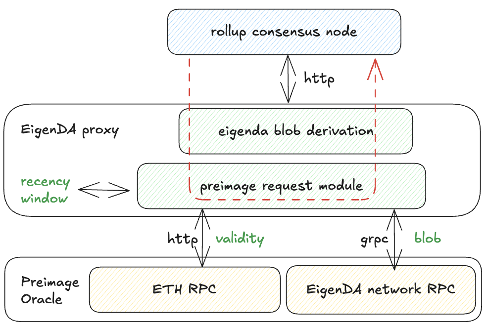

# Secure Integration

> **Audience:** This page is for EigenDA and rollup developers implementing secure integrations. For a high-level overview, see our [secure integration overview](https://docs.eigenda.xyz/integrations-guides/rollup-guides/integrations-overview).

## Overview

A secure integration must handle malicious data posted on Ethereum L1, unlike trusted integrations. Potential threats include:

- **Malicious batcher:** Posts invalid or malformed DA certificates (DA Cert)
- **Malicious proposer:** Publishes incorrect L2 state roots 

## EigenDA Blob Derivation

This section describes the canonical procedure for deriving a rollup payload from a DA Certificate. This derivation is integral to rollup consensus and must be implemented in both rollup nodes and secure integrations.

### Current Implementations

- **EigenDA Proxy**
- **OP EigenDA Secure Integration** ([Hokulea](https://github.com/Layr-Labs/hokulea/tree/master))

### Derivation Process

The diagram below shows the step-by-step transformation from input to final rollup payload:

**Key Components:**
- **Input:** Serialized DA Cert (as calldata) + block number of DA Cert inclusion
- **Blob Derivation:** Routes DA cert through validation to one of several terminal states
- **Preimage Oracle:** Interface for fetching additional data during derivation
  - Implementation varies by requirement (e.g., key-value mapping for optimistic fault proofs)
- **Host:** Entity that provides preimage oracle responses


### Terminal States

All inputs to the EigenDA derivation pipeline end in exactly one of these states:

| State | Description |
|-------|-------------|
| **Dropped** | Input rejected and ignored by rollup execution |
| **Stalled** | Required preimage data temporarily unavailable |
| **Rollup Payload** | ✅ Success - desired payload bytes produced |

### Failure Cases

When validation fails, the DA Cert is discarded and nothing is forwarded downstream:

#### Parse Failed
- Batcher submitted improperly-serialized or unrecognized DA Cert

#### Recency Check Failed
- DA Cert reached rollup inbox after reference block number + recency window 
- Host provides false recency window size that leads to failure

#### Cert Validity Check Failed
- Certificate doesn't satisfy [quorum-attestation constraint](#2-cert-validation)
- Host provides false validity information via preimage oracle

#### Decode Blob Failed
- EigenDA blob cannot be decoded back to rollup payload per [spec](./3-datastructs.md#data-structs)
- Causes:
  - Batcher intentionally corrupts encoding
  - Host transmits incorrect data

**Success:** If no failures occur, the pipeline outputs the expected payload.

## Secure Integration Framework

Rollup consensus must cover all aspects of EigenDA blob derivation. Designers have two degrees of freedom:

1. **Derivation Split:** Choose which parts are checked on-chain (pessimistically) vs off-chain (optimistically)
2. **Proving VM Choice:** Select the on-chain proving virtual machine

Each integration can be tailored to fit specifi rollup protocol constraints.

### Splitting EigenDA Blob Derivation

Rollups can split the derivation pipeline between on-chain and off-chain verification:

**Examples:**
- **Arbitrum with EigenDA V1:** All components through cert validity checked in rollup inbox
- **OP Integration:** Entire EigenDA blob derivation takes place off-chain 

### VM for Optimistic Fault Proof

In order to secure parts from the EigenDA blob derivation taking place off-chain:

1. **Integration Required:** Blob derivation must be imported into L2 consensus as a library
2. **Compilation:** The library compiles to instructions replayable by on-chain VM
3. **Security:** Off-chain derivation secured by proof system
4. **Complete Coverage:** Combined on-chain and off-chain logics covers entire derivation

**Preimage Oracle Requirement:** Both on-chain and off-chain implementations needed. 


### ZKVM for ZK Fault Proof

**Key Difference:** ZKVMs don't require preimage oracles since all preimage verification can be attached to EigenDA blob derivation usable as a library.

**Hybrid Approach:** Secure integrations can theoretically combine both ZKVM and optimistic fault proof VMs.

## EigenDA Blob Derivation in EigenDA Proxy

We have dedicated page for secure integrations, but let's review the **EigenDA Proxy** GET path implementation, which has been used in rollup consensus nodes since EigenDA integration began. Proxy also implements WRITE path, solely used by rollup batcher for rollup liveness.

### Proxy Architecture for Blob Derivation

The proxy combines:
- **Blob derivation logic**
- **Retrieval clients** for preimage data
  - **Cert validity:** ETH RPC
  - **EigenDA blob:** gRPC connection to EigenDA network
  - **Recency window:** Input parameter at binary startup 




## Derivation validation In Depth

### 1. RBN Recency Validation

This check is related to time guarantees. It is important for both optimistic and zk rollup validators to have sufficient time to download the blob from EigenDA once a cert lands in the batcher inbox. 

We will use fault proofs as our base example to reason about the necessity of the recency check.


Looking at the timing diagram above, we need the EigenDA availability period to overlap the ~7days challenge period. In order to uphold this guarantee, what we need to do is simply to have rollups' derivation pipelines reject certs whose DA availability period started a long time ago. However, from the cert itself, there is no way to know when the cert was signed and made available. The only information available on the cert itself is `cert.RBN`, the reference block number chosen by the disperser at which to anchor operator stakes. But that happens to be before validators sign, so it is enough to bound how far that can be from the cert's inclusion block.

Rollups must thus enforce that
```
certL1InclusionBlock - cert.RBN <= RecencyWindowSize
```

This has a second security implication. A malicious EigenDA disperser could have chosen a reference block number (RBN) that is very old, where the stake of operators was very different from the current one, due to operators withdrawing stake for example.

> To give a concrete example with a rollup stack, optimism has a [sequencerWindow](https://docs.optimism.io/stack/rollup/derivation-pipeline#sequencer-window) which forces batches to land onchain in a timely fashion (12h). This filtering however, happens in the [BatchQueue](https://specs.optimism.io/protocol/derivation.html#batch-queue) stage of the derivation pipeline (DP), and doesn't prevent the DP being stalled in the [L1Retrieval](https://specs.optimism.io/protocol/derivation.html#l1-retrieval) stage by an old cert having been submitted whose blob is no longer available on EigenDA. To prevent this, we need the recencyWindow filtering to happen during the L1Retrieval stage of the DP.
>
> Despite its semantics being slightly different, sequencerWindow and recencyWindow are related concepts, and in order to not force another config change on op altda forks, we suggest using the same value as the `SequencerWindowSize` for the `RecencyWindowSize`, namely 12h.


### 2. Cert Validation

Cert validation is done inside the EigenDACertVerifier contract, which EigenDA deploys as-is, but is also available for rollups to modify and deploy on their own. Specifically, [checkDACert](https://github.com/Layr-Labs/eigenda/blob/2414ed6f11bd28bc631eab4da3d6b576645801b0/contracts/src/periphery/cert/EigenDACertVerifier.sol#L46-L56) is the entry point for validation. This could either be called during a normal eth transaction (either for pessimistic “bridging” like EigenDA V1 used to do, or when uploading a Blob Field Element to a one-step-proof’s [preimage contract](https://specs.optimism.io/fault-proof/index.html#pre-image-oracle)), or be zk proven using a library like [Steel](https://github.com/risc0/risc0-ethereum/blob/main/crates/steel/docs/what-is-steel.md).

The `checkDACert` function accepts an ABI-encoded `[]byte` certificate input. This design allows the underlying DACert structure to evolve across versions, enabling seamless upgrades without requiring changes to the `EigenDACertVerifierRouter` interface.

The [cert verification](https://github.com/Layr-Labs/eigenda/blob/3e670ff3dbd3a0a3f63b51e40544f528ac923b78/contracts/src/periphery/cert/libraries/EigenDACertVerificationLib.sol#L92-L152) logic consists of:

1. verify blob batch [merkleInclusion](https://github.com/Layr-Labs/eigenda/blob/3e670ff3dbd3a0a3f63b51e40544f528ac923b78/contracts/src/periphery/cert/libraries/EigenDACertVerificationLib.sol#L154-L179) proof
2. [verify](https://github.com/Layr-Labs/eigenda/blob/3e670ff3dbd3a0a3f63b51e40544f528ac923b78/contracts/src/periphery/cert/libraries/EigenDACertVerificationLib.sol#L203-L240) `sigma` (operators’ bls signature) over `batchRoot` using the `NonSignerStakesAndSignature` struct
3. [verify](https://github.com/Layr-Labs/eigenda/blob/3e670ff3dbd3a0a3f63b51e40544f528ac923b78/contracts/src/periphery/cert/legacy/v2/EigenDACertVerificationV2Lib.sol#L198-L218) blob security params (blob_params + security thresholds)
4. [verify](https://github.com/Layr-Labs/eigenda/blob/3e670ff3dbd3a0a3f63b51e40544f528ac923b78/contracts/src/periphery/cert/legacy/v2/EigenDACertVerificationV2Lib.sol#L259-L279) each quorum part of the blob_header has met its threshold

### 3. Blob Validation

There are different required validation steps, depending on whether the client is retrieving or dispersing a blob.

Retrieval (whether data is coming from relays, or directly from DA nodes):

1. Verify that received blob length is ≤ the `length` in the cert’s `BlobCommitment`
2. Verify that the blob length claimed in the `BlobCommitment` is greater than `0`
3. Verify that the blob length claimed in the `BlobCommitment` is a power of two
4. Verify that the payload length claimed in the encoded payload header is ≤ the maximum permissible payload length, as calculated from the `length` in the `BlobCommitment`
    1. The maximum permissible payload length is computed by looking at the claimed blob length, and determining how many bytes would remain if you were to remove the encoding which is performed when converting a `payload` into an `encodedPayload`. This presents an upper bound for payload length: e.g. “If the `payload` were any bigger than `X`, then the process of converting it to an `encodedPayload` would have yielded a `blob` of larger size than claimed”
5. If the bytes received for the blob are longer than necessary to convey the payload, as determined by the claimed payload length, then verify that all extra bytes are `0x0`.
    1. Due to how padding of a blob works, it’s possible that there may be trailing `0x0` bytes, but there shouldn’t be any trailing bytes that aren’t equal to `0x0`.
6. Verify the KZG commitment. This can either be done:
    1. directly: recomputing the commitment using SRS points and checking that the two commitments match (this is the current implemented way)
    2. indirectly: verifying a point opening using Fiat-Shamir (see this [issue](https://github.com/Layr-Labs/eigenda/issues/1037))

Dispersal:

1. If the `BlobCertificate` was generated using the disperser’s `GetBlobCommitment` RPC endpoint, verify its contents:
    1. verify KZG commitment
    2. verify that `length` matches the expected value, based on the blob that was actually sent
    3. verify the `lengthProof` using the `length` and `lengthCommitment`
2. After dispersal, verify that the `BlobKey` actually dispersed by the disperser matches the locally computed `BlobKey`

Note: The verification steps in point 1. for dispersal are not currently implemented. This route only makes sense for clients that want to avoid having large amounts of SRS data, but KZG commitment verification via Fiat-Shamir is required to do the verification without this data. Until the alternate verification method is implemented, usage of `GetBlobCommitment` places a correctness trust assumption on the disperser generating the commitment.

## Upgradable Quorums and Thresholds for Optimistic Verification


The [`EigenDACertVerifierRouter`](./4-contracts.md#eigendacertverifierrouter) contract enables secure upgrades to a rollup’s required quorums and thresholds without compromising the integrity of previously submitted state commitments. It achieves this by routing certificate verification to the appropriate `EigenDACertVerifier` instance based on the `reference_block_number` embedded in the cert, which dictates the verifier whose activation block was effective at that time. This ensures backward compatibility, allowing older `DACert`s to be validated against the verifier version that was active at the time of their creation.

The router is typically deployed behind an upgradable admin proxy and should use the same `ProxyAdmin` multisig as the rollup for consistent and secure access control.


### Adding New Verifiers — Synchronization Risk

There is a synchronization risk that can temporarily cause dispersals to fail when adding a new `verifier'` to the `EigenDACertVerifierRouter` at a future activation block number (`abn'`). If `latest_block < abn'` **and** `rbn >= abn'`, dispersals may fail if the `required_quorums` set differs between `verifier` and `verifier'`. In this case, the quorums included in the client's `BlobHeader` (based on the old verifier) would not match those expected by `checkDACert` (using the new verifier). This mismatch results in **at most** a few failed dispersals, which will resolve once `latest_block >= abn'` and `reference_block_number >= abn'`, ensuring verifier consistency. The EigenDA integrations team will explore mitigations in the future.


### Rollup Stack Secure Integrations

|                     | Nitro V1       | OP V1 (insecure) | Nitro V2       | OP V2                                                                                |
| ------------------- | -------------- | ---------------- | -------------- | ------------------------------------------------------------------------------------ |
| Cert Verification   | SequencerInbox | x                | one-step proof | one-step proof: done in preimage oracle contract when uploading a blob field element |
| Blob Verification   | one-step proof | x                | one-step proof | one-step proof                                                                       |
| Timing Verification | SequencerInbox | x                | SequencerInbox | one-step proof (?)                                                                   |