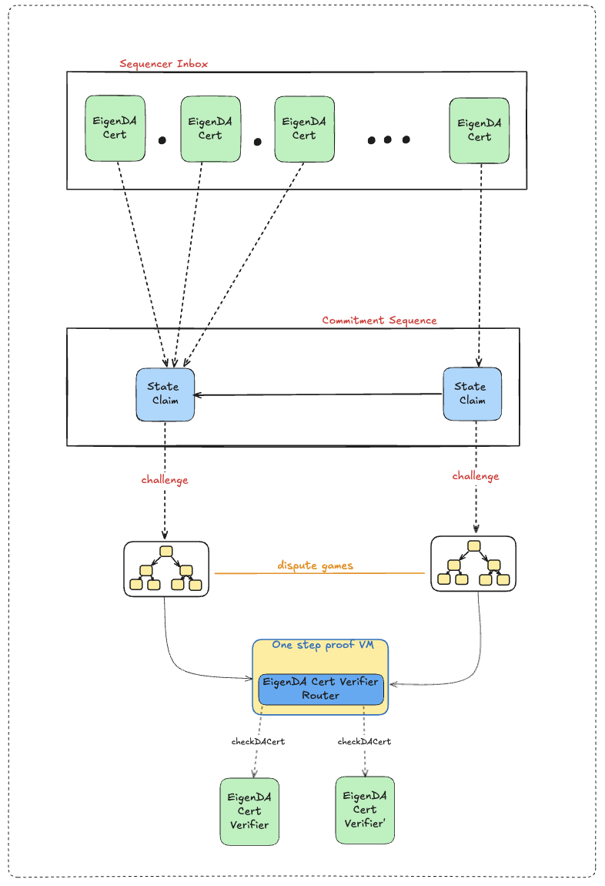

# Secure Integration

This page is meant to be read by eigenda and rollup developers who are writing a secure integration and need to understand the details. For users who want a high-level understanding of what a secure integration is, please visit our [secure integration overview](https://docs.eigenda.xyz/integrations-guides/rollup-guides/integrations-overview) page instead.


Unlike a trusted integration, a secure integration must handle the malicious data PUT on L1 Ethereum. A malicious batcher can post an invalid or malformed DA certificate (DA Cert) to stall the roll-up derivation pipeline. A malicious proposer can publish wrong L2 state roots. To overcome incorrect data posted on L1,
we rely on the GET path of the rollup to reliably filter out incorrect data posted by batcher, and challenge the incorrect state root by malicious proposer.

We will first introduce the derivation procedures and then discuss two implementations - **eigenda-proxy** and **Hokulea**.

## EigenDA blob derivation

This section introduces a canonical procedure for deriving a rollup payload from a DA Cert in the GET path. The diagram below illustrates a step-by-step transition from a raw DA Cert byte string to the final roll-up payload:

- Calldata Input: The pipeline starts with only the DA Cert as byte strings.
- Blob derivation: As the input transitions downward to the rollup payload at the bottom, the DA cert can be routed to one of the terminal states depending on if the DA certs is recent enough, if it is valid or if can be decoded correctly.
- Preimage oracle: Some procedures during the derivation requires fetching EigenDA blobs and other cert metadata. Access to each piece of data is abstracted behind a pre-image oracle. More see this [section](#eigenda-blob-derivation-and-preimage-oracle).
- Host: the name refers to an entity hostinh the preimage server behind the preimage oracle.


### Terminal states
All inputs to EigenDA derivation pipeline ends in exactly one of four terminal states:
| State               | Meaning                                                             |
| ------------------- | ------------------------------------------------------------------- |
| **dropped**         | The input is rejected and therefore ignored by the rollup execution |
| **stalled**         | Required data is temporarily unavailable.                           |
| **panic**           | A fundamental invariant (e.g., field-element validity) is violated. |
| **roll-up payload** | Success case when the desired payload bytes are produced.           |

### Failure cases

If an arrow in the diagram is labelled failed, the supplied data did not satisfy EigenDA’s safeguards. The DA Cert is discarded and nothing is forwarded downstream.

A path marked stall means the host cannot (yet) provide the requested data.
A path marked panic means the blob’s coefficients are not valid BN254 field elements. Then in theory, a KZG commitment cannot be generated, therefore derivation panic.

- parse failed – The batcher submitted an improperly-serialized DA Cert.
- recency check failed – The DA Cert reached the roll-up inbox too late.
- cert validity check failed – Either the certificate does not satisfy the [quorum-attestation constraint](#2-cert-validation) or the host lies about its validity via the preimage oracle.
- decode blob failed – The host supplies an EigenDA blob that cannot be decoded into back to rollup payload per the [spec](./3-datastructs.md#data-structs). This can occur when
  - the batcher intentionally corrupts the encoding, or
  - the host transmits incorrect data.

But if none of these errors arise, the derivation pipeline outputs the expected payload.

## EigenDA Blob derivation and Preimage Oracle

We have defined the canonical derivation process, and now we described two concrete implementations and their preimage oracle:

### EigenDA-proxy (Go)

Eigenda proxy is the first implementation of the eigenda blob derivation described above, it is also the first implementation  of the  preimage oracle
server that uses the external RPC to implement the preimage oracle. The proxy also contains services like http server, secondary storage and more features on [proxy github page](https://github.com/Layr-Labs/eigenda-proxy?tab=readme-ov-file#features-and-configuration-options-flagsenv-vars). Below we highlight some parts around derivation pipeline
- the calldata input in proxy is received from http listening port (typically the requester is a roll-up consensus node).
- proxy has both ETH RPC and EigenDA network RPC to get the preimage like the diagram below
- Queries an Ethereum RPC endpoint to validate the cert. In practice, it is handled by implemented by `verification` Go package.
- the EigenDA blob can be retrieved from EigenDA network either directly with an EigenDA relay node RPC or via distributed retrieval by communicating directly to the endpoints exposed by EigenDA validators. In practice, it is handled by implemented by `payloadretrieval` Go package.
- if everything succeeds, the roll-up payload is returned by the proxy to the requester via the HTTP response.

Eigenda-Proxy is the implemention which rollup consensus node runs in the normal mode for optimistic rollup.  


### Hokulea (Rust)

We have developed another implementation of EigenDA blob derivation for OP stack, primarily for securing OP stack rollup with optimistic fault-proof,
ZK Fault Proof or ZK proof. The hokulea client (and crates it uses) implements the identical eigenda blob derivation logics as mentioned in the [eigenda blob derivation section](#eigenda-blob-derivation), the client is intended to be imported as a library into OP consensus rust implementation [Kona](https://github.com/op-rs/kona).


The major difference between the two implementations comes to how the preimage oracle is abstracted and implemented.
For hokulea, the interface is abstracted as key-value map to make preimage oracle verifiable on L1 Ethereum,
whose relation is verifiable on L1 Ethereum.
In Hokulea, the preimage host for the key-value oracle interface is built on top of the Eigenda proxy. See diagram above. All the heavy lifting parts to get
the actual preimage data is done by the proxy, and the Hokulea host is a thin layer to translate http status codes into preimage data or error.

### Communication betweeen Hokulea host and EigenDA proxy

Proxy Uses HTTP interface, And to allow proxy to be used as a base layer for abstraction. The proxy exposes the following JSON status code In addition to http
status code to convey Information about the preimage.

| Message             | HTTP Status Code                | JSON Status Code                |     Indication      |
| ------------------- | ------------------------------- | ------------------------------- | ------------------- |
| **decoded blob (i.e rollup payload)**    | 200                             | NA                              |  successful request |
| **cert validity**   | 418                             | 1                               |  cert is invalid    |
| **cert recency**    | 418                             | 2                               |  cert is too old    |
| **encoded payload(subject to change)**    | 418                             | 3                               |  blob decoding error|

For careful readers and developer familiar with EigenDA proxy, proxy by default returns the decoded blob, i.e. the rollup payload, as a byte string in a HTTP 200
reponse message. However, to enable proxy as a part of the preimage oracle against other implementation of EigenDA derivation pipeline (like Hokulea), the preimage data must be a valid blob polynomial, whose every 32 Bytes must be valid field element on BN254 (i.e [encoded payload](./3-data-structs.md)).

Proxy must be able to return the encoded payload alone, though the specific implementation has not been decided yet.
As described in [data-struct page](./3-data-structs.md). During the creation of a DA cert a rollup payload, the data is first transformed into the encoded paylod
then undergo IFFT transform into the right polynomial format before sending to EigenDA that created a DA cert.

Normally the DecodeBlob functional interface on the GET path of the proxy does the FFT transformation on the received EigenDA blob to convert into the encoded
payload which is the original polynomial format.
To remove redundant work which the upper layer (Hokulea host) has to do (i.e. the FFT step), the proxy when used as a component for providing preimage, it returns
the encoded payload as opposed to the raw eigenda blob, which has the IFFT transformation, which is needed for optimistic challenge for opening points onchain.

In the following sections, We provide the definition for each check in the diagram above. 

## Derivation validation In Depth

### 1. RBN Recency Validation

This check is related to time guarantees. It is important for both optimistic and zk rollup validators to have sufficient time to download the blob from EigenDA once a cert lands in the batcher inbox. 

We will use fault proofs as our base example to reason about the necessity of the recency check.


Looking at the timing diagram above, we need the EigenDA availability period to overlap the ~7days challenge period. In order to uphold this guarantee, what we need to do is simply to have rollups' derivation pipelines reject certs whose DA availability period started a long time ago. However, from the cert itself, there is no way to know when the cert was signed and made available. The only information available on the cert itself is `cert.RBN`, the reference block number chosen by the disperser at which to anchor operator stakes. But that happens to be before validators sign, so it is enough to bound how far that can be from the cert's inclusion block.

Rollups must thus enforce that
```
certL1InclusionBlock - cert.RBN <= RecencyWindowSize
```

This has a second security implication. A malicious EigenDA disperser could have chosen a reference block number (RBN) that is very old, where the stake of operators was very different from the current one, due to operators withdrawing stake for example.

> To give a concrete example with a rollup stack, optimism has a [sequencerWindow](https://docs.optimism.io/stack/rollup/derivation-pipeline#sequencer-window) which forces batches to land onchain in a timely fashion (12h). This filtering however, happens in the [BatchQueue](https://specs.optimism.io/protocol/derivation.html#batch-queue) stage of the derivation pipeline (DP), and doesn't prevent the DP being stalled in the [L1Retrieval](https://specs.optimism.io/protocol/derivation.html#l1-retrieval) stage by an old cert having been submitted whose blob is no longer available on EigenDA. To prevent this, we need the recencyWindow filtering to happen during the L1Retrieval stage of the DP.
>
> Despite its semantics being slightly different, sequencerWindow and recencyWindow are related concepts, and in order to not force another config change on op altda forks, we suggest using the same value as the `SequencerWindowSize` for the `RecencyWindowSize`, namely 12h.


### 2. Cert Validation

Cert validation is done inside the EigenDACertVerifier contract, which EigenDA deploys as-is, but is also available for rollups to modify and deploy on their own. Specifically, [checkDACert](https://github.com/Layr-Labs/eigenda/blob/2414ed6f11bd28bc631eab4da3d6b576645801b0/contracts/src/periphery/cert/EigenDACertVerifier.sol#L46-L56) is the entry point for validation. This could either be called during a normal eth transaction (either for pessimistic “bridging” like EigenDA V1 used to do, or when uploading a Blob Field Element to a one-step-proof’s [preimage contract](https://specs.optimism.io/fault-proof/index.html#pre-image-oracle)), or be zk proven using a library like [Steel](https://github.com/risc0/risc0-ethereum/blob/main/crates/steel/docs/what-is-steel.md).

The `checkDACert` function accepts an ABI-encoded `[]byte` certificate input. This design allows the underlying DACert structure to evolve across versions, enabling seamless upgrades without requiring changes to the `EigenDACertVerifierRouter` interface.

The [cert verification](https://github.com/Layr-Labs/eigenda/blob/3e670ff3dbd3a0a3f63b51e40544f528ac923b78/contracts/src/periphery/cert/libraries/EigenDACertVerificationLib.sol#L92-L152) logic consists of:

1. verify blob batch [merkleInclusion](https://github.com/Layr-Labs/eigenda/blob/3e670ff3dbd3a0a3f63b51e40544f528ac923b78/contracts/src/periphery/cert/libraries/EigenDACertVerificationLib.sol#L154-L179) proof
2. [verify](https://github.com/Layr-Labs/eigenda/blob/3e670ff3dbd3a0a3f63b51e40544f528ac923b78/contracts/src/periphery/cert/libraries/EigenDACertVerificationLib.sol#L203-L240) `sigma` (operators’ bls signature) over `batchRoot` using the `NonSignerStakesAndSignature` struct
3. [verify](https://github.com/Layr-Labs/eigenda/blob/3e670ff3dbd3a0a3f63b51e40544f528ac923b78/contracts/src/periphery/cert/legacy/v2/EigenDACertVerificationV2Lib.sol#L198-L218) blob security params (blob_params + security thresholds)
4. [verify](https://github.com/Layr-Labs/eigenda/blob/3e670ff3dbd3a0a3f63b51e40544f528ac923b78/contracts/src/periphery/cert/legacy/v2/EigenDACertVerificationV2Lib.sol#L259-L279) each quorum part of the blob_header has met its threshold

### 3. Blob Validation

There are different required validation steps, depending on whether the client is retrieving or dispersing a blob.

Retrieval (whether data is coming from relays, or directly from DA nodes):

1. Verify that received blob length is ≤ the `length` in the cert’s `BlobCommitment`
2. Verify that the blob length claimed in the `BlobCommitment` is greater than `0`
3. Verify that the blob length claimed in the `BlobCommitment` is a power of two
4. Verify that the payload length claimed in the encoded payload header is ≤ the maximum permissible payload length, as calculated from the `length` in the `BlobCommitment`
    1. The maximum permissible payload length is computed by looking at the claimed blob length, and determining how many bytes would remain if you were to remove the encoding which is performed when converting a `payload` into an `encodedPayload`. This presents an upper bound for payload length: e.g. “If the `payload` were any bigger than `X`, then the process of converting it to an `encodedPayload` would have yielded a `blob` of larger size than claimed”
5. If the bytes received for the blob are longer than necessary to convey the payload, as determined by the claimed payload length, then verify that all extra bytes are `0x0`.
    1. Due to how padding of a blob works, it’s possible that there may be trailing `0x0` bytes, but there shouldn’t be any trailing bytes that aren’t equal to `0x0`.
6. Verify the KZG commitment. This can either be done:
    1. directly: recomputing the commitment using SRS points and checking that the two commitments match (this is the current implemented way)
    2. indirectly: verifying a point opening using Fiat-Shamir (see this [issue](https://github.com/Layr-Labs/eigenda/issues/1037))

Dispersal:

1. If the `BlobCertificate` was generated using the disperser’s `GetBlobCommitment` RPC endpoint, verify its contents:
    1. verify KZG commitment
    2. verify that `length` matches the expected value, based on the blob that was actually sent
    3. verify the `lengthProof` using the `length` and `lengthCommitment`
2. After dispersal, verify that the `BlobKey` actually dispersed by the disperser matches the locally computed `BlobKey`

Note: The verification steps in point 1. for dispersal are not currently implemented. This route only makes sense for clients that want to avoid having large amounts of SRS data, but KZG commitment verification via Fiat-Shamir is required to do the verification without this data. Until the alternate verification method is implemented, usage of `GetBlobCommitment` places a correctness trust assumption on the disperser generating the commitment.

## Upgradable Quorums and Thresholds for Optimistic Verification


The [`EigenDACertVerifierRouter`](./4-contracts.md#eigendacertverifierrouter) contract enables secure upgrades to a rollup’s required quorums and thresholds without compromising the integrity of previously submitted state commitments. It achieves this by routing certificate verification to the appropriate `EigenDACertVerifier` instance based on the `reference_block_number` embedded in the cert, which dictates the verifier whose activation block was effective at that time. This ensures backward compatibility, allowing older `DACert`s to be validated against the verifier version that was active at the time of their creation.

The router is typically deployed behind an upgradable admin proxy and should use the same `ProxyAdmin` multisig as the rollup for consistent and secure access control.


### Adding New Verifiers — Synchronization Risk

There is a synchronization risk that can temporarily cause dispersals to fail when adding a new `verifier'` to the `EigenDACertVerifierRouter` at a future activation block number (`abn'`). If `latest_block < abn'` **and** `rbn >= abn'`, dispersals may fail if the `required_quorums` set differs between `verifier` and `verifier'`. In this case, the quorums included in the client's `BlobHeader` (based on the old verifier) would not match those expected by `checkDACert` (using the new verifier). This mismatch results in **at most** a few failed dispersals, which will resolve once `latest_block >= abn'` and `reference_block_number >= abn'`, ensuring verifier consistency. The EigenDA integrations team will explore mitigations in the future.


### Rollup Stack Secure Integrations

|                     | Nitro V1       | OP V1 (insecure) | Nitro V2       | OP V2                                                                                |
| ------------------- | -------------- | ---------------- | -------------- | ------------------------------------------------------------------------------------ |
| Cert Verification   | SequencerInbox | x                | one-step proof | one-step proof: done in preimage oracle contract when uploading a blob field element |
| Blob Verification   | one-step proof | x                | one-step proof | one-step proof                                                                       |
| Timing Verification | SequencerInbox | x                | SequencerInbox | one-step proof (?)                                                                   |