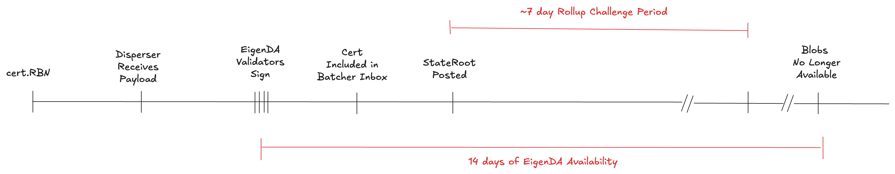

# Secure Integration

This page is meant to be read by eigenda and rollup developers who are writing a secure integration and need to understand the details. For users who want a high-level understanding of what a secure integration is, please visit our [secure integration overview](https://docs.eigenda.xyz/integrations-guides/rollup-guides/integrations-overview) page instead.


Unlike a trusted integration, a secure integration must be able to handle any malicious data posted on Ethereum L1:
- A malicious batcher can post an invalid or malformed DA certificate (DA Cert)
- A malicious proposer can publish wrong L2 state roots. 

## EigenDA blob derivation

This section describes a canonical procedure for deriving a rollup payload from a DA Cert. For any rollup integrated with EigenDA, this derivation is an integral part of the perspective L2 consensus whose logic must be present in both rollup node and secure integration. Currently, the EigenDA blob derivation has been implemented in EigenDA proxy, OP EigenDA secure integration ([Hokulea](https://github.com/Layr-Labs/hokulea/tree/master)) and Nitro EigenDA secure integration([EigenDA Nitro](https://github.com/Layr-Labs/nitro)). The diagram below illustrates **EigenDA blob derivation** highlighting step-by-step transition from an input to the final rollup payload. Each green box represents the data and its attribute.

- Input: The pipeline starts only containing a serialized DA Cert (as calldata) and block number of the DA Cert inclusion block.
- Blob derivation: As the input transitions downward to the rollup payload at the bottom, the DA cert can be routed to one of the terminal states.
- Preimage oracle: Some procedures during the derivation require fetching additional data beyond the Input provided at the start. A preimage oracle is an object with an interface which the derivation can use for fetching additional data. Depending on the requirement, the oracle and the interface use specific implementation. For example, a secure integration with optimistic fault proof requires the interface as a key value mapping whose relation is verifiable on chain.
- Host: an entity hosting a preimage oracle which can return the answer to the preimage query.


### Terminal states
All inputs to EigenDA derivation pipeline end in exactly one of four terminal states:
| State               | Meaning                                                             |
| ------------------- | ------------------------------------------------------------------- |
| **dropped**         | The input is rejected and therefore ignored by the rollup execution |
| **stalled**         | Required preimage data is temporarily unavailable.                           |
| **rollup payload** | Success case when the desired payload bytes are produced.           |

### Failure cases

If an arrow in the diagram is labelled failed, the supplied data did not satisfy EigenDA’s safeguards. The DA Cert is discarded and nothing is forwarded downstream.

- parse failed – The batcher submitted an improperly-serialized DA Cert or a unrecognized cert.
- recency check failed – The DA Cert reached the roll-up inbox too late.
- cert validity check failed – Either the certificate does not satisfy the [quorum-attestation constraint](#2-cert-validation) or the host lies about its validity via the preimage oracle.
- decode blob failed – The host supplies an EigenDA blob that cannot be decoded back into a rollup payload as per the [spec](./3-datastructs.md#data-structs). This can occur when
  - the batcher intentionally corrupts the encoding, or
  - the host transmits incorrect data.

If none of these error cases arise, the derivation pipeline outputs the expected payload.

## Secure Integration Framework

The L2 consensus must cover all parts from the EigenDA blob derivation. There are 2 degree of Freedom in Design a Secure Integration with EigendA.
- A split of the EigenDA blob derivation. Some can be checked onchain pessimistically and others offchain optimistically
- Choices of Onchain Proving VM

For every secure integration design, a  designer can tailor the protocol to fit Its own constraint from the protocol.

### Splitting EigenDA blob derivation

Depending on the approach a rollup is taking for its secure integration, some elements of the EIGENDA derivation pipeline can be pessimistically checked 
in the rollup inbox, leaving the rest of eigenda blob derivation to the proof system. For instance, in Arbitrum secure integration with Eigenda v1, all the component down to cert validity are checked within the rollup inbox. On the other hand, the entire EigenDA blob derivation takes place offchain in OP secure integration. 

### VM for Optimistic Fault Proof
At the high level, For parts of the Eigenda block variation that are not checked inside the inbox, they have to take place in the rollup consensus software.
For the Eigenda blob derivation to be fault proveable, the blob derivation must be imported into the L2 consensus as part of the library. 
Because the software is compiled into a set of instructions each can be replayed by onchain VM, the offchain part of EigenDA blob derivation is secured by the proof system. Together, the whole EigenDA blob deviation are covered and secured by Ethereum consensus.

Given Eigen da blob derivation requires parameter oracle, There should be implementations for both of them in both on-chain and off-chain. 


### ZKVM for ZK Fault Proof

Unlike VMs designed for optimistic far proof, an Integration using zkVM does not require a preimage oracle because all pre-image verification can be Augmented into the EigenDA blob dervation. But in theory, there's nothing stopping a secure integration design that takes advantage of both ZKey VM and VM for open-mesh fault proof.

## EigenDA Blob derivation in EigenDA-proxy

We have defined the canonical derivation process, and clarifies two design freedom allowed for The secure integration. Before diving into a specific secure integration, it's worth looking at one implementation of the eigenda blob derivation, **eigenda proxy** which has been used in rollup consensus nodes in the normal mode since the Start of the Eigenda integration.

EigenDA proxy implements the blob derivation. Like diagram below, At the high level, the proxy contains both the derivation and the retrieval client responsible for retrieving preimage using ETH and EigenDA network RPC. As shown in the diagram, the preimage for validity of the cert is Served by the ETH RPC. The EIGENDA blob is served by the gRPC connection to the EIGENDA network. And currently in proxy, the recency window is supplied as an input parameter when starting the binary. 


## Derivation validation In Depth

### 1. RBN Recency Validation

This check is related to time guarantees. It is important for both optimistic and zk rollup validators to have sufficient time to download the blob from EigenDA once a cert lands in the batcher inbox. 

We will use fault proofs as our base example to reason about the necessity of the recency check.



Looking at the timing diagram above, we need the EigenDA availability period to overlap the ~7days challenge period. In order to uphold this guarantee, what we need to do is simply to have rollups' derivation pipelines reject certs whose DA availability period started a long time ago. However, from the cert itself, there is no way to know when the cert was signed and made available. The only information available on the cert itself is `cert.RBN`, the reference block number chosen by the disperser at which to anchor operator stakes. But that happens to be before validators sign, so it is enough to bound how far that can be from the cert's inclusion block.

Rollups must thus enforce that
```
certL1InclusionBlock - cert.RBN <= RecencyWindowSize
```

This has a second security implication. A malicious EigenDA disperser could have chosen a reference block number (RBN) that is very old, where the stake of operators was very different from the current one, due to operators withdrawing stake for example.

> To give a concrete example with a rollup stack, optimism has a [sequencerWindow](https://docs.optimism.io/stack/rollup/derivation-pipeline#sequencer-window) which forces batches to land onchain in a timely fashion (12h). This filtering however, happens in the [BatchQueue](https://specs.optimism.io/protocol/derivation.html#batch-queue) stage of the derivation pipeline (DP), and doesn't prevent the DP being stalled in the [L1Retrieval](https://specs.optimism.io/protocol/derivation.html#l1-retrieval) stage by an old cert having been submitted whose blob is no longer available on EigenDA. To prevent this, we need the recencyWindow filtering to happen during the L1Retrieval stage of the DP.
>
> Despite its semantics being slightly different, sequencerWindow and recencyWindow are related concepts, and in order to not force another config change on op altda forks, we suggest using the same value as the `SequencerWindowSize` for the `RecencyWindowSize`, namely 12h.


### 2. Cert Validation

Cert validation is done inside the EigenDACertVerifier contract, which EigenDA deploys as-is, but is also available for rollups to modify and deploy on their own. Specifically, [checkDACert](https://github.com/Layr-Labs/eigenda/blob/2414ed6f11bd28bc631eab4da3d6b576645801b0/contracts/src/periphery/cert/EigenDACertVerifier.sol#L46-L56) is the entry point for validation. This could either be called during a normal eth transaction (either for pessimistic “bridging” like EigenDA V1 used to do, or when uploading a Blob Field Element to a one-step-proof’s [preimage contract](https://specs.optimism.io/fault-proof/index.html#pre-image-oracle)), or be zk proven using a library like [Steel](https://github.com/risc0/risc0-ethereum/blob/main/crates/steel/docs/what-is-steel.md).

The `checkDACert` function accepts an ABI-encoded `[]byte` certificate input. This design allows the underlying DACert structure to evolve across versions, enabling seamless upgrades without requiring changes to the `EigenDACertVerifierRouter` interface.

The [cert verification](https://github.com/Layr-Labs/eigenda/blob/3e670ff3dbd3a0a3f63b51e40544f528ac923b78/contracts/src/periphery/cert/libraries/EigenDACertVerificationLib.sol#L92-L152) logic consists of:

1. verify blob batch [merkleInclusion](https://github.com/Layr-Labs/eigenda/blob/3e670ff3dbd3a0a3f63b51e40544f528ac923b78/contracts/src/periphery/cert/libraries/EigenDACertVerificationLib.sol#L154-L179) proof
2. [verify](https://github.com/Layr-Labs/eigenda/blob/3e670ff3dbd3a0a3f63b51e40544f528ac923b78/contracts/src/periphery/cert/libraries/EigenDACertVerificationLib.sol#L203-L240) `sigma` (operators’ bls signature) over `batchRoot` using the `NonSignerStakesAndSignature` struct
3. [verify](https://github.com/Layr-Labs/eigenda/blob/3e670ff3dbd3a0a3f63b51e40544f528ac923b78/contracts/src/periphery/cert/legacy/v2/EigenDACertVerificationV2Lib.sol#L198-L218) blob security params (blob_params + security thresholds)
4. [verify](https://github.com/Layr-Labs/eigenda/blob/3e670ff3dbd3a0a3f63b51e40544f528ac923b78/contracts/src/periphery/cert/legacy/v2/EigenDACertVerificationV2Lib.sol#L259-L279) each quorum part of the blob_header has met its threshold

### 3. Blob Validation

There are different required validation steps, depending on whether the client is retrieving or dispersing a blob.

Retrieval (whether data is coming from relays, or directly from DA nodes):

1. Verify that received blob length is ≤ the `length` in the cert’s `BlobCommitment`
2. Verify that the blob length claimed in the `BlobCommitment` is greater than `0`
3. Verify that the blob length claimed in the `BlobCommitment` is a power of two
4. Verify that the payload length claimed in the encoded payload header is ≤ the maximum permissible payload length, as calculated from the `length` in the `BlobCommitment`
    1. The maximum permissible payload length is computed by looking at the claimed blob length, and determining how many bytes would remain if you were to remove the encoding which is performed when converting a `payload` into an `encodedPayload`. This presents an upper bound for payload length: e.g. “If the `payload` were any bigger than `X`, then the process of converting it to an `encodedPayload` would have yielded a `blob` of larger size than claimed”
5. If the bytes received for the blob are longer than necessary to convey the payload, as determined by the claimed payload length, then verify that all extra bytes are `0x0`.
    1. Due to how padding of a blob works, it’s possible that there may be trailing `0x0` bytes, but there shouldn’t be any trailing bytes that aren’t equal to `0x0`.
6. Verify the KZG commitment. This can either be done:
    1. directly: recomputing the commitment using SRS points and checking that the two commitments match (this is the current implemented way)
    2. indirectly: verifying a point opening using Fiat-Shamir (see this [issue](https://github.com/Layr-Labs/eigenda/issues/1037))

Dispersal:

1. If the `BlobCertificate` was generated using the disperser’s `GetBlobCommitment` RPC endpoint, verify its contents:
    1. verify KZG commitment
    2. verify that `length` matches the expected value, based on the blob that was actually sent
    3. verify the `lengthProof` using the `length` and `lengthCommitment`
2. After dispersal, verify that the `BlobKey` actually dispersed by the disperser matches the locally computed `BlobKey`

Note: The verification steps in point 1. for dispersal are not currently implemented. This route only makes sense for clients that want to avoid having large amounts of SRS data, but KZG commitment verification via Fiat-Shamir is required to do the verification without this data. Until the alternate verification method is implemented, usage of `GetBlobCommitment` places a correctness trust assumption on the disperser generating the commitment.

## Upgradable Quorums and Thresholds for Optimistic Verification


The [`EigenDACertVerifierRouter`](./4-contracts.md#eigendacertverifierrouter) contract enables secure upgrades to a rollup’s required quorums and thresholds without compromising the integrity of previously submitted state commitments. It achieves this by routing certificate verification to the appropriate `EigenDACertVerifier` instance based on the `reference_block_number` embedded in the cert, which dictates the verifier whose activation block was effective at that time. This ensures backward compatibility, allowing older `DACert`s to be validated against the verifier version that was active at the time of their creation.

The router is typically deployed behind an upgradable admin proxy and should use the same `ProxyAdmin` multisig as the rollup for consistent and secure access control.


### Adding New Verifiers — Synchronization Risk

There is a synchronization risk that can temporarily cause dispersals to fail when adding a new `verifier'` to the `EigenDACertVerifierRouter` at a future activation block number (`abn'`). If `latest_block < abn'` **and** `rbn >= abn'`, dispersals may fail if the `required_quorums` set differs between `verifier` and `verifier'`. In this case, the quorums included in the client's `BlobHeader` (based on the old verifier) would not match those expected by `checkDACert` (using the new verifier). This mismatch results in **at most** a few failed dispersals, which will resolve once `latest_block >= abn'` and `reference_block_number >= abn'`, ensuring verifier consistency. The EigenDA integrations team will explore mitigations in the future.


### Rollup Stack Secure Integrations

|                     | Nitro V1       | OP V1 (insecure) | Nitro V2       | OP V2                                                                                |
| ------------------- | -------------- | ---------------- | -------------- | ------------------------------------------------------------------------------------ |
| Cert Verification   | SequencerInbox | x                | one-step proof | one-step proof: done in preimage oracle contract when uploading a blob field element |
| Blob Verification   | one-step proof | x                | one-step proof | one-step proof                                                                       |
| Timing Verification | SequencerInbox | x                | SequencerInbox | one-step proof (?)                                                                   |