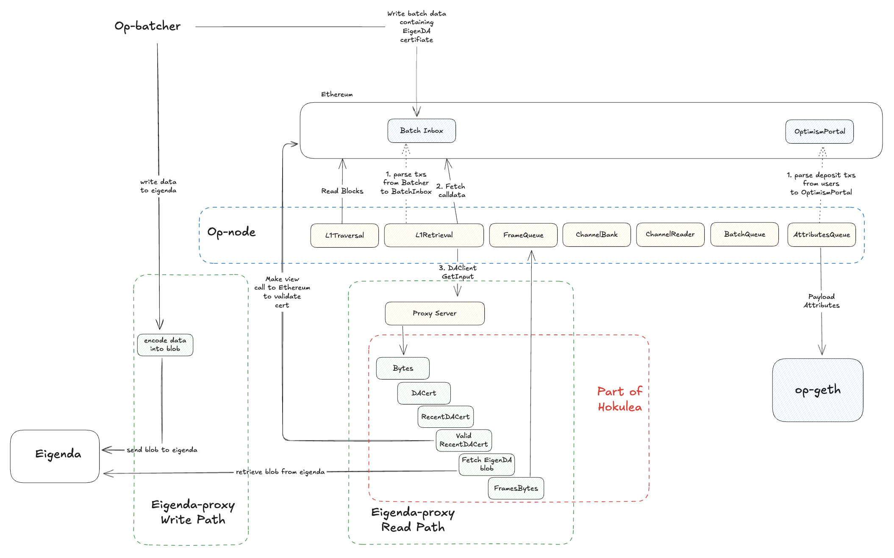

# EigenDA OP Secure integration

This document presents an overview on how EigenDA plugs into Optimism (OP) Stack.
- `write` and `read` path in a L2 rollup
- Why the `read` path must stay live (even with a misbehaving op-batcher)
- Adding an EigenDA stage to the OP derivation pipeline
- Hokulea, Rust library that defines and implement the Eigenda derivation rule
- How Hokulea works in both interactive fault-proof VMs and zkVMs

## Write and Read path in L2 consensus

A rollup system can be splitted into two parts: write path to L1 and read path from L1

| Path      | Direction | Purpose                                    | Main actor                   |
| --------- | --------- | ------------------------------------------ | ---------------------------- |
| **Write**| L2 → L1   | Liveness – keep blocks flowing             | `op-batcher` + EigenDA proxy |
| **Write**| Direct on L1   | Censorship resistance + Deposit        | Rollup users        + Opimism Portal     |
| **Read**  | L1 → L2   | Safety – all nodes see the same block list | OP derivation pipeline       |

- The `write path` ensures the liveness of the L2 consensus. It consists of L2 blocks produced by op-batch and L1 induced transactions.
- The `read path` controls the safety of the L2 consensus. It ensures all L2 consensus node sees an identical list of L2 blocks, then a EVM can produce identical L2 state

If the read path stalls, honest nodes can’t reach the block height needed to dispute a bad state root. As the result so it must never stall.

### L2 Write path (happy-flow)
- op-batcher bundles user txs.
- Sends batch to EigenDA proxy, which converts it to an Eigenda blob. Proxy sends blob to EigenDA, and forwards the returned certificate to op-batcher
- Post certificate are posted to the L1 Rollup Inbox.

### L2 Read path

The read path from L1 determines L2 consensus. OP has defined a derivation pipeline in OP [spec](https://specs.optimism.io/protocol/derivation.html#l2-chain-derivation-pipeline). 
Both [op-program](https://github.com/ethereum-optimism/optimism/tree/develop/op-program) in Golang and [Kona](https://github.com/op-rs/kona/tree/main)
in Rust implement the derivation pipeline. Like the diagram above, the derivation pipeline consists of stages that bring L1 transactions down to Payload Attributes which are L2 blocks.

To support secure integration, we have defined and inserted a Eigenda section in the OP derivation pipeline. In the diagram above, we have sketched
where and what rules EigenDA inserts in the OP derivation pipeline.
Both Eigenda proxy and Hokulea implement the eigenda blob derivation.

## L2 Read path with EigenDA

As in the diagram, op-nodes use the `read-path` on the eigenda-proxy to fetch EigenDA blob. The proxy checks
- certificate has sufficient stake and is valid
- certificate is not stale
- retrieve & KZG-checked blob from EigenDA
- Decode and pass the data onward

More information can be found in the page [secure integration](./6-secure-integration.md). The key properties which EigenDA derivation strives to keep are

- Determinism – one unique blob per DA certificate.
- Liveness – discard anything that could halt the chain.

Both eigenda-proxy and hokulea hold those properties.

## Proving correctness on L1

The security of rollup is determined by if there are provable ways to challenge incorrect L2 state posted on L1.
In this section, we discuss our OP secure integraton library **Hokulea**.

### Short intro to OP FPVM

The correctness of a L2 state is determined by the derivation rules, which are implemented in both Go [op-program](https://github.com/ethereum-optimism/optimism/tree/develop/op-program) and Rust [Kona](https://github.com/op-rs/kona/tree/main).

With interactive fault proof, the derivation logics are packaged into a binary ELF file, which can be run inside a FPVM (Cannon is the implementation).

The FPVM requires both the ELF binary and data (L2 batches and L1 deposits) to be able to rerun the derivation pipeline.
The ida is to repeat what op-node has done to reach consensus, except that in FPVM, every execution is traceable and challengable.

Data is provided to FPVM in the form of preimage oracle. OP spec has defined rules such that all data in the preimage oracle are verifiable on L1.
A FPVM creates a binding system on the relation between (software logic, data, VM opcode, and output).

### Hokulea

Hokulea builds on top of OP Kona derivation pipeline to integrate EigenDA as a Data Availability Source. Hokulea provides traits, implementation
for EigenDA part of derivation pipeline, such that those logics can be compiled into ELF together with Kona.

Hokulea also extends preimage oracle for EigenDA, which is able to provide the verifiable interface for answering
- if a DA cert is correct
- what is the current recency window to determine if a blob is stale

More information about the communication spec is at [Hokulea](https://github.com/Layr-Labs/hokulea/tree/master/docs). Both extension to preimage
oracle and derivation logics allows for 

- deterministically derive rollup payload from a EigenDA certificate
- discarding DA certs that can stall the derivation pipeline

### Canoe

We developed a rust library called [**Canoe**](https://github.com/Layr-Labs/hokulea/tree/master/canoe#1protocol-overview) that uses zk validity proof to provide ways 
- to efficiently verify the cert validity via verifying a zk validity proof
- to verify validity of a DA cert within zkVM, this enables zkVM integration

### Hokulea integration with zkVM

Unlike interactively challenge game with fault proof, a zk proof has a property that only the honest party can create a valid zk proof with respect to
the correct derivation rule.
Hence,a n incorrect party can raise a challenge but is unable to defend its position.

- The Hokulea+Kona derivation are compiled into ELF
- The Hokulea+Kona preimage oracle are prepared, where the validity of DA cert is provided by Canoe
- zkVM takes preimage and verifys it, then feed the data into the ELF containing the derivation logics
- zkVM produces a proof about the execution

Hokulea is currently integrating with [OP-succinct](https://github.com/succinctlabs/op-succinct) and [OP-Kailua](https://github.com/risc0/kailua).
For an integration guide, please refer to the [preloader](https://github.com/Layr-Labs/hokulea/tree/master/example/preloader) example for zk integration.

### Rust Kzg Bn254 library

The constraint also requires all eigenda blob with respect to the kzg commitment in the DA cert. We developed a similar library to `c-kzg`s called
[rust-kzg-bn254](https://github.com/Layr-Labs/rust-kzg-bn254) that offers similar functionalities as [4844 spec](https://github.com/ethereum/consensus-specs/blob/86fb82b221474cc89387fa6436806507b3849d88/specs/deneb/polynomial-commitments.md).