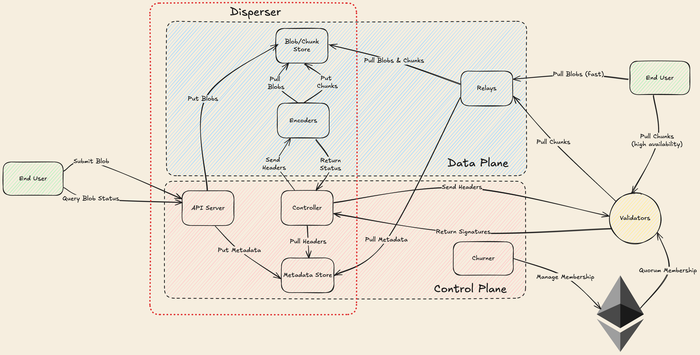
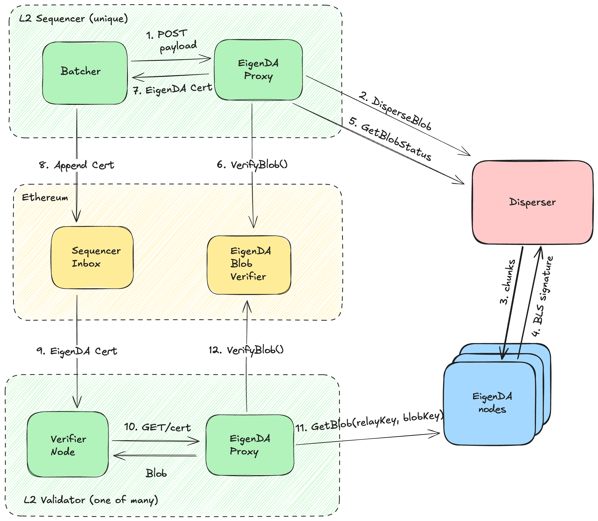

# EigenDA Protocol

Broken down into 3 main components.

## Core Services

EigenDA Protocol consists of a suite of services that allow for data to be securely stored and retrieved from the validators.

## Proxy

Proxy is the main entry point for most customers of the EigenDA protocol. It provides a very simple POST/GET REST interface to abstract away most of the complexity of interfacing with the different services correctly.

## Contracts