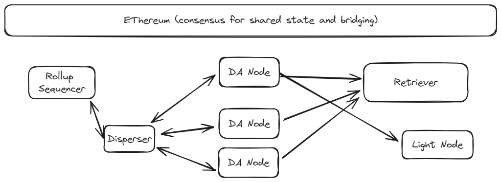
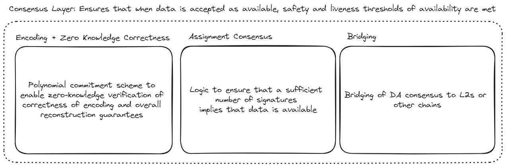
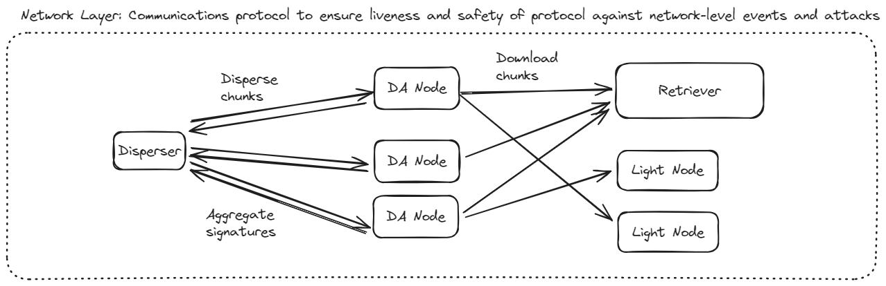
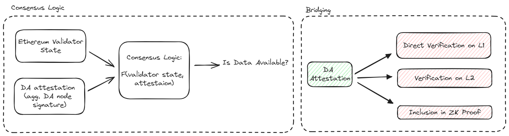

# System Architecture

## Core Components

- **DA nodes** are the service providers of EigenDA, storing chunks of blob data for a predefined time period and serving these chunks upon request. 
- The **disperser** is responsible for encoding blobs, distributing them to the DA nodes, and aggregating their digital signatures into a DA attestation. As the disperser is currently centralized, it is trusted for system liveness; the disperser will be decentralized over time.
- The disperser and the DA nodes both depend on the **Ethereum L1** for shared state about the DA node registration and stake delegation. The L1 is also currently used to bridge DA attestations to L2 end-user applications such as rollup chains. 

## Essential flows

**Dispersal**. The is the flow by which data is made available and consists of the following steps:
1. The Disperser receives a collection of blobs, [encodes them], constructs a batch of encoded blobs and headers, and sends the sharded batch to the DA nodes.
2. The DA nodes validate their shares of the batch, and return an attestation consisting of a BLS signature of the batch header. 
3. The disperser collects the attestations from the DA nodes and aggregates them into a single aggregate attestation. 

**Bridging**. For a DA attestation to be consumed by the L2 end-user (e.g. a rollup), the it must be bridged to a chain from which the L2 can read. This might simply be the Ethereum L1 itself, but in many cases it is more economical to bridge directly into the L2 since this drastically decreases signature verification costs. For the time being all attestations are bridged to the L1 by the disperser. 

**Retrieval**. Interested parties such as rollup challengers that want to obtain rollup blob data can retrieve a blob by downloading the encoded chunks from the DA nodes and decoding them. The blob lookup information contained in the request is obtained from the bridged attestation to the DA nodes.

# Protocol Overview

For expositional purposes, we will divide the protocol into two conceptual layers: 
- Attestation Layer: Modules to ensure that whenever a DA attestation is accepted by an end-user (e.g. a rollup), then the data is indeed available. More specifically, the attestation layer ensures that the system observes the safety and liveness tolerances defined in the [Security Model](#Security-Model) section.
- Network Layer: The communications protocol which ensures that the liveness and safety of the protocol are robust against network-level events and threats. 

## Attestation Layer

The attest layer is responsible for ensuring that when the network-level assumptions and safety and liveness tolerances are observed, the system properly makes data available. 

The primary responsibility of the attestation layer is to enable consensus about whether a given blob of data is fully within the custody of a set of honest nodes. (Here, what can be taken to be a set of honest nodes is defined by the system safety tolerance and the assurance that these honest nodes will be able to transmit the data to honest retrievers is handled by the network layer.) Since EigenDA is an EigenLayer AVS it does not need its own actual consensus protocol, but can instead piggy-back off of Ethereum's consensus. As a result, the attestation layer decomposes into two fairly straightforward pieces: 
- **Attestation Logic**: The attestation logic allows us to answer the question of whether a given blob is available, given both a DA attestation and the validator state at the associated Ethereum block. The attestation logic can be understood as simply a function of these inputs which outputs yes or no, depending on whether these inputs imply that data is available. Naturally, this function is grounded upon assumptions about the behavior of honest nodes, which must perform certain validation actions as part of the attestation layer. The attestation logic further decomposes into two major modules: 
    - *Encoding*: The encoding module defines a procedure for blobs to be encoded in such a way that their successful reconstruction can be guaranteed given a large enough collection of unique encoded chunks. The procedure also allows for the chunks to be trustlessly verified against a blob commitment so that the disperser cannot violate the protocol.
    - *Assignment*: The assignment module provides a deterministic mapping from validator state to an allocation of encoded chunks to DA nodes. The mapping is designed to uphold safety and liveness properties with minimal data-inefficiency. 
- **Bridging**: Bridging describes how the attestation is bridged to the consumer protocol, such as that of the rollup. In principle, bridging can be performed in one of several different ways in order to optimize efficiency and composability. At the moment, only bridging via the Ethereum L1 is directly supported. 

The desired behavior of the attestation logic can be formally described as follows (Ignore this if you're happy with the high level ideas): Let \\(\alpha\\) denote the safety threshold, i.e. the maximum proportion of adversarial stake that the system is able to tolerate. Likewise, let \\(\beta\\) represent the amount of stake that we require to be held by the signing operators in order to accept an attestation, i.e. one minus the liveness threshold. Also, let \\(O\\) denote the set of EigenDA operators.

We need to guarantee that any set of signing operators \\(U_q \subseteq O\\) such that

$$ \sum_{i \in U_q} S_i \ge \beta \sum_{i \in O}S_i$$

and any set of adversarial operators $U_a \subseteq U_q$ such

$$ \sum_{i \in U_a} S_i \le \alpha \sum_{i \in O}S_i$$

we can reconstruct the original data blob from the chunks held by \\( U_q \setminus U_a \\).

### Encoding Module

The [encoding module](./architecture/encoding.md) defines a procedure for blobs to be encoded in such a way that their successful reconstruction can be guaranteed given a large enough collection of unique encoded chunks. The procedure also allows for the chunks to be trustlessly verified against a blob commitment so that the disperser cannot violate the protocol.

### Assignment Module

The [assignment module](./architecture/assignment.md) is nothing more than a rule which takes in the Ethereum chain state and outputs an allocation of chunks to DA operators. 

### Signature verification and bridging

[Bridging module](./architecture/bridging.md)

## Network Layer

This section is under construction. 

## Protocol Time Synchronization

All protocol-level timing, expiry, and cross-node coordination in EigenDA use a consistent, NTP-synchronized time source. This is implemented via `core.NowWithNtpOffset()`, which ensures that all nodes, dispersers, and relays agree on time-sensitive operations (such as batch expiry, request validation, and protocol deadlines) regardless of local clock drift. Using NTP-synchronized time is critical for protocol correctness, as it prevents subtle bugs and disagreements that can arise from relying on local system clocks.

