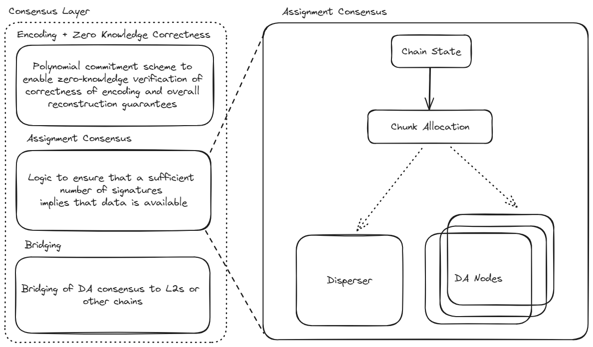

## Assignment Module

The assignment module determines how encoded blob chunks are allocated to DA operators based on the Ethereum chain state, specifically operator stakes and quorum memberships. Given the operator state and blob parameters, it produces a deterministic mapping from operators to chunk indices.

The assignment module is implemented in `core/v2/assignment.go`. For blobs dispersed to multiple quorums, the algorithm employs overlap optimization to minimize storage requirements while maintaining security guarantees. 




### Chunk Assignment Algorithm for a Single Quorum

The chunk assignment scheme assigns encoded chunks to validators proportionally to their stake, ensuring that any coalition of validators with sufficient combined stake can reconstruct the blob.

Given:
- A set of $n$ validators with stakes $\eta_1, \eta_2, \ldots, \eta_n$, where $\sum_{i=1}^n \eta_i = 1$
- A set of $c$ chunks to be assigned to the validators

Within a single quorum, the number of chunks assigned to validator $i$ is:
```math
c'_i = \lceil \eta_i(c - n) \rceil
```

The proof that any subset of validators with sufficient combined stake can reconstruct the blob is provided in [Security Parameters](./security-parameters.md).

### Chunk Assignment for Multiple Quorums

EigenDA supports blobs dispersed to multiple quorums simultaneously. The security threshold is guaranteed to hold for each quorum independently. The multi-quorum assignment algorithm minimizes storage requirements through overlap optimization while maintaining security guarantees.

#### Storage Optimization Strategy

The assignment algorithm uses two key strategies to minimize storage:

1. **Chunk Overlap Maximization:** When a validator participates in multiple quorums for the same blob, the algorithm reuses the same chunk indices across quorums whenever possible.

2. **Reconstruction Capping:** Each validator is assigned at most the number of chunks needed to independently reconstruct the blob.

**Example:** Consider a validator with 5% stake in quorum 0 and 15% stake in quorum 1. Without optimization, the validator might receive two non-overlapping sets of chunks (one per quorum), totaling up to 20% of all chunks. With overlap optimization, the validator stores only `max(chunks_quorum_0, chunks_quorum_1)` unique chunks, which is 15% of the total chunks. With reconstruction capping, if the coding rate is $r = 8$, the validator only needs to store 1/8 of the total chunks.

#### Algorithm Components

The multi-quorum assignment algorithm consists of four key functions:

**1. GetAssignmentsForQuorum:** Calculates assignments for a single quorum independently using the stake-proportional algorithm described above.

**2. AddAssignmentsForQuorum:** Generates the assignment for a new quorum while maximizing overlap with a baseline quorum assignment through a two-phase process:

- **Phase 1 (Overlap Maximization):** For each operator, reuse as many chunk indices as possible from the baseline quorum assignment, up to the number required for the new quorum. Mark these reused indices as "used."

- **Phase 2 (Gap Filling):** Distribute the remaining unused chunk indices to operators who need additional chunks beyond what was reused from the baseline, ensuring each operator receives their stake-proportional allocation in the new quorum.

This algorithm guarantees that validators participating in both quorums store only `max(chunks_in_quorum_1, chunks_in_quorum_2)` unique chunks rather than the sum.

**3. MergeAssignmentsAndCap:** Merges assignments across all quorums and caps the total at the reconstruction threshold:
```math
\text{max\_chunks} = c / r
```
 where $c$ is the total number of chunks and $r$ is the coding rate. This cap exists because once an operator has enough unique chunks to reconstruct the blob, additional chunks provide no incremental benefit.

**4. GetAssignmentsForBlob:** Coordinates the full multi-quorum assignment process:
1. Generate the assignment for quorum 0 using `GetAssignmentsForQuorum`
2. Generate assignments for all other quorums using `AddAssignmentsForQuorum` with quorum 0 as the baseline
3. Merge all per-quorum assignments using `MergeAssignmentsAndCap` to produce the final assignment for each validator

**Note on Optimality:** The algorithm produces optimal storage assignments for two quorums. For three or more quorums, the assignment is not guaranteed to be globally optimal. Since quorums 0 and 1 are typically the largest (containing most validators), and other quorums are smaller custom quorums, the algorithm achieves near-optimal storage reduction for the majority of validators.

### Code Walkthrough

**Location:** `core/v2/assignment.go`

**Data Structure:**
```go
type Assignment struct {
    Indices []uint32  // Explicit list of chunk indices (non-contiguous)
}
```

**Core Functions:**

**1. GetAssignmentsForQuorum (`core/v2/assignment.go:40-90`)**

Assigns chunks for a single quorum with deterministic ordering:

```go
func GetAssignmentsForQuorum(
    state *core.OperatorState,
    blobParams *core.BlobVersionParameters,
    quorum core.QuorumID,
) (map[core.OperatorID]*Assignment, []core.OperatorID, error)
```

Algorithm:
1. Sort operators by hex ID for determinism
2. Calculate effective chunks: `effectiveNumChunks = NumChunks - MaxNumOperators`
3. For each operator $i$: `chunksForOperator = ceil((effectiveNumChunks × stake_i) / totalStake)`
4. Assign contiguous indices starting from offset 0
5. Return assignments and ordered operator list

**2. AddAssignmentsForQuorum (`core/v2/assignment.go:99-161`)**

Maximizes overlap with a baseline assignment:

```go
func AddAssignmentsForQuorum(
    assignments map[core.OperatorID]*Assignment,  // Baseline from first quorum
    state *core.OperatorState,
    blobParams *core.BlobVersionParameters,
    quorum core.QuorumID,
) (map[core.OperatorID]*Assignment, error)
```

Two-phase algorithm:
- **Phase 1 (Lines 115-136):** For each operator, reuse indices from baseline up to their allotted count for this quorum
- **Phase 2 (Lines 145-158):** Distribute unused indices to operators needing more chunks

**3. MergeAssignmentsAndCap (`core/v2/assignment.go:167-220`)**

```go
func MergeAssignmentsAndCap(
    assignments []map[core.OperatorID]*Assignment,
    blobParams *core.BlobVersionParameters,
) map[core.OperatorID]Assignment
```

Merges all quorum assignments and caps at `maxChunks = NumChunks / CodingRate`

**4. GetAssignmentsForBlob (`core/v2/assignment.go:227-266`)**

Main entry point coordinating the full multi-quorum assignment:

```go
func GetAssignmentsForBlob(
    state *core.OperatorState,
    blobParams *core.BlobVersionParameters,
    quorums []core.QuorumID,
) (map[core.OperatorID]Assignment, error) {
    // Sort quorums for determinism
    sort.Slice(quorums, ...)

    // Process first quorum
    assignmentsList[0], _, err = GetAssignmentsForQuorum(state, blobParams, quorums[0])

    // Process remaining quorums with overlap optimization
    for i := 1; i < len(quorums); i++ {
        assignmentsList[i], err = AddAssignmentsForQuorum(
            assignmentsList[0], state, blobParams, quorums[i])
    }

    // Merge and cap
    return MergeAssignmentsAndCap(assignmentsList, blobParams)
}
```

**Usage in Node Chunk Download (`node/node_v2.go:40-105`):**

```go
func (n *Node) DetermineChunkLocations(
    batch *corev2.Batch,
    operatorState *core.OperatorState,
) {
    for _, cert := range batch.BlobCertificates {
        // Get assignment for this operator across ALL quorums in the blob
        assgn, err := corev2.GetAssignmentForBlob(
            operatorState,
            blobParams,
            cert.BlobHeader.QuorumNumbers,  // Multiple quorums
            n.Config.ID)

        // Request specific chunk indices from relay
        req.chunkRequests = append(req.chunkRequests, &relay.ChunkRequestByIndex{
            BlobKey: blobKey,
            Indices: assgn.Indices,  // Explicit indices with overlap optimization
        })
    }
}
```

**Usage in Validation (`core/v2/validator.go:49-79`):**

```go
func (v *shardValidator) validateBlobParams(
    blob *BlobShard,
    blobParams *core.BlobVersionParameters,
    operatorState *core.OperatorState,
) (*Assignment, error) {
    // Get assignment across all quorums for this blob
    assignment, err := GetAssignmentForBlob(
        operatorState,
        blobParams,
        blob.BlobHeader.QuorumNumbers,  // All quorums
        v.operatorID)

    // Validate chunk count
    if assignment.NumChunks() != uint32(len(blob.Bundle)) {
        return error
    }

    // Validate chunk lengths
    for _, chunk := range blob.Bundle {
        if chunk.Length() != expectedChunkLength {
            return error
        }
    }

    return &assignment, nil
}
```
