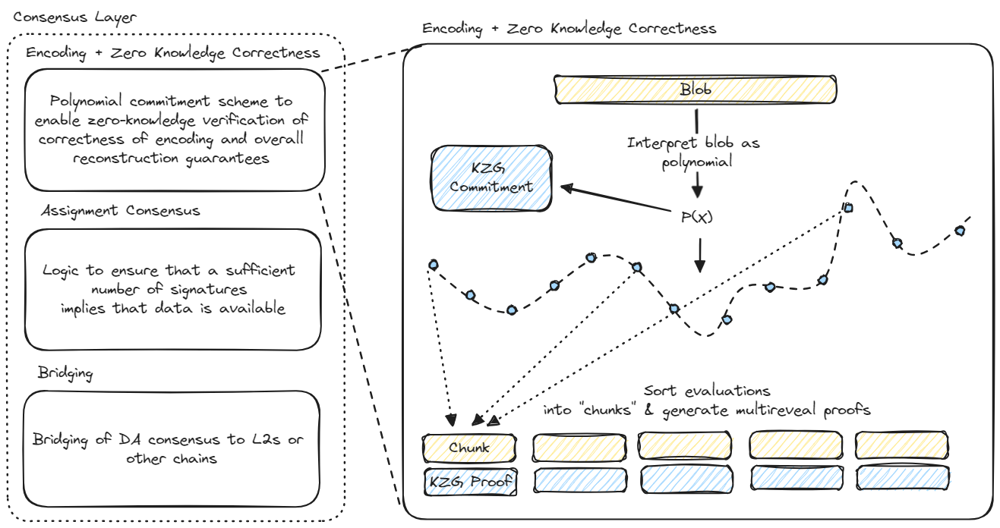

## Encoding Module

The encoding module defines a procedure for blobs to be encoded in such a way that their successful reconstruction can be guaranteed given a large enough collection of unique encoded chunks. The procedure also allows for the chunks to be trustlessly verified against a blob commitment so that the disperser cannot violate the protocol.

One way to think of the encoding module is that it must satisfy the following security requirements:
1. *Adversarial tolerance for DA nodes*: We need to have tolerance to arbitrary adversarial behavior by any number of DA nodes up to some threshold. Note that while simple sharding approaches such as duplicating slices of the blob data have good tolerance to random node dropout, they have poor tolerance to worst-case adversarial behavior.
2. *Adversarial tolerance for disperser*: We do not want to put trust assumptions on the encoder or rely on fraud proofs to detect if an encoding is done incorrectly.

## Trustless Encoding via KZG and Reed-Solomon

EigenDA uses a combination of Reed-Solomon (RS) erasure coding and KZG polynomial commitments to perform trustless  encoding. In this section, we provide a high level overview of how the EigenDA encoding module works and how it achieves these properties.

### Reed Solomon Encoding

Basic RS encoding is used to achieve the first requirement of *Adversarial tolerance for DA nodes*. This looks like the following:

1. The blob data is represented as a string of symbols, where each symbol is elements in a certain finite field. The number of symbols is called the `BlobLength`
2. These symbols are interpreted as the coefficients of a `BlobLength`-1 degree polynomial.
3. This polynomial is evaluated at `NumChunks`*`ChunkLength` distinct indices.
4. Chunks are constructed, where each chunk consists of the polynomial evaluations at `ChunkLength` distinct indices.

Notice that given any number of chunks $M$ such that $M \times$`ChunkLength` >= `BlobLength`, via [polynomial interpolation](https://en.wikipedia.org/wiki/Polynomial_interpolation) it is possible to reconstruct the original polynomial, and therefore its coefficients which represent the original blob. 

### Validation via KZG

To address the requirement *Adversarial tolerance for disperser* using RS encoding alone requires fraud proofs: a challenger must download all of the encoded chunks and check that they lie on a polynomial corresponding to the blob commitment. 

To avoid the need for fraud proofs, EigenDA follows the trail blazed by the Ethereum DA sharding roadmap in using [KZG polynomial commitments](https://dankradfeist.de/ethereum/2020/06/16/kate-polynomial-commitments.html). 

**Chunk Validation**

Blobs sent to EigenDA are identified by their KZG commitment (which can be calculated by the disperser and easily validated by the rollup sequencer). When the disperser generates the encoded blob chunks, it also generates a collection of opening proofs which the DA nodes can use to trustlessly verify that their chunks fall on the blob polynomial at the correct indices (note: the indices are jointly derived by the disperser and DA nodes from the chain state using the logic in the Assignment module to ensure that the evaluation indices for each node are unique).

**Blob Size Verification**
KZG commitments also can be used to verify the degree of the original polynomial, which in turn corresponds to the size of the original blob. Having a trustlessly verifiable upper bound on the size of the blob is necessary for DA nodes to verify the correctness of the chunk assignment defined by the assignment module.

The KZG commitment relies on a structured reference string (SRS) containing a generator point $G$ multiplied by all of the powers of some secret field element $\tau$, up to some maximum power $n$. This means that it is not possible to use this SRS to commit to a polynomial of degree greater than $n$. A consequence of this is that if $p(x)$ is a polynomial of degree greater than $m$, it will not be possible to commit to the polynomial $x^{n-m}p(x)$. A "valid" commitment to the polynomial $x^{n-m}p(x)$ thus constitutes a proof that the polynomial $p(x)$ is of degree less than or equal to $m$. 

In practice, this looks like the following: 
1. If the disperser wishes to claim that the polynomial $p(x)$ is of degree less than or equal to $m$, they must provide along with the commitment $C_1$ to $p$, a commitment $C_2$ to $q(x) = x^{n-m}p(x)$. 
2. The verifier then performs the pairing check $e(C_1,[x^{n-m}]_2) = e(C_2,H)$, where $H$ is the G2 generator and $[x^{n-m}]_2$ is the $n-m$'th power of tau. This pairing will only evaluate correctly when $C_2$ was constructed as described above and $deg(p) <= m$. 

Note: The blob length verification here allows for the blob length to be upper-bounded; it cannot be used to prove the exact blob length.

### Prover Optimizations

EigenDA makes use of the results of [Fast Amortized Kate Proofs](https://github.com/khovratovich/Kate/blob/master/Kate_amortized.pdf), developed for Ethereum's sharding roadmap, to reduce the computational complexity for proof generation. 

See the [full discussion](./amortized-proving.md)

### Verifier Optimizations

Without any optimizations, the KZG verification complexity can lead to a computational bottleneck for the DA nodes. Fortunately, the [Universal Verification Equation](https://ethresear.ch/t/a-universal-verification-equation-for-data-availability-sampling/13240) developed for Danksharding data availability sampling dramatically reduces the complexity. EigenDA has implemented this optimization to eliminate this bottleneck for the DA nodes. 
