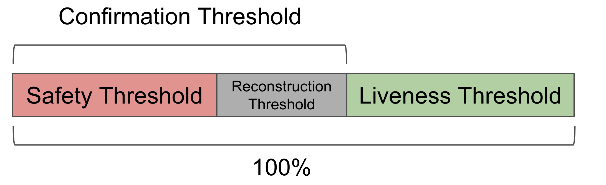

# Security Parameters

This page proves the relationship between blob parameters and security thresholds. 
We also point readers to the code where security threshold constraints are implemented.

## Blob Parameters and Reconstruction Threshold

In this part, we present the blob parameters and use these parameters to derive the reconstricution threshold.

### Blob Parameters

We define the **Blob parameters** as a tuple **$(n, c, \gamma)$** where:


- $n$ (`MaxNumOperators`): Maximum number of validators allowed in EigenDA.  
- $c$ (`NumChunks`): The total number of encoded chunks after erasure coding (must be a power of 2).  
- $\gamma$ (`1/CodingRate`): The ratio of original data to total encoded chunks, providing redundancy (must be an inverse power of 2). Note that for representational purposes, the `CodingRate` in our code is the inverse of  $\gamma$, the standard coding rate used in coding theory.

Among the blob parameters, `CodingRate` and `NumChunks` are used in the [encoding](./encoding.md) process, while `NumChunks` and `MaxNumOperators` are used in the chunk [assignment](./assignment.md) process.

This tuple is stored in the struct shown below ([see in the code](https://github.com/Layr-Labs/eigenda/blob/d8090af76ed69920983bb3781399a91d84d20d10/contracts/src/core/libraries/v1/EigenDATypesV1.sol#L7)):

```solidity
struct VersionedBlobParams {
    uint32 maxNumOperators;
    uint32 numChunks;
    uint8 codingRate;
}
```
The blob parameters for each version is stored in the `EigenDAThresholdRegistry` contract.
It's configured [here](https://github.com/Layr-Labs/eigenda/blob/556dc34fcd4774b683cbc78590bccee66a096b42/contracts/script/deploy/eigenda/mainnet.beta.config.toml#L69) and the default parameters are shown below.
```
versionedBlobParams = [
    { 0_maxNumOperators = 3537, 1_numChunks = 8192, 2_codingRate = 8 }
]
```

### Reconstruction Threshold

We define `ReconstructionThreshold`, also denoted as $r$, the minimum fraction of total stake required to reconstruct the blob. 
In this section, we prove that, with our [chunk assignment algorithm](./assignment.md), the reconstruction threshold is:
$$
r = \frac{c}{c-n} \gamma 
$$

In other words, we want to prove that any subset of validators with $\frac{c}{c-n} \gamma$ of total stake collectively own enough chunks to reconstruct the original blob. 
Formally, we need to show that for any set of validators $H$ with total stake $\sum_{i \in H} \eta_i \geq \frac{c}{c-n} \gamma$, the chunks assigned to $H$ satisfy $\sum_{i \in H} c_i \geq \gamma c$. 

**Proof:**

By the chunk assignment scheme, we have:
$$c_i \geq c'_i = \lceil \eta_i(c - n) \rceil $$
$$\geq \eta_i(c - n)$$

Therefore, since $\sum_{i \in H} \eta_i \geq \frac{c}{c-n} \gamma$, we have:
$$ \sum_{i \in H} c_i \geq \sum_{i \in H} \eta_i (c-n) \geq \frac{c}{c-n} \gamma \cdot (c - n) = \gamma c$$

Now, we prove that any subset of validators with $r$ of the total stake own at least $\gamma c$ chunks, which is guaranteed to reconstruct the origianl blob due to the property of Reed-Solomon encoding.

As we show in the previous subsection, by default, $n = 3537$, $c = 8192$ and $\gamma = 1/8$, which gives us the reconstruction threshold $r = 22\%$.

### Intuition: Loss in Chunk Assignment
If we look closely at the reconstruction threshold, we find that it is given by the encoding rate multiplied by a factor:  

$$
\frac{c}{c-n} > 1
$$

This means that in practice, a group of validators needs to hold **more stake** than the theoretical threshold to guarantee reconstruction.  

In an ideal world, any subset of validators holding a fraction $\gamma$ of the total stake would also hold $\gamma$ of the chunks, and therefore could recover the blob.
But in reality, because chunk assignments are discrete, some loss occurs: a validator’s assigned share of chunks can be **less** than its stake share.  

Suppose there are 10 chunks and 3 validators, each with one-third of the stake. Using the assignment algorithm, we might get:  
- Validator 1 → 4 chunks  
- Validator 2 → 3 chunks  
- Validator 3 → 3 chunks  

Here, Validator 2 has 33% of the stake but only 30% of the chunks. This loss can make the difference in meeting the reconstruction threshold.  

The mismatch becomes even more pronounced as the number of validators increases.
Imagine 10 million validators, each with equal stake, but only 10,000 chunks to be assigned in total. In this case, only a small fraction of validators can get at least 1 chunk, while the majority get none at all. The loss is enormous.
This is why the `MaxNumOperators` becomes an important parameter in determining the reconstruction threshold: the more validators there are relative to the number of chunks, the higher the loss from assignment imbalance.  


## BFT Security

Having established the relationship between the blob parameters and the reconstruction threshold, we now turn to the Byzantine Fault Tolerant (BFT) security model and how it relates to the blob parameters. 
### Definition of Security Thresholds
In this section, we define and prove the safety and liveness properties of EigenDA, building on the reconstruction property established above.

The Byzantine liveness and safety properties of a blob are specified by a collection of `SecurityThresholds`:

- `ConfirmationThreshold` - The confirmation threshold defines the minimum percentage of stake that must sign to make the DA certificate valid.
- `SafetyThreshold` - The safety threshold refers to the minimum percentage of total stake an attacker must control to make a blob with a valid DA certificate unavailable.
- `LivenessThreshold` - The liveness threshold refers to the minimum percentage of total stake an attacker must control to cause a liveness failure.

### How to Set the Confirmation Threshold

In the BFT security model, the `SafetyThreshold` and `LivenessThreshold` are estimated by the client. The `SafetyThreshold` is the maximum stake controlled by an adversary that signs the certificate but fails to serve the data, while the `LivenessThreshold` is the maximum stake controlled by an adversary that does not sign the certificates.

The `ConfirmationThreshold` is set based on the following two criteria:

**1. Confirmation Threshold and Safety Threshold**

To ensure that each blob with a valid DA certificate is available, the following inequality must be satisfied when setting the `ConfirmationThreshold`: 

`ConfirmationThreshold` - `SafetyThreshold` >= `ReconstructionThreshold` (1)

Intuitively, since the adversary controls less than `SafetyThreshold` of stake, at least `ConfirmationThreshold` - `SafetyThreshold` honest validators need to sign to form a valid DA certificate. 
Therefore, as long as `ConfirmationThreshold` - `SafetyThreshold` >= `ReconstructionThreshold`, the honest validators should own a large enough set of chunks to reconstruct the blob.

⚠️
We strongly recommend that users set a `SafetyThreshold` >= 33% if they ever want to change the default settings.

**2. Confirmation Threshold and Liveness Threshold**

The `ConfirmationThreshold` and `LivenessThreshold` satisfy the following inequality:

`ConfirmationThreshold` <= 1 - `LivenessThreshold` (2)

This is because a valid certificate requires signatures from at least `ConfirmationThreshold` of stake. If `ConfirmationThreshold` is greater than 1 - `LivenessThreshold`, the adversary can cause a liveness failure by simply not signing the certificate.

In summary, the `SafetyThreshold` and `LivenessThreshold` depends on the choice of `ConfirmationThreshold`. The picture below shows the relationship between these security thresholds.



A table of the security thresholds is given below for the reader's reference, assuming that the reconstruction threshold is 22%.

| Confirmation Threshold | Safety Threshold | Liveness Threshold |
| :------: | :------: | :------: |
|  55%    |  33%  |   45%  |
|  60%    |  38%  |   40%  |
|  65%    |  43%  |   35%  |

### Implementation Details

In our code, we use slightly different names for the security thresholds compared to the notation in this document.  
Here is the mapping from the notations in this doc to the variable names in the code:  

- `ConfirmationThreshold` → `securityThresholds.confirmationThreshold`  
- `SafetyThreshold` → `securityThresholds.adversaryThreshold`
- $c$ → `blobParams.numChunks`
- $n$ → `blobParams.maxNumOperators`
- $\gamma$ → 1 / `blobParams.codingRate`

Note that `SafetyThreshold` is called `adversaryThreshold` in the code.

**1. Safety Threshold**

The check for the inequality (1) above is implemented as follows ([see in code](https://github.com/Layr-Labs/eigenda/blob/6cd192ecbe5f0abfe73fc08df306cf00e32ef010/contracts/src/integrations/cert/libraries/EigenDACertVerificationLib.sol#L188)).

```solidity
function checkSecurityParams(
    DATypesV1.VersionedBlobParams memory blobParams,
    DATypesV1.SecurityThresholds memory securityThresholds
) internal pure returns (StatusCode err, bytes memory errParams) {
    uint256 gamma = securityThresholds.confirmationThreshold - securityThresholds.adversaryThreshold;
    uint256 n = (10000 - ((1_000_000 / gamma) / uint256(blobParams.codingRate))) * uint256(blobParams.numChunks);
    uint256 minRequired = blobParams.maxNumOperators * 10000;

    if (n >= minRequired) {
        return (StatusCode.SUCCESS, "");
    } else {
        return (StatusCode.SECURITY_ASSUMPTIONS_NOT_MET, abi.encode(gamma, n, minRequired));
    }
}
```
Specifically, the code above implements a check for the following inequality:  

`(10000 - ((1_000_000 / (securityThresholds.confirmationThreshold - securityThresholds.adversaryThreshold)) / uint256(blobParams.codingRate))) * uint256(blobParams.numChunks) >= blobParams.maxNumOperators * 10000`  

By substituting the variables using the notation mapping shown at the beginning of this section and simplifying, we get:  
`ConfirmationThreshold - SafetyThreshold >= (c / (c - n)) * γ = ReconstructionThreshold`, 
which is exactly inequality (1) shown in the previous subsection.  

**2. Liveness Threshold**

The `LivenessThreshold` does not appear in the code, but users should keep the equation (2) in mind when setting the confirmation `ConfirmationThreshold`. 

**System Default**

The security threshods are configured as follows ([see in the code](https://github.com/Layr-Labs/eigenda/blob/730ab91d41a8ba2cae141d782adcb4aec2aaaa0b/contracts/script/deploy/certverifier/config/v2/sepolia/testnet.config.json#L4)):

```
{
    "eigenDAServiceManager": "0x3a5acf46ba6890B8536420F4900AC9BC45Df4764",
    "eigenDAThresholdRegistry": "0x0DA66C1930Acc54809093Bb42f2e6a4bE21d5403",
    "defaultSecurityThresholds": {
        "0_confirmationThreshold": 55,
        "1_adversaryThreshold": 33
    },
    
    "quorumNumbersRequired": "0x0001"
}
```

By default, the `ConfirmationThreshold` is 55%. With the default `ReconstructionThreshold` = 22%, the default  `ConfirmationThreshold` gives a `SafetyThreshold` of 33% and a `LivenessThreshold` of 45%. 
