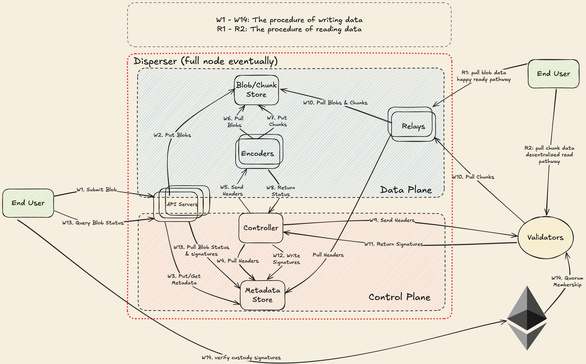

## Write and Read Workflow

This page provides an overview of the workflow for writing data to and reading data from EigenDA. The workflow is illustrated in the diagram below.

**Notes:**
* The "end user" for writing and the "end user" for reading can be the same entity. They are shown separately in the diagram for clarity.
* We are planning to build full nodes that will perform the disperser's functionality plus additional duties.

### Write

When a user writes data to EigenDA (in the form of a blob), the blob is encoded into chunks and distributed to the validators in accordance with the [Chunk Assignment Logic](./assignment.md). After enough validators have acknowledged receipt of their chunks and returned their signatures to the disperser, the disperser aggregates the signatures into a data availability (DA) certificate and sends it to the user upon request.

The write process follows the sequence below. The labels in parentheses (e.g., W1, W2) correspond to the steps shown in the diagram above.

1. **Disperser Receives Blob (W1, W2, W3).**
   The disperser receives a blob consisting of a `BlobHeader` and `BlobData`. As a precaution, the disperser can validate the `PaymentMetadata` contained in the `BlobHeader` to ensure that the blob is properly funded, and that the KZG commitments in the `BlobHeader` are correct. Note that validators may still reject payment data as invalid even if approved by the disperser, since the disperser lacks knowledge of global payment state (see [Payment System](../payments/payment_system.md#211-source-of-truth) for more details).

2. **Disperser Encodes Blob (W6, W7).**
   The disperser references the Chunk Assignment Logic to translate the `BlobHeader` into a set of `EncodingParams`. The disperser then encodes the blob according to the [Encoding Module](./encoding.md) and the `EncodingParams` to produce a collection of encoded `Chunk`s.

3. **Disperser Serves Chunks.**
   The disperser makes the encoded chunks available via the relay's `GetChunks` interface. This is an authenticated and rate-limited interface where each validator can only request its allocated amount of data.

4. **Disperser Constructs Blob Certificate.**
   The disperser constructs a `BlobCertificate` consisting of the `BlobHeader` and a `RelayKey`, which can be used to identify the relay URI where the associated chunks are available.

5. **Disperser Constructs Batch Header.**
   The disperser constructs a `BatchHeader` consisting of a Merkelized collection of `BlobCertificate`s and a `ReferenceBlockNumber`, which anchors all blobs in the batch to a specific stake distribution on EigenLayer.

6. **Disperser Sends Batch Header (W9).**
   The disperser sends the `BatchHeader` to the validators using the `StoreChunks` API.

7. **Validators Validate Batch Header.**
   The validators validate the `PaymentMetadata` for each `BlobHeader` contained in the batch. If any blob contains improper payment information, the batch is rejected.

8. **Validators Download and Validate Chunks (W10, W11).**
   For properly authorized batches, validators reference the Chunk Assignment Logic together with the `QuorumNumbers` of each `BlobHeader` to determine which chunks they are responsible for hosting. Validators request all associated encoded chunks from the `GetChunks` interface of the appropriate relays and validate that each `Chunk` matches the corresponding blob's KZG commitment using the included opening proof. Validators also validate that each chunk has the correct length using the Chunk Assignment Logic. If any chunk is unavailable or cannot be validated, the batch is rejected.

9. **Validators Sign Batch Header (W12).**
   For batches that successfully complete validation, each validator signs the batch header using the BLS identity registered in the `EigenDAServiceManager` and returns the signature to the disperser.

10. **Disperser Aggregates Signatures.**
    The disperser aggregates the BLS signatures from the validators and returns a `Certificate` containing the `BatchHeader`, aggregate signature, and inclusion information used for verifying that a blob is part of the batch.

### Read

To read a blob, a client follows the sequence below. The labels in parentheses (e.g., R1, R2) correspond to the steps shown in the diagram above.

1. **Read from Relay (R1).**
   The client attempts to retrieve the blob from the `GetBlob` interface of the relay(s) identified in the `BlobHeader`. This is the primary and most efficient retrieval method, as the relay stores complete blobs.

2. **Read from Validators (R2).**
   If the blob is not available from the relay(s), the client falls back to retrieving individual chunks directly from the validators and reconstructing the blob. The client reconstructs chunk assignments for all validators assigned to the blob and downloads chunks in a random order until it has collected enough unique chunks to reconstruct the blob. Each chunk is validated using the included KZG proofs before the blob is reconstructed using the erasure coding scheme. This approach distributes load evenly across validators and terminates as soon as the minimum number of unique chunks are verified.