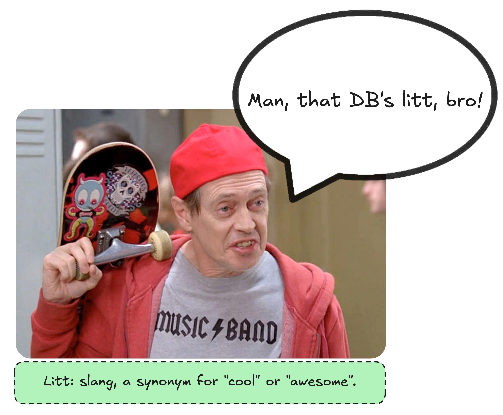
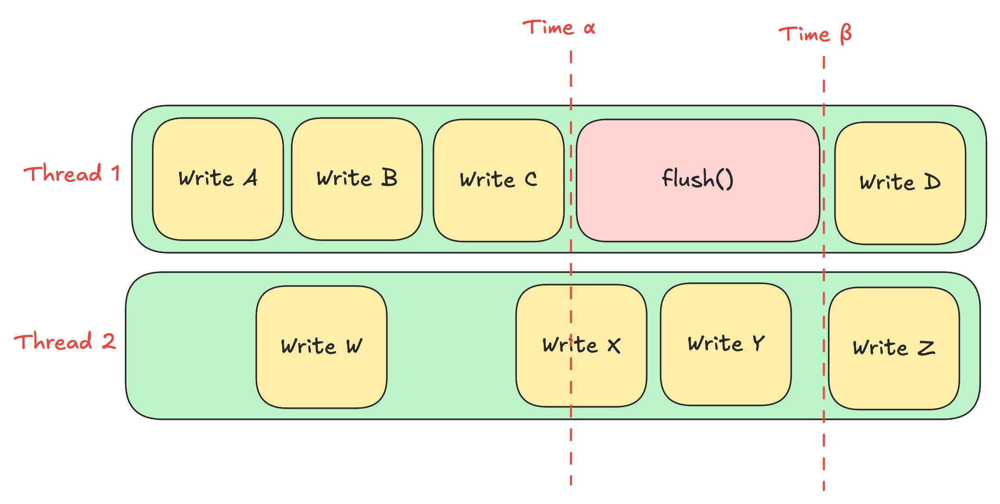

# Contents

- [What is LittDB?](#what-is-littdb)
    - [Features](#features)
    - [Consistency Guarantees](#consistency-guarantees)
    - [Planned/Possible Features](#plannedpossible-features)
    - [Anti-Features](#anti-features)
- [API](#api)
    - [Overview](#overview)
    - [Getting Started](#getting-started)
    - [Configuration Options](#configuration-options)
- [Definitions](#definitions)
- [Architecture](./docs/architecture.md)
- [Filesystem Layout](./docs/filesystem_layout.md)

# What is LittDB?

LittDB is a highly specialized embedded key-value store that is optimized for the following workload:

- high write throughput
- low read latency
- low memory usage
- write once, never update
- data is only deleted via a [TTL](#ttl) (time-to-live) mechanism

In order to achieve these goals, LittDB provides an intentionally limited feature set. For workloads
that are capable of being handled with this limited feature set, LittDB is going to be more performant
than just about any other key-value store on the market. For workloads that require more advanced
features, "sorry, not sorry". LittDB is able to do what it does precisely because it doesn't provide
a lot of the features that a more general-purpose key-value store would provide, and adding those
can only be done by sacrificing the performance that LittDB is designed to provide.

## Features

The following features are currently supported by LittDB:

- writing values (once)
- reading values
- [TTLs](#ttl) and automatic (lazy) deletion of expired values
- [tables](#table) with non-overlapping namespaces
- multi-drive support (data can be spread across multiple physical volumes)
- incremental backups (both local and remote)
- keys and values up to 2^32 bytes in size

## Consistency Guarantees

The consistency guarantees provided by LittDB are more limited than those provided by typical general-purpose
transactional databases. This is intentional, as the intended use cases of LittDB do not require higher order
consistency guarantees.

- thread safety
- [read-your-writes consistency](#read-your-writes-consistency)
- crash [durability](#durability) for data that has been [flushed](#flushing)
- [atomic](#atomicity) writes
    - Although [batched writes](#batched-writes) are supported (for performance), batches are not [atomic](#atomicity).
      Each individual write within a batch is [atomic](#atomicity), but the batch as a whole is not. That is to say,
      if the computer crashes after a [batch](#batched-writes) has been written but before [flushing](#flushing),
      some of the writes in the [batch](#batched-writes) may be [durable](#durability) on disk, while others may
      not be.

## Planned/Possible Features

The following features are planned for future versions of LittDB, or are technically feasible if a strong
enough need is demonstrated:

- dynamic multi-drive support: Drives can currently only be added/removed with a DB restart.
  It's currently fast, but not instantaneous. With this feature, drives can be added/removed on the fly.
- full snapshots/backups
- differential snapshots/backups
- read-only mode from an outside process
- CLI utility for managing the DB without the need for custom code
  (e.g. getting info, setting TTLs, adding/removing drives, etc.)
- DB iteration (this is plausible to implement without high overhead, but we don't currently have
  a good use case to justify the implementation effort)
- more keymap implementations (e.g. badgerDB, a custom solution, etc.)
- data check-summing and verification (to protect/detect things like disk corruption)
- keys and values up to 2^64 bytes in size

## Anti-Features

These are the features that LittDB specifically does not provide, and will never provide. This is
not done because we're lazy, but because these features would significantly impact the performance
of the database, and because they are simply not needed for the intended use cases of LittDB. LittDB
is a highly specialized tool for a very specific task, and it is not intended to be a general-purpose
key-value store.

- mutating existing values (once a value is written, it cannot be changed)
- deleting values (values only leave the DB when they expire via a TTL)
- transactions (individual operations are atomic, but there is no way to group operations atomically)
- fine granularity for [TTL](#ttl) (all data in the same table must have the same TTL)
- multi-computer replication (LittDB is designed to run on a single machine)
- data encryption
- data compression
- any sort of query language other than "get me the value associated with this key"
- ordered data iteration

# API

## Overview

Below is a high level overview of the LittDB API. For more detailed information, see the inline documentation in the
interface files.

Source: [db.go](db.go)

```go
type DB interface {
GetTable(name string) (Table, error)
DropTable(name string) error
Stop() error
Destroy() error
}
```

Source: [table.go](table.go)

```go
type Table interface {
Name() string
Put(key []byte, value []byte) error
PutBatch(batch []*types.KVPair) error
Get(key []byte) ([]byte, bool, error)
Exists(key []byte) (bool, error)
Flush() error
Size() uint64
SetTTL(ttl time.Duration) error
SetCacheSize(size uint64) error
}
```

Source: [kv_pair.go](types/kv_pair.go)

```
type KVPair struct {
	Key []byte
	Value []byte
}
```

## Getting Started

Below is a functional example showing how to use LittDB.

```go
// Configure and build the database.
config, err := littbuilder.DefaultConfig("path/to/where/data/is/stored")
if err != nil {
return err
}

db, err := config.Build(context.Background())
if err != nil {
return err
}

myTable, err := db.GetTable("my-table") // this code works if the table is new or if the table already exists
if err != nil {
return err
}

// Write a key-value pair to the table.
key := []byte("this is a key")
value := []byte("this is a value")

err = myTable.Put(key, value)
if err != nil {
return err
}

// Flush the data to disk.
err = myTable.Flush()
if err != nil {
return err
}

// Congratulations! Your data is now durable on disk.

// Read the value back. This works before or after a flush.
val, ok, err := myTable.Get(key)
if err != nil {
return err
}
```

## Configuration Options

For more information about configuration, see [littdb_config.go](littdb_config.go).

# Definitions

This section contains an alphabetized list of technical definitions for a number of terms used by LittDB. This
list is not intended to be read in order, but rather to be used as a reference when reading other parts of the
documentation.

## Address

An address partially describes the location on disk where a [value](#value) is stored. Together with a [key](#key),
the [value](#value) associated with a [key](#key) can be retrieved from disk.

An address is encoded in a 64-bit integer. It contains two pieces of information:

- the [segment](#segment) [index](#segment-index) where the [value](#value) is stored
- the offset within the [value file](#segment-value-files) where the first byte of
  the [value](#value) is stored

This information is not enough by itself to retrieve the [value](#value) from disk if there is more than one
[shard](#shard) in the [table](#table). When there is more than one [shard](#shard), the following information
must also be known in order to retrieve the [value](#value) (i.e. to figure out which [shard](#shard) to look in):

- the [sharding factor](#sharding-factor) for the [segment](#segment) where the [value](#value) is stored
  (stored in the [segment metadata file](#segment-metadata-file))
- the [sharding salt](#sharding-salt) for the [table](#table) where the [value](#value) is stored
  (stored in the [table metadata file](#table-metadata-file))
- the [key](#key) that the [value](#value) is associated with

## Atomicity

In the context of this document, atomicity means that an operation is either done completely or not at all. That is
to say, if there is a crash while an operation is in progress, the operation will either be completed when the
database is restarted, or it will not be completed at all.

As a specific example, if writing a [value](#value) and there is a crash, either the entire [value](#value) will be
written to disk and available when the database is restarted, or the [value](#value) will be completely absent.
It will never be the case that only part of the [value](#value) is written to disk.

## Cache

LittDB maintains an in-memory cache of [key](#key)-[value](#value) pairs. Data is stored in this cache when a value
is first written, as well as when it is read from disk. This is not needed for correctness, but is rather a performance
optimization. The cache is not persistent, and is lost when the database is restarted. The size of the cache is
configurable.

## Batched Writes

LittDB supports batched write operations. Multiple write operations can be grouped together and passed to the database
as a single operation. This may have positive performance implications, but is semantically equivalent to writing each
value individually. A batch of writes is not [atomic](#atomicity) as a whole, but each individual write within the
batch is [atomic](#atomicity). That is to say, if there is a crash after a batch of writes has been written but before
it has been [flushed](#flushing), some of the writes in the batch may be [durable](#durability) on disk, while others
may not be.

## Durability

In this context, the term "durable" is used to mean that data is stored on disk in such a way that it will not be lost
in the event of a crash. Data that has been [flushed](#flushing) is considered durable. Data that has not been flushed
is not considered durable. That doesn't mean that the data will be lost in the event of a crash, but rather that it
is not guaranteed to be present after a crash.

There are some limits to the strength of the durability guarantee provided by LittDB. For example, some drives buffer
data in internal buffers before writing it to disk, and do not necessarily write data to disk immediately. LittDB is
only as robust as the OS/hardware it is running on. This is true for any database, but it is worth mentioning here
for the sake of completeness.

## Flushing

Calling `Flush()` causes all data previously written to be written [durably](#durability) to disk. A call to `Flush()`
blocks until all data that was written prior to the call to `Flush()` has been written to disk.

It is ok to never call `Flush()`. As internal buffers fill, data is written to disk automatically. However, calling
`Flush()` can be useful in some cases, such as when you want to ensure that data is written to disk before proceeding
with other operations.

If `Flush()` is never called, data becomes durable through two mechanisms:

- When a [segment](#segment) becomes full, it is made immutable and a new segment is created. As part of the process
  of making a segment immutable, all data in the segment is fully written to disk.
- When the database is cleanly stopped via a call to `Stop()`, all unflushed data is written to disk. `Stop()` blocks
  until this has been completed.

`Flush()` makes no guarantees about the [durability](#durability) of data written concurrently with the call to
`Flush()` or after the call to `Flush()` has returned. It's not harmful to write data concurrently with a call to
`Flush()` as long as it is understood that this data may or may not be [durable](#durability) on disk when the call
to `Flush()` returns.

The following example demonstrates the consistency guarantees provided by the `Flush()` operation:



In this example there are two threads performing operations, `Thread 1` and `Thread 2`. `Thread 1` writes `A`, `B`,
and `C`, calls `Flush()`, and then writes `D`. `Thread 2` writes `W`, `X`, `Y`, and `Z`. `Time α` is the moment
when the flush operation is invoked, and `Time β` is the moment when the flush operation returns.

All write operations that have completed at `Time α` before the flush operation is invoked are [durable](#durability)
when the flush operation returns at `Time β`. These are `A`, `B`, `C`, and `W`. Although writing `X` begins prior to
`Time α`, since it is not complete at `Time α`, the flush operation does not guarantee that `X` is
[durable](#durability) when it returns at `Time β`. The same is true for `Y`, `Z`, and `D`.

Note that just because an operation is not guaranteed to be [durable](#durability) when `Flush()` returns does not mean
that is guaranteed to be not [durable](#durability). If the computer crashes after `Time β` but before the next call
to `Flush()`, then `X`, `Y`, `Z`, and `D` may or may not be lost as a result.

## Key

A key in a key-[value](#value) store. A key is a byte slice that is used to look up a [value](#value) in the database.

LittDB is agnostic to the contents of the key, other than requiring that keys be unique within a [table](#table).
Although large keys are supported, performance has been tuned under the assumption that keys are generally small
compared to [values](#value). The use case LittDB was originally intended for uses 32-byte keys.

## Keymap

At a conceptual level, a keymap is a mapping from [keys](#key) to [addresses](#address). In order to look up a
[value](#value) in the database one needs to know two things: the [key](#key) and the [address](#address). The keymap
is therefore necessary to lookup data given a specific [key](#key).

There are currently two implementations of the keymap in LittDB: an in-memory keymap and a keymap that uses levelDB.
There are tradeoffs to each implementation. The in-memory keymap is faster, but has higher memory usage and longer
startup times (it has to be rebuilt at boot time). The levelDB keymap is slower, but has a lower memory footprint and
faster startup times.

From a thread safety point of view, if a mapping is present in the keymap, the [value](#value) associated with the
entry is guaranteed to be present on disk.

- When writing a new [value](#value), it is first written to disk, and when that is complete the [key](#key) and
  [address](#address) are written to the keymap.
- When deleting a [value](#value), the [key](#key) and [address](#address) are first removed from the keymap, and
  then the [value](#value) is deleted from disk.

LittDB supports reading [values](#value) immediately after they are written, and during that period there may not
be a corresponding entry in the keymap. For more information on how this edge case is handled, information about the
[unflushed data map](#unflushed-data-map).

## Read-Your-Writes Consistency

The definition of read-your-writes consistency is well summarized by its name. If a thread writes a [value](#value)
to the database and then turns around and attempts to read that [value](#value) back, it will either

1. read the [value](#value) that was just written, or
2. read an updated [value](#value) that was written AFTER the [value](#value) that was just written

Note that in LittDB, values are never permitted to be mutated. But when values grow older than their [TTL](#ttl),
the value can be deleted. From a consistency point of view, the garbage collection process is equivalent to an update.
That is to say, if a thread writes a [value](#value), waits a very long time, then reads that same [value](#value)
back again, it is not a violation of read-your-writes consistency if the [value](#value) is not present because the
[garbage collector](#garbage-collection) has deleted it.

An "eventual consistent" database does not necessarily provide read-your-writes consistency. In the author's experience,
such systems can be very difficult to reason about, and can lead to subtle bugs that are difficult to track down.
Read-your-writes consistency is simple, yet powerful and intuitive. Since providing this level of consistency
does not hurt performance, the complexity of its implementation is justified.

## Segment

Data in LittDB [table](#table) can be visualized as a linked list. Each element in that linked list is called a
"segment". A segment can hold many individual [values](#value). Old data is near the beginning of the list, and new
data is near the end. Old, [expired](#ttl) data is always deleted from the first segment currently in the list. New
data is always written to the last segment currently in the list.

Segments are deleted as a whole. That is, when a segment is deleted, all data in that segment is deleted at the same
time. Segments are only deleted when all data contained within them has [expired](#ttl).

Segments have a target data size. When a segment is full, that segment is made immutable, and a new segment is created
and added to the end of the list.

Note that the maximum size of a segment file is not a hard limit. As long as the first byte of a [value](#value) is
written to a segment file before the segment is full, the segment is permitted to hold it. An [address](#address)
points to that first byte of a value. Since there are 32 bits in an [address](#address) used to store the offset
within the file, the maximum offset for the first byte of a value is 2^32 bytes (4GB).

A natural side effect of only requiring the first byte of a [value](#value) to be written before the segment is full is
that LittDB can support arbitrarily large [values](#value). Doing so may result in a large amount of data in a single
segment, but this does not violate any correctness invariants.

Each segment may split its data into multiple [shards](#shard). The number of shards in a segment is called the
[sharding factor](#sharding-factor). The [sharding factor](#sharding-factor) is configurable, and different segments
may use different [sharding factors](#sharding-factor).

There are three types of files that contain data for a segment:

- [metadata](#segment-metadata-file)
- [keys](#segment-key-file)
- [values](#segment-value-files)

### Segment Index

Each segment has a serial number called a "segment index". The first segment ever created with index `0`, the next
segment created has index `1`, and so on. Segment `N` is always deleted before segment `N+1`, meaning there will
never be a gap in the segment indices currently in use.

### Segment Key File

A segment key file contains the [keys](#key) and [addresses](#address) for all the [values](#value) stored the segment.
At runtime, [keys](#key)-[address](#address) pairs are appended to the key file. It is not read except during the
following circumstances:

- when a [segment](#segment) is deleted, the file is iterated to delete entries from the [keymap](#keymap)
- when the DB is loaded from disk, the data is used to rebuild the [keymap](#keymap). This may not be needed
  in situations where the keymap has durably stored data, and does not need to be rebuilt.

The file name of a key file is `X.keys`, where `X` is the [segment index](#segment-index).

### Segment Metadata File

This file contains metadata about the segment. This metadata is small, and so it can be kept in memory. The file is
read at startup to rebuild the in-memory representation of the segment.

Each metadata contains the following information:

- the [segment index](#segment-index)
- serialization version (in case the format changes in the future)
- the [sharding factor](#sharding-factor) for the segment
- the [salt](#sharding-salt) used for the segment
- the [timestamp](#segment-timestamp) of the last element written in the segment.
  the [TTL](#ttl) of any data contained within it.
- whether or not the segment is [immutable](#segment-mutability)

The file name of a metadata file is `X.metadata`, where `X` is the [segment index](#segment-index).

### Segment Mutability

Only the last segment in the "linked list" is mutable. All other segments are immutable.

### Segment Timestamp

The timestamp of the last element written to the segment. This is used to determine when it is safe to delete a
segment without violating the [TTL](#ttl) of any data contained within it. This value is unset for the last segment
in the list, as it is still being written to.

### Segment Value Files

Each segment has one value file for each [shard](#shard) in the segment. Values are appended to the value files.
The [address](#address) of a [value](#value) is the offset within the value file where the [value](#value) begins.

The file name of a value file is `X-Y.values`, where `X` is the [segment index](#segment-index) and `Y` is the
[shard](#shard) index.

## Shard

LittDB supports sharding. That is to say, it can break the data into smaller pieces and spread those pieces across
multiple locations.

In order to determine the shard that a particular [key](#key) is in, a hash function is used. The data that goes
into the hash function is the [key](#key) itself, as well as a [sharding salt](#sharding-salt) that is unique to
each [segment](#segment).

The [sharding salt](#sharding-salt) is chosen randomly. Its purpose is to make the mapping between [keys](#key) and
shards unpredictable to an outside attacker. Without this sort of randomness, an attacker could intentionally craft
keys that all map to the same shard, causing a hot spot in the database and potentially degrading performance.

### Sharding Factor

The number of [shards](#shard) in a [segment](#segment) is called the "sharding factor". The sharding factor must be
a positive, non-zero integer. The sharding factor can be changed at runtime without restarting the database or
performing a data migration.

### Sharding Salt

A random number chosen to make the [shard](#shard) hash function unpredictable to an outside attacker. This number
does not need to be chosen via a cryptographically secure random number generator, as long as it is not publicly
known.

## Table

A table in LittDB is a unique namespace. Two [keys](#key) with identical values do not conflict with each other as
long as they are in different tables.

Each table has its own [TTL](#ttl), and all data in the table is subject to that [TTL](#ttl). Each table has its
own [keymap](#keymap) and its own set of [segments](#segment). [Flushing](#flushing) one table does not affect
any other table. Aside from hardware, tables do not share any resources.

In many ways, a table is a stand-alone database. The higher level [API](#api) that works with multiple tables is
provided as a convenience, but does not enhance the performance of the DB in any way.

### Table Metadata File

A [table](#table) metadata file contains configuration for the table. It is intended to preserve high level
configuration between restarts.

## TTL

TTL stands for "time-to-live". If data is configured to have a TTL of X hours, the data is automatically deleted
approximately X hours after it is written.

Note that TTL is the only way littDB supports removing data from the database. Although it is legal to configure
a table with a TTL of 0 (i.e. where data never expires), such a table will never be able to remove data.

## Unflushed Data Map

An in-memory map that contains [keys](#key)-[values](#value) pairs that are not yet [durable](#durability) on disk.
Entries are added to the map when a [value](#value) is written, and removed when the [value](#value) is fully
written to both the [keymap](#keymap) and the [segment](#segment) files.

This data structure is not to be confused with the [cache](#cache). Its purpose is not to improve performance, but
rather to provide [read-your-writes consistency](#read-your-writes-consistency).

## Value

The value in a key-[value](#value) store. A value is a byte slice that is associated with a [key](#key) in the database.
LittDB is optimized to support large values, although small values are perfectly fine as well. Writing the X bytes
of data as a single large value is more efficient than writing X bytes of data as Y smaller values.

# Architecture

For a detailed overview of the architecture of LittDB, see the [Architecture](docs/architecture.md) docs.

# Filesystem Layout

For information about how LittDB arranges its internal files, see the [Filesystem Layout](docs/filesystem_layout.md)
docs.