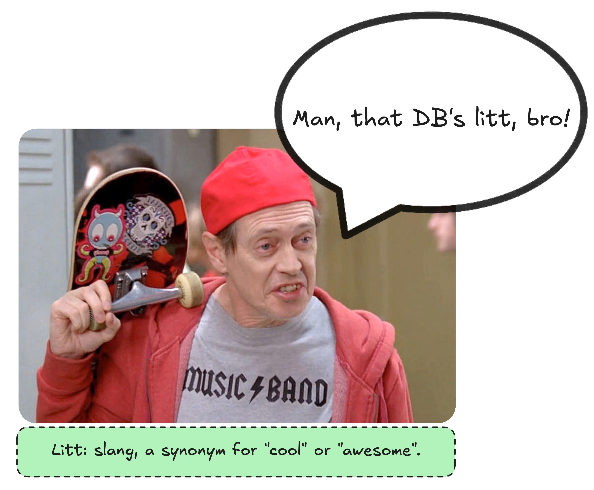

Note: this document is a work in progress.



# What is LittDB?

LittDB is a highly specialized embedded key-value store that is optimized for the following workload:

- high write throughput
- low read latency
- low memory usage
- write once, never update
- data is only deleted via a [TTL](#ttl) (time-to-live) mechanism

In order to achieve these goals, LittDB provides an intentionally limited feature set. For workloads
that are capable of being handled with this limited feature set, LittDB is going to be more performant
than just about any other key-value store on the market. For workloads that require more advanced
features, "sorry, not sorry". LittDB is able to do what it does precisely because it doesn't provide
a lot of the features that a more general-purpose key-value store would provide, and adding those
can only be done by sacrificing the performance that LittDB is designed to provide.

## Features

The following features are currently supported by LittDB:

- writing values (once)
- reading values
- [TTLs](#ttl) and automatic (lazy) deletion of expired values
- [tables](#table) with non-overlapping namespaces
- multi-drive support (data can be spread across multiple physical volumes)
- incremental backups (both local and remote)

## Consistency Guarantees

The consistency guarantees provided by littDB are more limited than those provided by typical general-purpose
transactional databases. This is intentional, as the intended use cases of littDB do not require higher order
consistency guarantees.

- thread safety
- [read-your-writes consistency](#read-your-writes-consistency)
- crash [durability](#durability) for data that has been [flushed](#flushing)
- [atomic](#atomicity) writes
    - Although [batched writes](#batched-writes) are supported (for performance), batches are not [atomic](#atomicity).
      Each individual write within a batch is [atomic](#atomicity), but the batch as a whole is not. That is to say,
      if the computer crashes after a [batch](#batched-writes) has been written but before [flushing](#flushing),
      some of the writes in the [batch](#batched-writes) may be [durable](#durability) on disk, while others may
      not be.

## Planned/Possible Features

The following features are planned for future versions of LittDB, or are technically feasible if a strong
enough need is demonstrated:

- dynamic multi-drive support: Drives can currently only be added/removed with a DB restart.
  It's currently fast, but not instantaneous. With this feature, drives can be added/removed on the fly.
- full snapshots/backups
- differential snapshots/backups
- read-only mode from an outside process
- CLI utility for managing the DB without the need for custom code
  (e.g. getting info, setting TTLs, adding/removing drives, etc.)
- DB iteration (this is plausible to implement without high overhead, but we don't currently have
  a good use case to justify the implementation effort)
- more keymap implementations (e.g. badgerDB, a custom solution, etc.)
- data check-summing and verification (to protect/detect things like disk corruption)

## Anti-Features

These are the features that littDB specifically does not provide, and will never provide. This is
not done because we're lazy, but because these features would significantly impact the performance
of the database, and because they are simply not needed for the intended use cases of littDB. littDB
is a highly specialized tool for a very specific task, and it is not intended to be a general-purpose
key-value store.

- mutating existing values (once a value is written, it cannot be changed)
- deleting values (values only leave the DB when they expire via a TTL)
- transactions (individual operations are atomic, but there is no way to group operations atomically)
- fine granularity for [TTL](#ttl) (all data in the same table must have the same TTL)
- multi-computer replication (littDB is designed to run on a single machine)
- data encryption
- data compression
- any sort of query language other than "get me the value associated with this key"
- ordered data iteration

# API

## Overview

Below is a high level overview of the LittDB API. For more detailed information, see the inline documentation in the
interface files.

Source: [db.go](db.go)
```go
type DB interface {
	GetTable(name string) (Table, error)
	DropTable(name string) error
	Stop() error
	Destroy() error
}
```

Source: [table.go](table.go)
```go
type Table interface {
	Name() string
	Put(key []byte, value []byte) error
	PutBatch(batch []*types.KVPair) error
	Get(key []byte) ([]byte, bool, error)
	Flush() error
	SetTTL(ttl time.Duration) error
	SetCacheSize(size uint64) error
}
```

Source: [kv_pair.go](types/kv_pair.go)
```
type KVPair struct {
	Key []byte
	Value []byte
}
```

## Getting Started

Below is a functional example showing how to use littDB.

```go
// Configure and build the database.
config, err := littbuilder.DefaultConfig("path/to/where/data/is/stored")
if err != nil {
    return err
}

db, err := config.Build(context.Background())
if err != nil {
    return err
}

myTable, err := db.GetTable("my-table") // this code works if the table is new or if the table already exists
if err != nil {
    return err
}

// Write a key-value pair to the table.
key := []byte("this is a key")
value := []byte("this is a value")

err = myTable.Put(key, value)
if err != nil {
    return err
}

// Flush the data to disk.
err = myTable.Flush()
if err != nil {
    return err
}

// Congratulations! Your data is now durable on disk.

// Read the value back. This works before or after a flush.
val, ok, err := myTable.Get(key)
if err != nil {
    return err
}
```

# Definitions

This section contains an alphabetized list of technical definitions for a number of terms used by LittDB. This
list is not intended to be read in order, but rather to be used as a reference when reading other parts of the
documentation.

## Address

An address partially describes the location on disk where a [value](#value) is stored. Together with a [key](#key),
the [value](#value) associated with a [key](#key) can be retrieved from disk.

An address is encoded in a 64-bit integer. It contains two pieces of information:

- the [segment](#segment) [index](#segment-index) where the [value](#value) is stored
- the offset within the [value file](#segment-value-files) where the first byte of
  the [value](#value) is stored

This information is not enough by itself to retrieve the [value](#value) from disk if there is more than one
[shard](#shard) in the [table](#table). When there is more than one [shard](#shard), the following information
must also be known in order to retrieve the [value](#value) (i.e. to figure out which [shard](#shard) to look in):

- the [sharding factor](#sharding-factor) for the [segment](#segment) where the [value](#value) is stored
  (stored in the [segment metadata file](#segment-metadata-file))
- the [sharding salt](#sharding-salt) for the [table](#table) where the [value](#value) is stored
  (stored in the [table metadata file](#table-metadata-file))
- the [key](#key) that the [value](#value) is associated with

## Atomicity

In the context of this document, atomicity means that an operation is either done completely or not at all. That is
to say, if there is a crash while an operation is in progress, the operation will either be completed when the
database is restarted, or it will not be completed at all.

As a specific example, if writing a [value](#value) and there is a crash, either the entire [value](#value) will be
written to disk and available when the database is restarted, or the [value](#value) will be completely absent.
It will never be the case that only part of the [value](#value) is written to disk.

## Cache

littDB maintains an in-memory cache of [key](#key)-[value](#value) pairs. Data is stored in this cache when a value
is first written, as well as when it is read from disk. This is not needed for correctness, but is rather a performance
optimization. The cache is not persistent, and is lost when the database is restarted. The size of the cache is
configurable.

## Batched Writes

littDB supports bated write operations. Multiple write operations can be grouped together and passed to the database
as a single operation. This may have positive performance implications, but is semantically equivalent to writing each
value individually. A batch of writes is not [atomic](#atomicity) as a whole, but each individual write within the
batch is [atomic](#atomicity). That is to say, if there is a crash after a batch of writes has been written but before
it has been [flushed](#flushing), some of the writes in the batch may be [durable](#durability) on disk, while others
may not be.

## Durability

In this context, the term "durable" is used to mean that data is stored on disk in such a way that it will not be lost
in the event of a crash. Data that has been [flushed](#flushing) is considered durable. Data that has not been flushed
is not considered durable. That doesn't mean that the data will be lost in the event of a crash, but rather that it
is not guaranteed to be present after a crash.

There are some limits to the strength of the durability guarantee provided by littDB. For example, some drives buffer
data in internal buffers before writing it to disk, and do not necessarily write data to disk immediately. LittDB is
only as robust as the OS/hardware it is running on. This is true for any database, but it is worth mentioning here
for the sake of completeness.

TODO fsync

## Flushing

Calling `Flush()` causes all data previously written to be written [durably](#durability) to disk. A call to `Flush()`
blocks until all data that was written prior to the call to `Flush()` has been written to disk.

It is ok to never call `Flush()`. As internal buffers fill, data is written to disk automatically. However, calling
`Flush()` can be useful in some cases, such as when you want to ensure that data is written to disk before proceeding
with other operations.

`Flush()` makes no guarantees about the [durability](#durability) of data written concurrently with the call to
`Flush()` or after the call to `Flush()` has returned. It's not harmful to write data concurrently with a call to
`Flush()` as long as it is understood that this data may or may not be [durable](#durability) on disk when the call
to `Flush()` returns.

## Key

TODO

## Keymap

TODO

## Read-Your-Writes Consistency

TODO

## Segment

TODO

### Segment Index

TODO

### Segment Key File

TODO

### Segment Metadata File

TODO

### Segment Mutability

TODO

### Segment Timestamp

TODO

### Segment Value Files

TODO

## Shard

TODO

### Sharding Factor

TODO

### Sharding Salt

TODO

## Table

TODO

### Table Metadata File

TODO

## TTL

## Unflushed Data Map

TODO

## Value

TODO

# Configuration Options

TODO

# Architecture

TODO

# File Layout

This section provides an overview of how littDB stores data on disk.

## Roots

LittDB spreads its data across N root directories. In practice, each root directory will probably be on its
own physical drive, but that's not a hard requirement.

In the example below, the root directories are named `root0`, `root1`, and `root2`.

## Tables

LittDB supports multiple tables, each with its own namespace. Each table is stored within its own subdirectory.

In the example below, there are three tables: `tableA`, `tableB`, and `tableC`.

## Keymap

All keymap data appears in the directory named `keymap`. The file `keymap-type.txt` contains the name of the
keymap implementation. If the keymap writes data to disk (e.g. levelDB, as pictured below), then the data will
be stored in the `keymap/data` directory.

## Segments

TODO explain different types of segment files

## Example Layout

The following is an example file tree for a simple littDB instance.
(This example file tree was generated using generate_example_tree_test.go.)

There are three directories into which data is written. In theory, these could be located on three separate
physical drives. Those directories are

- `root/root0`
- `root/root1`
- `root/root2`

The table is configured to have four shards. That's one more shard than root directory, meaning that one of the
root directories will have two shards, and all the others will have one shard.

There are three tables, each with its own namespace. The tables are

- `tableA`
- `tableB`
- `tableC`

A little data has been written to the DB.

- `tableA` has enough data to have three segments
- `tableB` has enough data to have two segments
- `tableC` has enough data to have one segment

The keymap is implemented using levelDB.

```text
root
├── root0
│   ├── tableA
│   │   ├── keymap
│   │   │   ├── data
│   │   │   │   ├── 000001.log
│   │   │   │   ├── CURRENT
│   │   │   │   ├── LOCK
│   │   │   │   ├── LOG
│   │   │   │   └── MANIFEST-000000
│   │   │   └── keymap-type.txt
│   │   ├── segments
│   │   │   ├── 0-2.values
│   │   │   ├── 0.keys
│   │   │   ├── 0.metadata
│   │   │   ├── 1-2.values
│   │   │   ├── 1.keys
│   │   │   ├── 1.metadata
│   │   │   ├── 2-2.values
│   │   │   ├── 2.keys
│   │   │   ├── 2.metadata
│   │   │   ├── 3-2.values
│   │   │   ├── 3.keys
│   │   │   └── 3.metadata
│   │   └── table.metadata
│   ├── tableB
│   │   ├── keymap
│   │   │   ├── data
│   │   │   │   ├── 000001.log
│   │   │   │   ├── CURRENT
│   │   │   │   ├── LOCK
│   │   │   │   ├── LOG
│   │   │   │   └── MANIFEST-000000
│   │   │   └── keymap-type.txt
│   │   ├── segments
│   │   │   ├── 0-2.values
│   │   │   ├── 0.keys
│   │   │   ├── 0.metadata
│   │   │   ├── 1-2.values
│   │   │   ├── 1.keys
│   │   │   ├── 1.metadata
│   │   │   ├── 2-2.values
│   │   │   ├── 2.keys
│   │   │   └── 2.metadata
│   │   └── table.metadata
│   └── tableC
│       ├── keymap
│       │   ├── data
│       │   │   ├── 000001.log
│       │   │   ├── CURRENT
│       │   │   ├── LOCK
│       │   │   ├── LOG
│       │   │   └── MANIFEST-000000
│       │   └── keymap-type.txt
│       ├── segments
│       │   ├── 0-2.values
│       │   ├── 0.keys
│       │   └── 0.metadata
│       └── table.metadata
├── root1
│   ├── tableA
│   │   └── segments
│   │       ├── 0-0.values
│   │       ├── 0-3.values
│   │       ├── 1-0.values
│   │       ├── 1-3.values
│   │       ├── 2-0.values
│   │       ├── 2-3.values
│   │       ├── 3-0.values
│   │       └── 3-3.values
│   ├── tableB
│   │   └── segments
│   │       ├── 0-0.values
│   │       ├── 0-3.values
│   │       ├── 1-0.values
│   │       ├── 1-3.values
│   │       ├── 2-0.values
│   │       └── 2-3.values
│   └── tableC
│       └── segments
│           ├── 0-0.values
│           └── 0-3.values
└── root2
    ├── tableA
    │   └── segments
    │       ├── 0-1.values
    │       ├── 1-1.values
    │       ├── 2-1.values
    │       └── 3-1.values
    ├── tableB
    │   └── segments
    │       ├── 0-1.values
    │       ├── 1-1.values
    │       └── 2-1.values
    └── tableC
        └── segments
            └── 0-1.values
```
