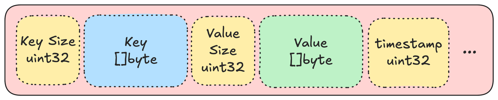
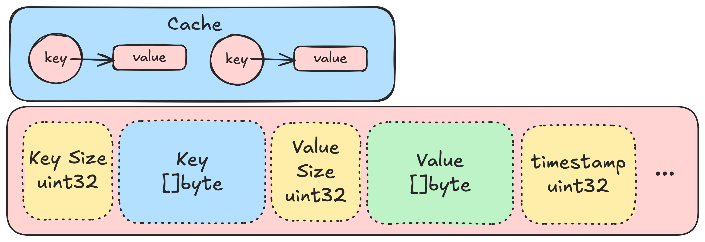
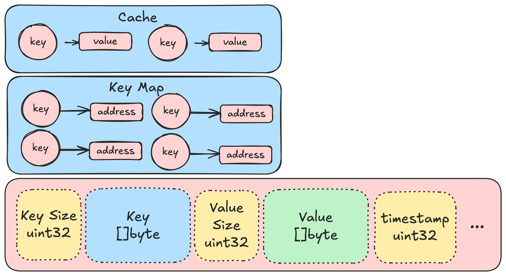
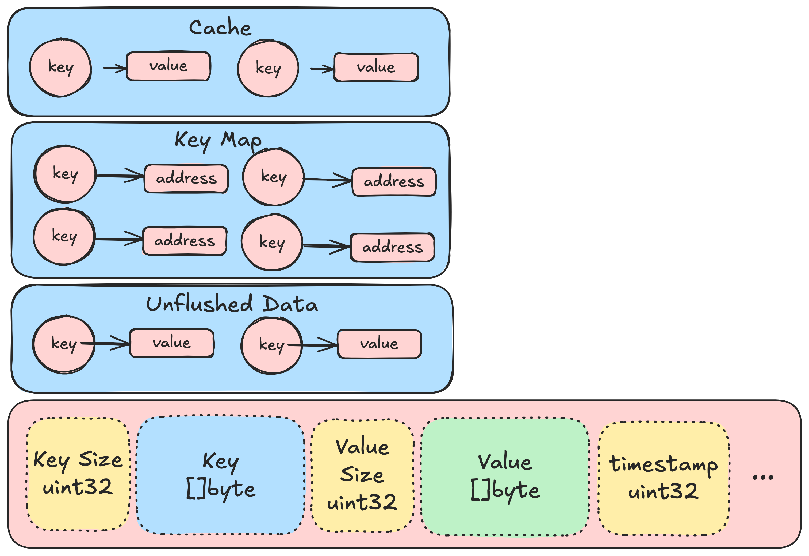
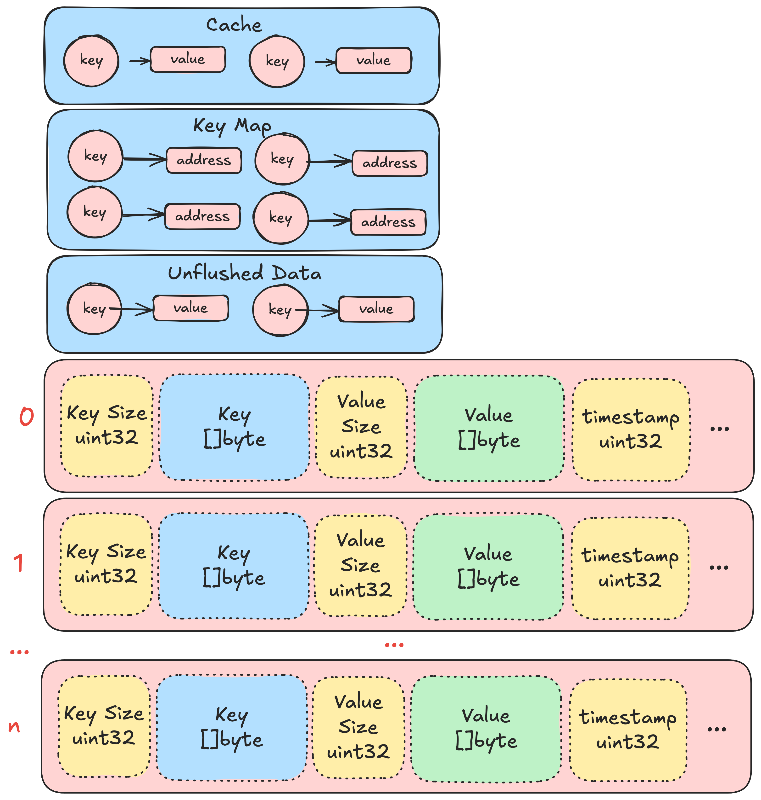
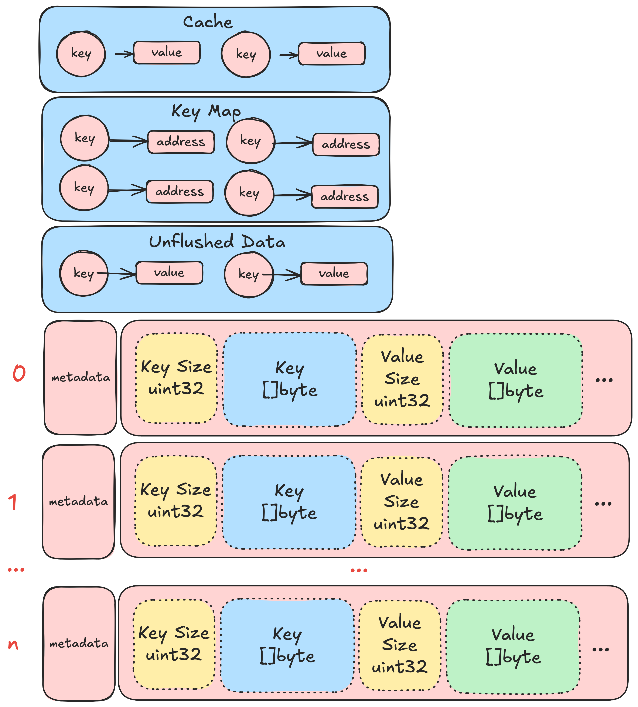
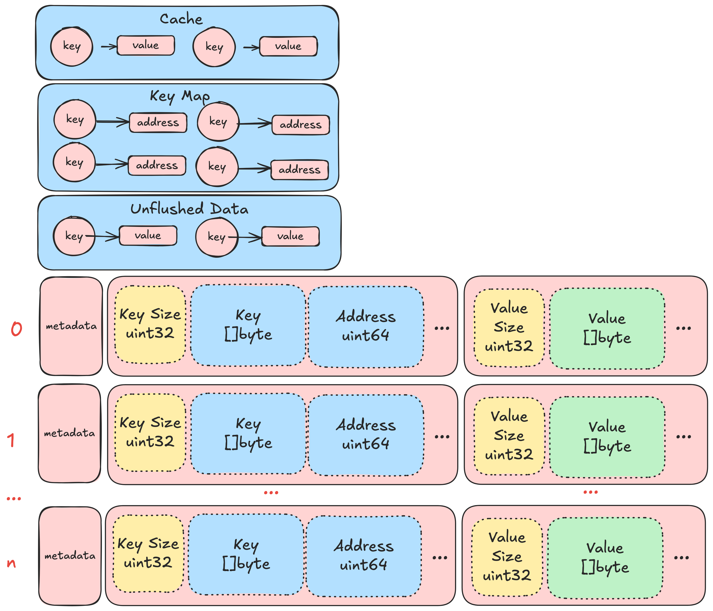
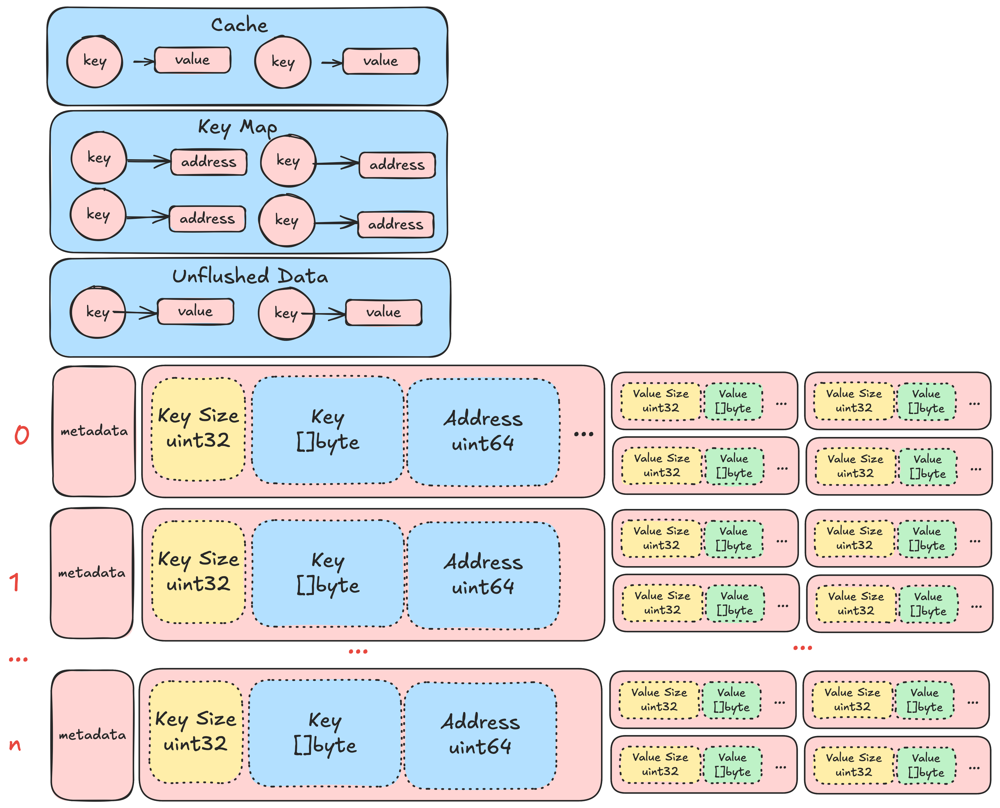
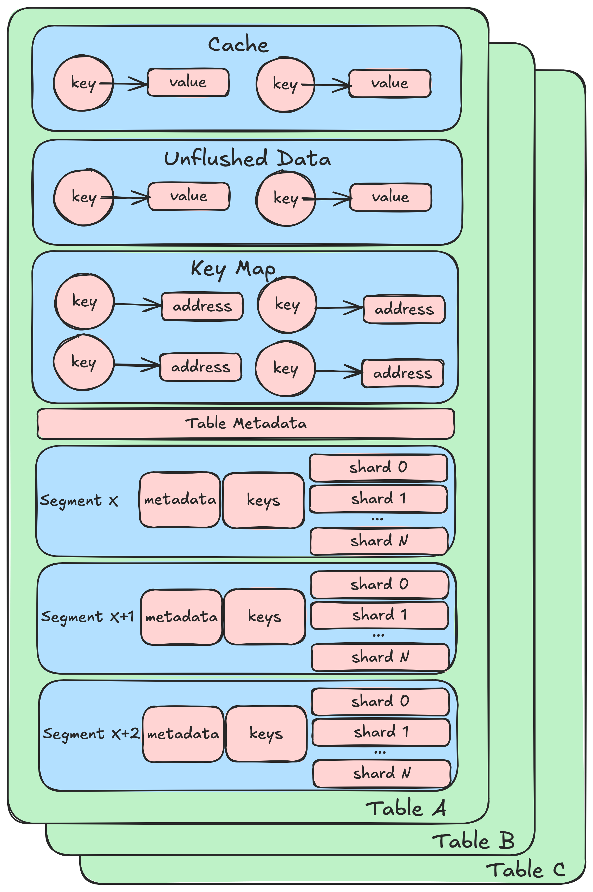

# LittDB Architecture

This section explains the high level architecture of LittDB. It starts out by describing a simple (but inefficient)
storage solution, and incrementally adds complexity in order to solve various problems. For the full picture, skip to
[Putting it all together: LittDB](#putting-it-all-together-littdb).

For each iteration, the database must fulfill the following requirements:

- must support `put(key, value)`/`get(key)` operations
- must be thread safe
- must support a TTL
- must be crash durable

## Iteration 1: Appending data to a file

Let's implement the simplest possible key-value store that satisfies the requirements above. It's going to be super
slow. Ok, fine. We want simple.

When the user writes a key-value pair to the database, append the key and the value to the end of the file, along
with a timestamp. When the user reads a key, scan the file from the beginning until you find the key and
return the value.

Periodically, scan the data in the file to check for expired data. If a key has expired, remove it from the file
(will require the file to be rewritten).

This needs to be thread safe. Keep a global read-write lock around the file. When a write or GC operation is in
progress, no reads are allowed. GC operations and writes are not permitted to happen in parallel. Allow multiple
reads to happen concurrently.

In order to provide durability, ensure the file is fully flushed to disk before releasing a write lock.

Congratulations! You've written your very own database!

## Iteration 2: Add a cache

Reads against the database in 1 are slow. If there is any way we could reduce the number of times we have to iterate
over the file, that would be great. Let's add an in-memory cache.

Let's assume we are using a thread safe map to implement the cache.

When reading data, first check to see if the data is in the cache. If it is, return it. If it is not, acquire a read
lock and scan the file. Be sure to update the cache with the data you read.

When writing data, write the data to the file, and then update the cache. Data that is recently written is often
read immediately shortly after, for many workloads.

When deleting data, remove the data from the file, and then remove the data from the cache.

## Iteration 3: Add an index

Reading recent values is a lot faster now. But if you miss the cache, things start getting slow. `O(n)` isn't fun
when you database holds 100TB. To address this, let's add an index that allows us to jump straight to the data we
are looking for. For the sake of consistency with other parts of this document, let's call this index a "keymap".

Inside the keymap, maintain a mapping from each key to the offset in the file where the first byte of the value is
stored.

When writing a value, take note of the offset in the file where the value was written. Store the key and the offset
in the keymap.

When reading a value and there is a cache miss, look up the key inside the keymap. If the key is present, jump to
start of the value in the file and read the value. If the key is not present, tell the user that the key is not
present in the database.

When deleting a value, remove the key from the keymap in addition to removing the value from the file.

At startup time, we will have to rebuild the keymap, since we are only storing it in memory. In order to do so,
iterate over the file and reconstruct the keymap. If this is too slow, consider storing the keymap on disk (perhaps
using an off-the-shelf key-value store like levelDB).

The database needs to do a little extra bookkeeping when it deletes data from the file. If it deletes X bytes from
the beginning of the file, then the offsets recorded in the keymap are off by a factor of X. The key map doesn't
need to be rebuilt in order to fix this. Rather, the database can simply subtract X from all the offsets in the
keymap to find the actual location of the data in the file. Additionally, it must add X to the offset when computing
the "offset" of new data that is written to the file.

## Iteration 4: Unflushed data map

In order to be thread safe, the solution above uses a global lock. While one thread is writing, readers must wait
unless they get lucky and find their data in the cache. It would be really nice if we could permit reads to continue
uninterrupted while writes are happening in the background.

Create another key->value map called the "unflushed data map". Use a thread safe map implementation.

When the user writes data to the database, immediately add it to the unflushed data map, but not the key map.
After that is completed, write it to file. The write doesn't need to be synchronous. For example, you can use file
stream APIs that buffer data in memory before writing it to disk in larger chunks. The write operation doesn't need
to block until the data is written to disk, it can return as soon as the data is in the unflushed data map and written
to the buffer.

Expose a new method in the database called `Flush()`. When `Flush()` is called, first flush all data in buffers to disk,
then empty out the unflushed data map. Before each entry is removed, write the key-address pair to the key map.
This flush operation should block until all of this work is done.

When reading data, look for it in the following places, in order:

- the cache
- the unflushed data map
- on disk (via the keymap and data file)

Unlike previous iterations, write no longer needs to hold a lock that blocks readers. This is thread safe, and it
provides read-your-writes consistency.

If a reader is attempting to read data that is currently in the process of being written to disk, then the data will
be present in the unflushed data map. If the reader finds an entry in the key map, this means that the data has already
been written out to disk, and is therefore safe to read from the file. Even if the writer is writing later in the file,
the bytes the reader wants to read will be immutable.

Although the strategy described above allows read operations to execute concurrently with write operations, it does
not solve the problem for deletions of values that have exceeded their TTL. This operation will still require a global
lock that blocks all reads and writes.

## Iteration 5: Break the file into segments

One of the biggest inefficiencies in design, to this point, is that the deleting values is exceptionally slow. The
entire file must be rewritten in order to trim bytes from the beginning. And to make matters worse, we need to hold
a global lock while we do it. To fix this, let's break apart the data file into multiple data files. We'll call each
data file a "segment".

Decide on a maximum file size for each segment. Whenever a file gets "full", close it and open a new one. Let's assign
each of these files a serial number starting with `0` and increasing monotonically. We'll call this serial number the
"segment index".

Previously, the address stored in the key map told us the offset in the file where the value was stored. Now, the
address will also need to keep track of the segment index, as well as the offset.

Deletion of data is now super easy. When all data in the oldest segment file exceeds its TTL, we can delete just that
segment without modifying any of the other segment files. Iterate over the segment file to delete values from the key
map.

In order to avoid the race condition where a reader is reading data from a segment that is in the process of being
deleted, use reference counters for each segment. When a reader goes to read data, it first finds the address in the
keymap, than increments the reference counter for the segment. When the reader is done reading, it decrements the
reference counter. When the garbage collector goes to delete a segment, it waits to actually delete the file on disk
until the reference counter is zero. As a result of this strategy, there is now no longer a need for garbage collection
to hold a global lock.

## Iteration 6: Metadata files

In the previous iteration, we do garbage collection by deleting a segment once all data contained within that segment
has expired. But how do we figure out when that actually is? In the previous iteration, the only way to do that is to
iterate over the entire segment file and read the timestamp stored with the last value. Let's do better.

For each segment, let's create a metadata file. We'll put the timestamp of the last value written to the segment into
this file. As a result, we will no longer need to store timestamp information inside the value files, which will
save us a few bytes per entry.

Now, all the garbage collector needs to read to decide when it is time to delete a segment is the metadata file for
that segment.

## Iteration 7: Key files

Storing timestamp information in a metadata file is a good start, but we still need to scan the value file. When a
segment is deleted, we need to clean up the key map. In order to do this, we need to know which keys are stored in the
segment. Additionally, when we start up the database, we need to rebuild the key map. This requires us to scan each
segment file to find the keys.

From an optimization point of view, we can assume that in general keys will be much smaller than values. During the
operations described above, we don't care about the values, only the keys. So lets separate the keys from the values
to avoid having to read the values when we don't need them.

Everything works the same way as before. But instead of iterating huge segment files when deleting a segment
or rebuilding the key map at startup, we only have to iterate over the key file. The key file is going to be
significantly smaller than the value file (for sane key-value size ratios), and so this will be much faster.

## Iteration 8: Sharding

A highly desirable property for this database is the capability to spread its data across multiple physical drives.
In order to do this, we need to shard the data. That is to say, we need to break the data into smaller pieces and
spread those pieces across multiple locations.

Key files and metadata files are small. For the sake of simplicity, let's not bother sharding those. Value files
are big. Break apart value files, and have one value file per shard.

When writing data, the first thing to do will be to figure out which shard the data belongs in. Do this by taking a
hash of the key modulo the number of shards.

When reading data, we need to do the reverse. Take a hash of the key modulo the number of shards to figure out which
shard to look in. As a consequence, the address alone is no longer enough information to find the data. We also need
to know the key when looking up data. But this isn't a problem, since we always have access to the key when we are
looking up data.

From a security perspective, sharding with a predictable hash is dangerous. An attacker could, in theory, craft keys
that all map to the same shard, causing a hot spot in the database. To prevent this, the database chooses a random
"salt" value that it includes in the hash function. As long as an attacker does not know the salt value, they cannot
predict which shard a key will map to.

We already have a metadata file for each segment. We can go ahead and save the sharding factor and salt in the metadata
file. This will give us enough information to find data contained within the segment.

## Iteration 9: Multi-table support

A nice-to-have feature would be the ability to support multiple tables. Each table would have its own namespace, and
data in one table would not conflict with data in another table.

This is simple! Let's just run a different DB instance for each table.

Since each table might want to have its own configuration, we can store that configuration in a metadata file for each
table.

## Putting it all together: LittDB

