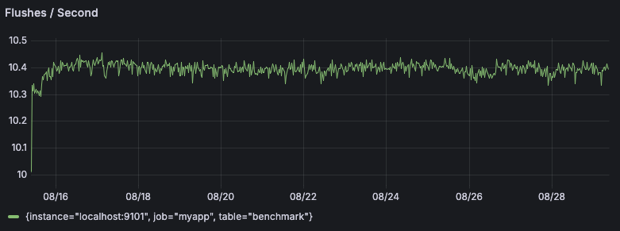
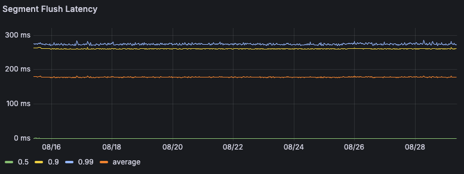
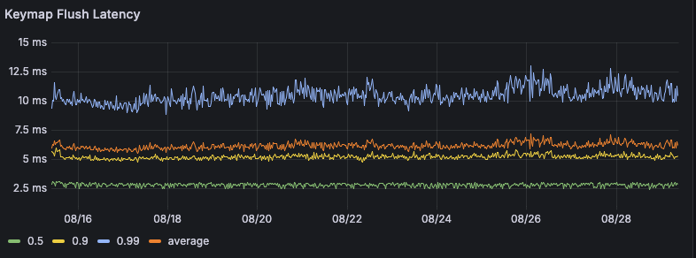
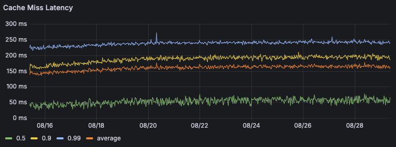

# Test Description

A long term soak test (2 weeks) with ~200 TB on disk. The goal of this test was to verify that LittDB performance
did not degrade over time and with this quantity of data on disk.

# Setup


| Property          | Value                                        | 
|-------------------|----------------------------------------------| 
| commit            | `2625a70cecf0efc239fb9891691b7b179733b5f8`   | 
| environment       | OCI (Oracle Cloud Infrastructure)            |
| region            | US East (Ashburn)                            |
| OS                | Canonical-Ubuntu-20.04-2025.07.23-0          |
| shape             | VM.Optimized3.Flex                           |
| OCPU count        | 1                                            |
| Network Bandwidth | 4 Gbps                                       |
| Memory            | 14 GB                                        |
| Disk              | 8x 32TB block volumes, per disk config below |
| Disk Performance  | Balanced (VPU/GB:10)                         |
| Disk Throughput   | 480 MB/s                                     |
| Disk IOPS         | 25,000 IOPS                                  |
| Disk encryption   | disabled                                     |
| Disk backup       | disabled                                     |

# Setup

I used the following benchmark configuration:

```json
{
  "LittConfig": {
    "Paths": ["~/mount/b", "~/mount/c", "~/mount/d", "~/mount/e", "~/mount/f", "~/mount/g", "~/mount/h", "~/mount/i"],
    "MetricsEnabled": true
  },
  "MaximumWriteThroughputMB": 1024,
  "MetricsLoggingPeriodSeconds": 1,
  "TTLHours": 168
}
```

The block volumes were mounted under `~/mount/b` ... `~/mount/i` and formatted with `ext4` filesystem. 
("`/dev/sda`" was already in use, so I started with "`/dev/sdb`".)

I ran the test for 14 days. The first 7 days (i.e. 168 hours) were spent ramping up, followed by 7 days of steady state.

# Results

| | |
|---|---|
|  |  |
|  |  |
|  |  |
|  |  |
|  |  |
|  |  |
|  |  |
|  |  |
|  |  |

# Notes and Observations

## Clean Bill of Health

The test completed successfully with no errors. All metrics reported healthy values. There were no signs of 
performance degradation or resource leaks over the course of the test. Although read latency and memory use did
increase slightly over time, I suspect this can be explained by the growth in size of the keymap (i.e. an internal
LevelDB instance used for tracking metadata). Once the size of the data reached a steady state, this minor growth
in read latency and memory appeared to flatten out and enter a steady state as well.

## Is the benchmark code available?

Yes! To run this benchmark yourself, follow the following steps:

- install golang 1.24
- `git clone https://github.com/Layr-Labs/eigenda.git`
- `cd eigenda/litt && make build`
  - this will create the LittDB CLI binary at `./eigenda/litt/bin/litt`
  - you can install this CLI by making sure this binary is on your bash PATH, or you can invoke it directly
- create a benchmark config file
  - the above example is a good starting point
  - a complete list of config options can be found at https://github.com/Layr-Labs/eigenda/blob/master/litt/benchmark/config/benchmark_config.go
- `litt benchmark /path/to/benchmark_config.json`

## Why OCI?

It's cheap.

## What's the current write bottleneck?

The write throughput observed during this test vastly exceeds what we need, so I didn't spend much time attempting to
further optimize the write throughput.

I suspect the write bottleneck is one of two things:

- the benchmark utility itself
- some sort of OCI limitation based on the VM shape

When I was running this benchmark with a single disk, I observed slightly faster write throughput. If the bottleneck
was the capacity of the disks themselves, I would expect that adding more disks would increase the write throughput.
Additionally, the observed write throughput is well below the theoretical maximum of the disks (even when running with 
a single disk).

It's plausible that there is some other cause for the current write bottleneck. As of now, I've not collected
sufficient data to determine the exact cause.

## Memory Use

It's important to point out that the benchmark allocates a fixed size 1 GB memory buffer. Although the system was using
~2 GB of memory, the actual memory use of the DB itself was at most only half of that.

In a production environment, LittDB can use a lot of memory depending on cache configuration. But modulo caching,
the baseline memory needed for a high capacity LittDB instance is quite low (under 1 GB).

## Garbage Collection Overhead

One of the major problems with other DB's I've tested with the EigenDA workload is garbage collection. This test
demonstrates that LittDB garbage collection is exceptionally fast and efficient. Garbage collection runs once
per 5 minutes, and takes 100-200ms to complete.

## Data Validation

A feature of this benchmark is that when it reads data, it validates that the data read is correct. During the span
of this two week benchmark, no data corruption was detected. Note that since the write rate was much larger than
the read rate, only a small fraction of the data written was actually read and validated. But if there was systemic
and large scale data corruption, it is very likely that the random sampling would have detected it.

## Further Work

### Test Length

The intended use case of the DB requires continuous uptime over months or years. This test was only 2 weeks long, so
it's possible that issues could arise over longer time periods. The length of this test was limited by cost 
considerations,

### Read Workload

The read workload of this test was intentionally kept light. The primary purpose of this test was to verify that
performance did not degrade with large quantities of data on disk. It might be interesting to repeat this test
with a more realistic read workload.

### Larger Data Set

The target data size for this test was ~200 TB. The test only achieved ~192 TB, but this is close enough for all
practical purposes. The exact quantity of data stored on disk is a function of the write throughput and the TTL.
Since the write throughput was dependant on the speed of the underlying disks and the TTL was fixed at 7 days, the
exact quantity of data stored on disk could not be precisely controlled.

Based on this data, we are confident that LittDB can handle EigenDA workloads for 1/8th stake validators, and then some!
The scale of this benchmark exceeded the requirements for this EigenDA use case by 2-4x.

A long term goal is to make the EigenDA protocol capable of bearing 1gb/s. In order to do so, we will need to validate
LittDB at a 1-2 petabyte scale. Due to cost considerations, this test was not performed at that scale. Based on observed
data, I do not anticipate DB problems at this scale. But it's hard to say for sure without actually running the test.